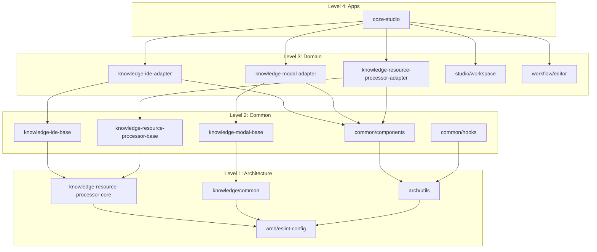
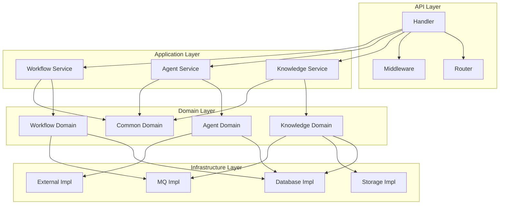

# Coze Plus 代码结构文档

## 📋 文档概述

本文档详细说明 Coze Plus 项目的代码组织结构、模块划分、依赖关系和开发规范。项目采用前后端分离架构，前端使用 Rush.js monorepo 管理，后端采用 DDD 领域驱动设计。

## 🏗️ 整体代码结构

```
coze-plus/
├── 📁 frontend/                    # 前端代码 (TypeScript + React)
├── 📁 backend/                     # 后端代码 (Go + Hertz)
├── 📁 idl/                         # 接口定义语言 (Thrift)
├── 📁 docker/                      # 容器配置
├── 📁 scripts/                     # 构建脚本
├── 📁 docs/                        # 项目文档
├── 📁 common/                      # 通用配置
├── 📄 rush.json                    # Rush.js 配置
├── 📄 Makefile                     # 构建命令
└── 📄 CLAUDE.md                    # 开发指南
```

## 🎨 前端代码结构

### Rush.js Monorepo 架构

前端采用 Rush.js 管理的 monorepo 架构，包含 135+ 个包，分为 4 个依赖层级：

```
frontend/
├── 📁 apps/                        # Level 4: 应用层
│   └── 📁 coze-studio/             # 主应用入口
│       ├── 📄 package.json
│       ├── 📄 rsbuild.config.ts    # Rsbuild 构建配置
│       ├── 📄 tsconfig.json
│       ├── 📁 src/
│       │   ├── 📄 index.tsx        # 应用入口
│       │   ├── 📄 App.tsx          # 根组件
│       │   ├── 📁 pages/           # 页面组件
│       │   ├── 📁 components/      # 应用级组件
│       │   └── 📁 hooks/           # 应用级Hooks
│       └── 📁 public/              # 静态资源
├── 📁 packages/                    # Level 1-3: 包层
│   ├── 📁 arch/                    # Level 1: 架构层
│   │   ├── 📁 eslint-config/       # ESLint 配置包
│   │   ├── 📁 ts-config/           # TypeScript 配置包
│   │   ├── 📁 idl/                 # IDL 接口生成
│   │   └── 📁 utils/               # 架构级工具
│   ├── 📁 common/                  # Level 2: 通用层
│   │   ├── 📁 components/          # 通用UI组件
│   │   ├── 📁 hooks/               # 通用React Hooks
│   │   ├── 📁 services/            # 通用业务服务
│   │   ├── 📁 utils/               # 通用工具函数
│   │   └── 📁 stores/              # 全局状态管理
│   ├── 📁 data/                    # Level 3: 数据层
│   │   └── 📁 knowledge/           # 知识库数据包
│   │       ├── 📁 common/          # 知识库通用组件
│   │       ├── 📁 knowledge-ide-base/           # IDE基础包
│   │       ├── 📁 knowledge-ide-adapter/        # IDE适配器包
│   │       ├── 📁 knowledge-modal-base/         # 模态框基础包
│   │       ├── 📁 knowledge-modal-adapter/      # 模态框适配器包
│   │       ├── 📁 knowledge-resource-processor-core/     # 资源处理器核心
│   │       ├── 📁 knowledge-resource-processor-base/     # 资源处理器基础
│   │       └── 📁 knowledge-resource-processor-adapter/  # 资源处理器适配器
│   ├── 📁 studio/                  # Level 3: 工作室功能
│   │   ├── 📁 workspace/           # 工作空间
│   │   ├── 📁 agent/               # AI代理
│   │   └── 📁 settings/            # 设置
│   └── 📁 workflow/                # Level 3: 工作流
│       ├── 📁 editor/              # 工作流编辑器
│       ├── 📁 nodes/               # 工作流节点
│       └── 📁 runner/              # 工作流执行器
├── 📁 config/                      # 配置文件
│   ├── 📁 eslint-config/           # ESLint 配置
│   ├── 📁 ts-config/               # TypeScript 配置
│   ├── 📁 rsbuild/                 # Rsbuild 配置
│   └── 📁 stylelint/               # Stylelint 配置
├── 📁 infra/                       # 基础设施
│   ├── 📁 build-tools/             # 构建工具
│   ├── 📁 dev-tools/               # 开发工具
│   └── 📁 testing/                 # 测试工具
└── 📁 scripts/                     # 脚本文件
    ├── 📄 build.js                 # 构建脚本
    ├── 📄 dev.js                   # 开发脚本
    └── 📄 test.js                  # 测试脚本
```

### 前端包命名规范

| 包类型 | 命名规范 | 示例 | 说明 |
|--------|----------|------|------|
| **架构层** | `@coze-arch/*` | `@coze-arch/eslint-config` | 基础架构配置 |
| **通用层** | `@coze-common/*` | `@coze-common/components` | 通用组件库 |
| **数据层** | `@coze-data/*` | `@coze-data/knowledge` | 数据服务 |
| **工作室** | `@coze-studio/*` | `@coze-studio/workspace` | 工作室功能 |
| **工作流** | `@coze-workflow/*` | `@coze-workflow/editor` | 工作流相关 |
| **应用层** | `@coze-apps/*` | `@coze-apps/studio` | 应用入口 |

### 知识库模块详细结构

```
packages/data/knowledge/
├── 📁 common/                      # 通用基础 (Level 1)
│   ├── 📄 package.json
│   ├── 📁 src/
│   │   ├── 📁 components/          # 基础UI组件
│   │   │   ├── 📄 KnowledgeCard.tsx
│   │   │   ├── 📄 DocumentViewer.tsx
│   │   │   └── 📄 SearchInput.tsx
│   │   ├── 📁 hooks/               # 基础Hooks
│   │   │   ├── 📄 useKnowledge.ts
│   │   │   ├── 📄 useDocument.ts
│   │   │   └── 📄 useSearch.ts
│   │   ├── 📁 types/               # 类型定义
│   │   │   ├── 📄 knowledge.ts
│   │   │   ├── 📄 document.ts
│   │   │   └── 📄 search.ts
│   │   └── 📁 utils/               # 工具函数
│   │       ├── 📄 formatters.ts
│   │       └── 📄 validators.ts
│   └── 📄 index.ts                 # 导出入口
├── 📁 knowledge-resource-processor-core/    # 核心处理器 (Level 2)
│   ├── 📄 package.json
│   ├── 📁 src/
│   │   ├── 📁 processors/          # 文档处理器
│   │   │   ├── 📄 TextProcessor.ts
│   │   │   ├── 📄 PDFProcessor.ts
│   │   │   └── 📄 ImageProcessor.ts
│   │   ├── 📁 chunkers/            # 分块器
│   │   │   ├── 📄 TextChunker.ts
│   │   │   └── 📄 SemanticChunker.ts
│   │   └── 📁 embeddings/          # 向量化
│   │       ├── 📄 EmbeddingService.ts
│   │       └── 📄 VectorStore.ts
│   └── 📄 index.ts
├── 📁 knowledge-resource-processor-base/     # 处理器基础 (Level 2)
│   ├── 📄 package.json
│   ├── 📁 src/
│   │   ├── 📁 components/          # 处理器UI组件
│   │   │   ├── 📄 ProcessorStatus.tsx
│   │   │   ├── 📄 ProgressBar.tsx
│   │   │   └── 📄 ErrorDisplay.tsx
│   │   ├── 📁 hooks/               # 处理器Hooks
│   │   │   ├── 📄 useProcessor.ts
│   │   │   └── 📄 useProgress.ts
│   │   └── 📁 services/            # 处理器服务
│   │       ├── 📄 ProcessorAPI.ts
│   │       └── 📄 QueueManager.ts
│   └── 📄 index.ts
├── 📁 knowledge-resource-processor-adapter/  # 处理器适配器 (Level 3)
│   ├── 📄 package.json
│   ├── 📁 src/
│   │   ├── 📁 adapters/            # 业务适配器
│   │   │   ├── 📄 WorkspaceAdapter.ts
│   │   │   └── 📄 AgentAdapter.ts
│   │   ├── 📁 integrations/        # 第三方集成
│   │   │   ├── 📄 S3Integration.ts
│   │   │   └── 📄 WebDAVIntegration.ts
│   │   └── 📁 workflows/           # 工作流集成
│   │       └── 📄 ProcessorWorkflow.ts
│   └── 📄 index.ts
├── 📁 knowledge-ide-base/          # IDE基础 (Level 3)
│   ├── 📄 package.json
│   ├── 📁 src/
│   │   ├── 📁 components/          # IDE组件
│   │   │   ├── 📄 KnowledgeExplorer.tsx
│   │   │   ├── 📄 DocumentEditor.tsx
│   │   │   └── 📄 SearchPanel.tsx
│   │   ├── 📁 layouts/             # 布局组件
│   │   │   ├── 📄 IDELayout.tsx
│   │   │   └── 📄 PanelLayout.tsx
│   │   └── 📁 contexts/            # React Context
│   │       ├── 📄 IDEContext.tsx
│   │       └── 📄 SelectionContext.tsx
│   └── 📄 index.ts
├── 📁 knowledge-ide-adapter/       # IDE适配器 (Level 3)
│   ├── 📄 package.json
│   ├── 📁 src/
│   │   ├── 📁 adapters/            # 业务场景适配
│   │   │   ├── 📄 AgentIDEAdapter.ts
│   │   │   └── 📄 WorkflowIDEAdapter.ts
│   │   ├── 📁 plugins/             # IDE插件
│   │   │   ├── 📄 SearchPlugin.ts
│   │   │   └── 📄 PreviewPlugin.ts
│   │   └── 📁 shortcuts/           # 快捷键
│   │       └── 📄 KeyboardShortcuts.ts
│   └── 📄 index.ts
├── 📁 knowledge-modal-base/        # 模态框基础 (Level 3)
│   ├── 📄 package.json
│   ├── 📁 src/
│   │   ├── 📁 components/          # 模态框组件
│   │   │   ├── 📄 KnowledgeModal.tsx
│   │   │   ├── 📄 DocumentModal.tsx
│   │   │   └── 📄 SearchModal.tsx
│   │   ├── 📁 hooks/               # 模态框Hooks
│   │   │   ├── 📄 useModal.ts
│   │   │   └── 📄 useModalState.ts
│   │   └── 📁 providers/           # 状态提供者
│   │       └── 📄 ModalProvider.tsx
│   └── 📄 index.ts
├── 📁 knowledge-modal-adapter/     # 模态框适配器 (Level 3)
│   ├── 📄 package.json
│   ├── 📁 src/
│   │   ├── 📁 modals/              # 业务模态框
│   │   │   ├── 📄 CreateKnowledgeModal.tsx
│   │   │   ├── 📄 UploadDocumentModal.tsx
│   │   │   └── 📄 SettingsModal.tsx
│   │   └── 📁 flows/               # 模态框流程
│   │       ├── 📄 OnboardingFlow.tsx
│   │       └── 📄 ImportFlow.tsx
│   └── 📄 index.ts
└── 📁 knowledge-data-set-for-agent/ # Agent数据集 (Level 3)
    ├── 📄 package.json
    ├── 📁 src/
    │   ├── 📁 components/          # Agent专用组件
    │   │   ├── 📄 AgentKnowledgePanel.tsx
    │   │   └── 📄 KnowledgeSelector.tsx
    │   ├── 📁 hooks/               # Agent专用Hooks
    │   │   ├── 📄 useAgentKnowledge.ts
    │   │   └── 📄 useKnowledgeBinding.ts
    │   └── 📁 services/            # Agent数据服务
    │       ├── 📄 AgentKnowledgeService.ts
    │       └── 📄 BindingService.ts
    └── 📄 index.ts
```

### 前端包依赖关系



## 🚀 后端代码结构

### DDD 领域驱动设计架构

后端采用 DDD (Domain-Driven Design) 架构，清晰分离业务逻辑：

```
backend/
├── 📁 api/                         # API 接口层
│   ├── 📁 handler/                 # HTTP 处理器
│   │   └── 📁 coze/                # Coze 业务处理器 (统一在此目录)
│   │       ├── 📄 knowledge_service.go    # 知识库服务接口
│   │       ├── 📄 agent_run_service.go    # 智能体运行服务接口
│   │       ├── 📄 bot_open_api_service.go # Bot OpenAPI 接口
│   │       ├── 📄 workflow_service.go     # 工作流服务接口
│   │       ├── 📄 developer_api_service.go # 开发者 API 接口
│   │       ├── 📄 playground_service.go    # Playground 接口
│   │       └── 📄 channel_service.go       # 渠道服务接口
│   ├── 📁 middleware/              # 中间件 (独立目录)
│   │   ├── 📄 session.go                  # Session 认证中间件
│   │   ├── 📄 openapi_auth.go             # OpenAPI 认证中间件
│   │   ├── 📄 request_inspector.go        # 请求检测中间件
│   │   ├── 📄 permission.go               # 权限检查中间件
│   │   └── 📄 cors.go                     # 跨域中间件
│   ├── 📁 model/                   # API 数据模型 (Thrift 生成)
│   │   ├── 📁 knowledge/           # 知识库API模型
│   │   ├── 📁 app/                 # 应用API模型
│   │   │   ├── 📁 bot_common/            # Bot 通用模型
│   │   │   ├── 📁 bot_open_api/          # Bot OpenAPI 模型
│   │   │   └── 📁 developer_api/         # 开发者 API 模型
│   │   ├── 📁 conversation/        # 对话API模型
│   │   │   └── 📁 run/                   # 运行模型
│   │   ├── 📁 workflow/            # 工作流API模型
│   │   ├── 📁 channel/             # 渠道API模型
│   │   └── 📁 base/                # 基础模型
│   ├── 📁 router/                  # 路由配置
│   │   └── 📁 coze/                # Coze 路由
│   │       ├── 📄 api.go                  # API 路由注册
│   │       └── 📄 middleware.go           # 中间件配置
│   └── 📁 internal/                # API 内部工具
│       └── 📁 httputil/            # HTTP 工具函数
├── 📁 application/                 # 应用服务层
│   ├── 📁 app/                     # 应用管理
│   ├── 📁 channel/                 # 渠道应用服务
│   ├── 📁 conversation/            # 对话应用服务
│   │   ├── 📄 agent_run.go                # 智能体运行
│   │   ├── 📄 message.go                  # 消息管理
│   │   └── 📄 openapi_agent_run.go        # OpenAPI 智能体运行
│   ├── 📁 knowledge/               # 知识库应用服务
│   │   ├── 📄 knowledge.go                # 知识库服务
│   │   ├── 📄 convertor.go                # 转换器
│   │   └── 📄 knowledge_test.go           # 测试文件
│   ├── 📁 memory/                  # 记忆应用服务
│   │   ├── 📄 database.go                 # 数据库服务
│   │   └── 📄 variables.go                # 变量服务
│   ├── 📁 plugin/                  # 插件应用服务
│   │   ├── 📄 plugin.go                   # 插件服务
│   │   ├── 📄 api_management.go           # API 管理
│   │   └── 📄 lifecycle.go                # 生命周期管理
│   ├── 📁 singleagent/             # 单智能体应用服务
│   │   ├── 📄 single_agent.go             # 单智能体服务
│   │   ├── 📄 create.go                   # 创建服务
│   │   ├── 📄 publish.go                  # 发布服务
│   │   └── 📄 get.go                      # 获取服务
│   ├── 📁 user/                    # 用户应用服务
│   └── 📁 workflow/                # 工作流应用服务
│       ├── 📄 workflow.go                 # 工作流服务
│       ├── 📄 chatflow.go                 # ChatFlow 服务
│       └── 📄 chatflow_test.go            # 测试文件
├── 📁 domain/                      # 领域层 (DDD 设计)
│   ├── 📁 agent/                   # 单智能体领域
│   │   └── 📁 singleagent/         # 单智能体子域
│   │       ├── 📁 entity/              # 领域实体
│   │       ├── 📁 internal/            # 内部实现
│   │       │   ├── 📁 agentflow/           # 智能体流程
│   │       │   └── 📁 dal/                 # 数据访问层
│   │       └── 📁 service/             # 领域服务
│   ├── 📁 app/                     # 应用领域
│   │   ├── 📁 entity/              # 应用实体
│   │   └── 📁 service/             # 应用服务
│   ├── 📁 channel/                 # 渠道领域
│   │   ├── 📁 entity/              # 渠道实体
│   │   ├── 📁 service/             # 渠道服务
│   │   └── 📁 repository/          # 仓储接口
│   ├── 📁 conversation/            # 对话领域
│   │   ├── 📁 agentrun/            # 智能体运行
│   │   │   ├── 📁 entity/              # 运行实体
│   │   │   ├── 📁 internal/            # 内部实现
│   │   │   └── 📁 service/             # 运行服务
│   │   ├── 📁 conversation/        # 会话管理
│   │   │   ├── 📁 entity/              # 会话实体
│   │   │   ├── 📁 internal/            # 内部实现
│   │   │   └── 📁 service/             # 会话服务
│   │   └── 📁 message/             # 消息管理
│   │       ├── 📁 entity/              # 消息实体
│   │       ├── 📁 internal/            # 内部实现
│   │       ├── 📁 repository/          # 仓储接口
│   │       └── 📁 service/             # 消息服务
│   ├── 📁 knowledge/               # 知识库领域
│   │   ├── 📁 entity/              # 领域实体
│   │   │   ├── 📄 knowledge.go            # 知识库实体
│   │   │   ├── 📄 document.go             # 文档实体
│   │   │   └── 📄 slice.go                # 文档切片实体
│   │   ├── 📁 processor/           # 文档处理器
│   │   │   └── 📁 impl/                # 处理器实现
│   │   ├── 📁 repository/          # 仓储接口
│   │   └── 📁 service/             # 领域服务
│   │       ├── 📄 knowledge.go            # 知识库服务
│   │       ├── 📄 retrieve.go             # 检索服务
│   │       └── 📄 sheet.go                # 表格服务
│   ├── 📁 memory/                  # 记忆领域
│   │   ├── 📁 database/            # 数据库记忆
│   │   │   ├── 📁 entity/              # 数据库实体
│   │   │   ├── 📁 internal/            # 内部实现
│   │   │   ├── 📁 repository/          # 仓储接口
│   │   │   └── 📁 service/             # 数据库服务
│   │   └── 📁 variables/           # 变量记忆
│   │       ├── 📁 entity/              # 变量实体
│   │       ├── 📁 internal/            # 内部实现
│   │       └── 📁 repository/          # 仓储接口
│   ├── 📁 permission/              # 权限领域
│   │   ├── 📁 entity/              # 权限实体
│   │   ├── 📁 repository/          # 仓储接口
│   │   └── 📁 service/             # 权限服务
│   ├── 📁 plugin/                  # 插件领域
│   │   ├── 📁 dto/                 # 数据传输对象
│   │   ├── 📁 entity/              # 插件实体
│   │   ├── 📁 internal/            # 内部实现
│   │   ├── 📁 repository/          # 仓储接口
│   │   └── 📁 service/             # 插件服务
│   ├── 📁 user/                    # 用户领域
│   │   ├── 📁 entity/              # 用户实体
│   │   ├── 📁 internal/            # 内部实现
│   │   ├── 📁 repository/          # 仓储接口
│   │   └── 📁 service/             # 用户服务
│   └── 📁 workflow/                # 工作流领域
│       ├── 📁 entity/              # 工作流实体
│       │   └── 📁 vo/                  # 值对象
│       ├── 📁 internal/            # 内部实现
│       │   ├── 📁 canvas/              # 画布实现
│       │   ├── 📁 compose/             # 组合实现
│       │   ├── 📁 execute/             # 执行实现
│       │   ├── 📁 nodes/               # 节点实现
│       │   ├── 📁 repo/                # 仓储实现
│       │   └── 📁 schema/              # Schema 实现
│       ├── 📁 plugin/              # 工作流插件
│       ├── 📁 service/             # 工作流服务
│       └── 📁 variable/            # 工作流变量
├── 📁 infra/                       # 基础设施层
│   ├── 📁 contract/                # 基础设施接口
│   │   ├── 📁 database/            # 数据库接口
│   │   │   ├── 📄 mysql.go                       # MySQL接口
│   │   │   ├── 📄 redis.go                       # Redis接口
│   │   │   └── 📄 milvus.go                      # Milvus接口
│   │   ├── 📁 storage/             # 存储接口
│   │   │   ├── 📄 file_storage.go                # 文件存储接口
│   │   │   └── 📄 object_storage.go              # 对象存储接口
│   │   ├── 📁 mq/                  # 消息队列接口
│   │   │   └── 📄 nsq.go                         # NSQ接口
│   │   └── 📁 external/            # 外部服务接口
│   │       ├── 📄 llm_provider.go                # LLM提供商接口
│   │       └── 📄 embedding_provider.go          # Embedding提供商接口
│   └── 📁 impl/                    # 基础设施实现
│       ├── 📁 database/            # 数据库实现
│       │   ├── 📄 mysql_impl.go                  # MySQL实现
│       │   ├── 📄 redis_impl.go                  # Redis实现
│       │   └── 📄 milvus_impl.go                 # Milvus实现
│       ├── 📁 storage/             # 存储实现
│       │   ├── 📄 local_storage.go               # 本地存储实现
│       │   └── 📄 minio_storage.go               # MinIO存储实现
│       ├── 📁 mq/                  # 消息队列实现
│       │   └── 📄 nsq_impl.go                    # NSQ实现
│       └── 📁 external/            # 外部服务实现
│           ├── 📄 openai_provider.go             # OpenAI实现
│           ├── 📄 claude_provider.go             # Claude实现
│           └── 📄 gemini_provider.go             # Gemini实现
├── 📁 crossdomain/                 # 跨域服务
│   ├── 📁 contract/                # 跨域服务接口
│   │   ├── 📁 knowledge/           # 知识库跨域接口
│   │   └── 📁 workflow/            # 工作流跨域接口
│   └── 📁 impl/                    # 跨域服务实现
│       ├── 📁 knowledge/           # 知识库跨域实现
│       └── 📁 workflow/            # 工作流跨域实现
├── 📁 pkg/                         # 通用包
│   ├── 📁 config/                  # 配置管理
│   │   ├── 📄 config.go                          # 配置结构
│   │   └── 📄 loader.go                          # 配置加载器
│   ├── 📁 logger/                  # 日志组件
│   │   ├── 📄 logger.go                          # 日志接口
│   │   └── 📄 zap_logger.go                      # Zap日志实现
│   ├── 📁 errors/                  # 错误处理
│   │   ├── 📄 errors.go                          # 错误定义
│   │   └── 📄 codes.go                           # 错误码
│   ├── 📁 utils/                   # 工具函数
│   │   ├── 📄 crypto.go                          # 加密工具
│   │   ├── 📄 json.go                            # JSON工具
│   │   └── 📄 validator.go                       # 验证工具
│   └── 📁 middleware/              # 中间件包
│       ├── 📄 recovery.go                        # 恢复中间件
│       └── 📄 metrics.go                         # 监控中间件
├── 📁 conf/                        # 配置文件
│   ├── 📁 model/                   # 模型配置
│   │   ├── 📁 template/            # 配置模板
│   │   ├── 📄 openai.yaml          # OpenAI配置
│   │   ├── 📄 claude.yaml          # Claude配置
│   │   └── 📄 gemini.yaml          # Gemini配置
│   ├── 📄 app.yaml                 # 应用配置
│   ├── 📄 database.yaml            # 数据库配置
│   └── 📄 redis.yaml               # Redis配置
├── 📁 internal/                    # 内部包
│   ├── 📁 server/                  # 服务器
│   │   └── 📄 server.go                          # HTTP服务器
│   └── 📁 wire/                    # 依赖注入
│       ├── 📄 wire.go                            # Wire配置
│       └── 📄 wire_gen.go                        # 生成的代码
├── 📄 main.go                      # 应用入口
├── 📄 go.mod                       # Go模块文件
└── 📄 go.sum                       # Go依赖锁定文件
```

### 后端模块依赖关系



## 🔗 IDL 接口定义

```
idl/
├── 📁 data/                        # 数据相关接口
│   ├── 📁 knowledge/               # 知识库接口
│   │   ├── 📄 knowledge.thrift             # 知识库服务接口
│   │   ├── 📄 document.thrift              # 文档服务接口
│   │   └── 📄 search.thrift                # 搜索服务接口
│   └── 📁 common/                  # 通用数据接口
│       ├── 📄 pagination.thrift            # 分页接口
│       └── 📄 response.thrift              # 响应接口
├── 📁 studio/                      # 工作室相关接口
│   ├── 📁 agent/                   # AI代理接口
│   │   ├── 📄 agent.thrift                 # 代理服务接口
│   │   └── 📄 conversation.thrift          # 对话服务接口
│   ├── 📁 workflow/                # 工作流接口
│   │   ├── 📄 workflow.thrift              # 工作流服务接口
│   │   └── 📄 execution.thrift             # 执行服务接口
│   └── 📁 workspace/               # 工作空间接口
│       └── 📄 workspace.thrift             # 工作空间服务接口
└── 📁 common/                      # 通用接口
    ├── 📄 auth.thrift              # 认证接口
    ├── 📄 user.thrift              # 用户接口
    └── 📄 error.thrift             # 错误接口
```

## 🚀 开发规范

### 代码组织原则

1. **单一职责原则**: 每个模块、包、文件只负责一个功能
2. **依赖倒置原则**: 高层模块不依赖低层模块，都依赖抽象
3. **开闭原则**: 对扩展开放，对修改关闭
4. **接口隔离原则**: 使用多个专门的接口，而不是单一的总接口

### 命名规范

#### 前端命名规范

- **包名**: kebab-case (`knowledge-ide-base`)
- **文件名**: PascalCase for components (`KnowledgeCard.tsx`), camelCase for others (`useKnowledge.ts`)
- **组件名**: PascalCase (`KnowledgeCard`)
- **函数名**: camelCase (`handleSearch`)
- **常量名**: UPPER_SNAKE_CASE (`MAX_FILE_SIZE`)

#### 后端命名规范

- **包名**: snake_case (`knowledge_service`)
- **文件名**: snake_case (`knowledge_service.go`)
- **结构体名**: PascalCase (`KnowledgeService`)
- **方法名**: PascalCase (`CreateKnowledge`)
- **变量名**: camelCase (`knowledgeID`)
- **常量名**: PascalCase (`DefaultPageSize`)

### 目录结构规范

#### 前端目录规范

```
package-name/
├── 📄 package.json             # 包配置文件
├── 📄 tsconfig.json            # TypeScript配置
├── 📄 eslint.config.js         # ESLint配置
├── 📄 README.md                # 包说明文档
├── 📁 src/                     # 源代码目录
│   ├── 📁 components/          # 组件目录
│   ├── 📁 hooks/               # Hooks目录
│   ├── 📁 services/            # 服务目录
│   ├── 📁 types/               # 类型定义目录
│   ├── 📁 utils/               # 工具函数目录
│   └── 📄 index.ts             # 导出入口文件
├── 📁 tests/                   # 测试目录
│   ├── 📁 __fixtures__/        # 测试数据
│   ├── 📁 __mocks__/           # Mock数据
│   └── 📄 *.test.ts            # 测试文件
└── 📁 docs/                    # 文档目录
    └── 📄 README.md            # 包文档
```

#### 后端目录规范

```
module-name/
├── 📁 entity/                  # 实体目录
├── 📁 service/                 # 服务目录
├── 📁 repository/              # 仓储目录
├── 📁 valueobject/             # 值对象目录
├── 📁 internal/                # 内部包目录
├── 📄 *_test.go                # 测试文件
└── 📄 README.md                # 模块说明
```

## 📊 测试策略

### 前端测试策略

- **Level 1**: 80% 覆盖率，90% 增量覆盖率
- **Level 2**: 30% 覆盖率，60% 增量覆盖率
- **Level 3-4**: 0% 覆盖率要求（灵活配置）

### 后端测试策略

- **单元测试**: 所有领域服务和实体
- **集成测试**: 仓储和外部服务接口
- **API测试**: 所有HTTP接口
- **性能测试**: 关键业务流程

## 🔧 构建和部署

### 前端构建

```bash
# 安装依赖
rush update

# 构建所有包
rush build

# 构建特定包
rush rebuild --to @coze-apps/studio

# 运行测试
rush test

# 代码检查
rush lint
```

### 后端构建

```bash
# 构建后端服务
make build_server

# 运行测试
go test ./...

# 代码检查
golangci-lint run

# 生成依赖注入代码
wire gen ./internal/wire/
```

## 🔗 相关文档

- [项目架构文档](./project-architecture.md)
- [开发规范文档](./development-guidelines.md)
- [API接口文档](../idl/)
- [部署指南](./deployment-guide.md)

---

**文档版本**: v1.0
**最后更新**: 2025-10-27
**维护者**: Coze Plus Team