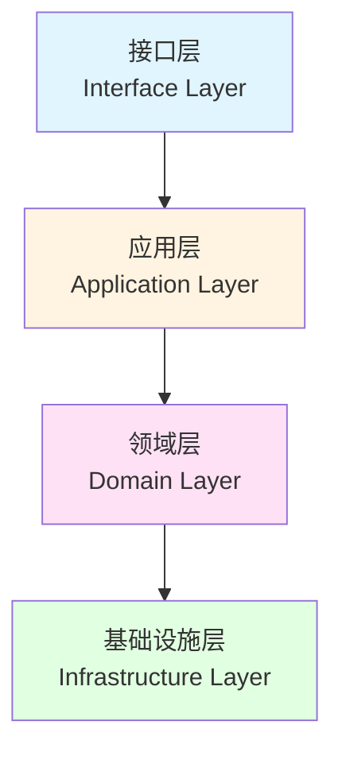
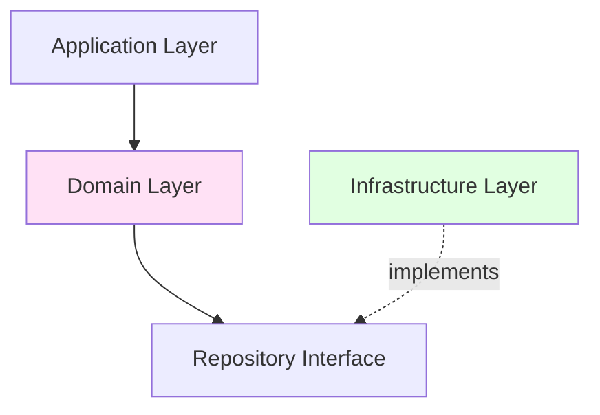

# DDD 设计

本文档详细介绍 Coze Plus 项目中的领域驱动设计（Domain-Driven Design）实践、设计模式和最佳实践。

## DDD 概述

### 什么是 DDD

领域驱动设计（Domain-Driven Design）是一种软件开发方法论，强调：

- **以业务领域为中心**：代码结构反映业务领域
- **统一语言**：开发人员和业务专家使用相同术语
- **分层架构**：明确的职责分离
- **聚合根**：维护数据一致性的边界
- **领域事件**：领域内重要业务变化的表达

### 为什么使用 DDD

1. **业务复杂性管理**：AI Agent 平台涉及复杂的业务逻辑
2. **代码可维护性**：清晰的边界和职责划分
3. **团队协作**：统一语言减少沟通成本
4. **系统扩展性**：易于添加新功能和修改现有功能
5. **知识沉淀**：领域知识在代码中得到体现

## DDD 分层架构

### 四层架构



### 层级职责

| 层级 | 职责 | 依赖方向 |
|------|------|---------|
| **接口层** | 处理外部请求、响应格式化、参数验证 | → 应用层 |
| **应用层** | 用例编排、事务管理、权限检查 | → 领域层 |
| **领域层** | 业务逻辑、领域规则、领域模型 | → 无（纯业务逻辑） |
| **基础设施层** | 数据持久化、外部服务、技术实现 | ← 领域层（依赖倒置） |

## 核心概念

### 1. 实体（Entity）

具有唯一标识的领域对象，标识不变但属性可变。

**特征**：
- 有唯一 ID
- 包含业务逻辑
- 生命周期管理
- 可变性

**示例**：

```go
// Agent 实体
type Agent struct {
    // 唯一标识
    ID          string

    // 基本属性
    Name        string
    Description string
    IconURL     string

    // 业务属性
    Prompt      string
    Model       string
    Temperature float64

    // 关联
    Tools       []Tool
    Plugins     []Plugin

    // 状态
    Status      AgentStatus
    Version     string

    // 审计字段
    CreatorID   int64
    SpaceID     int64
    CreatedAt   time.Time
    UpdatedAt   time.Time
    DeletedAt   *time.Time
}

// 实体方法（业务逻辑）
func (a *Agent) Validate() error {
    if a.Name == "" {
        return errors.New("agent name is required")
    }
    if len(a.Name) > 100 {
        return errors.New("agent name too long")
    }
    if a.Model == "" {
        return errors.New("model is required")
    }
    return nil
}

// 实体行为
func (a *Agent) Publish() error {
    if a.Status == AgentStatusPublished {
        return errors.New("agent already published")
    }

    // 状态转换
    a.Status = AgentStatusPublished
    a.Version = a.generateVersion()

    return nil
}

// 实体行为
func (a *Agent) Archive() error {
    if a.Status == AgentStatusArchived {
        return errors.New("agent already archived")
    }

    a.Status = AgentStatusArchived
    return nil
}

// 业务规则
func (a *Agent) CanAddTool(tool Tool) bool {
    // 最多 10 个工具
    if len(a.Tools) >= 10 {
        return false
    }

    // 工具不能重复
    for _, t := range a.Tools {
        if t.ID == tool.ID {
            return false
        }
    }

    return true
}

// 私有辅助方法
func (a *Agent) generateVersion() string {
    return fmt.Sprintf("v%d", time.Now().Unix())
}
```

### 2. 值对象（Value Object）

没有唯一标识，由属性值定义的不可变对象。

**特征**：
- 无 ID，由值定义
- 不可变
- 可替换
- 相等性基于值

**示例**：

```go
// ModelConfig 值对象
type ModelConfig struct {
    Provider    string
    Model       string
    APIKey      string
    Temperature float64
    MaxTokens   int
    TopP        float64
}

// 值对象必须不可变，使用构造函数创建
func NewModelConfig(
    provider, model, apiKey string,
    temperature float64,
    maxTokens int,
) (*ModelConfig, error) {
    // 验证
    if provider == "" || model == "" {
        return nil, errors.New("provider and model are required")
    }

    if temperature < 0 || temperature > 2 {
        return nil, errors.New("temperature must be between 0 and 2")
    }

    return &ModelConfig{
        Provider:    provider,
        Model:       model,
        APIKey:      apiKey,
        Temperature: temperature,
        MaxTokens:   maxTokens,
        TopP:        1.0,
    }, nil
}

// 值对象的比较
func (m *ModelConfig) Equals(other *ModelConfig) bool {
    if other == nil {
        return false
    }

    return m.Provider == other.Provider &&
        m.Model == other.Model &&
        m.APIKey == other.APIKey &&
        m.Temperature == other.Temperature &&
        m.MaxTokens == other.MaxTokens
}

// 值对象的修改返回新对象
func (m *ModelConfig) WithTemperature(temp float64) (*ModelConfig, error) {
    return NewModelConfig(
        m.Provider,
        m.Model,
        m.APIKey,
        temp,
        m.MaxTokens,
    )
}

// 更多值对象示例
type Address struct {
    Country  string
    Province string
    City     string
    Street   string
    ZipCode  string
}

type Money struct {
    Amount   decimal.Decimal
    Currency string
}

type DateRange struct {
    StartDate time.Time
    EndDate   time.Time
}

func (d *DateRange) Contains(date time.Time) bool {
    return !date.Before(d.StartDate) && !date.After(d.EndDate)
}

func (d *DateRange) Duration() time.Duration {
    return d.EndDate.Sub(d.StartDate)
}
```

### 3. 聚合（Aggregate）

一组相关实体和值对象的集合，作为数据修改的单元。

**特征**：
- 有聚合根（Aggregate Root）
- 聚合根是唯一入口
- 内部一致性保证
- 事务边界

**示例**：

```go
// Workflow 聚合根
type Workflow struct {
    // 聚合根标识
    ID          int64

    // 基本信息
    Name        string
    Description string

    // 聚合内的实体集合
    Nodes       []*WorkflowNode  // 工作流节点
    Edges       []*WorkflowEdge  // 节点连接
    Variables   []*Variable      // 变量

    // 值对象
    Config      *WorkflowConfig

    // 状态
    Status      WorkflowStatus
    Version     string

    // 审计
    CreatedAt   time.Time
    UpdatedAt   time.Time
}

// 聚合根方法（保证聚合内一致性）
func (w *Workflow) AddNode(node *WorkflowNode) error {
    // 验证
    if node == nil {
        return errors.New("node cannot be nil")
    }

    // 检查节点是否已存在
    for _, n := range w.Nodes {
        if n.ID == node.ID {
            return errors.New("node already exists")
        }
    }

    // 业务规则：最多 100 个节点
    if len(w.Nodes) >= 100 {
        return errors.New("workflow cannot have more than 100 nodes")
    }

    // 添加节点
    w.Nodes = append(w.Nodes, node)
    w.UpdatedAt = time.Now()

    return nil
}

// 聚合根方法
func (w *Workflow) RemoveNode(nodeID string) error {
    // 查找节点
    index := -1
    for i, n := range w.Nodes {
        if n.ID == nodeID {
            index = i
            break
        }
    }

    if index == -1 {
        return errors.New("node not found")
    }

    // 删除关联的边
    w.removeEdgesByNode(nodeID)

    // 删除节点
    w.Nodes = append(w.Nodes[:index], w.Nodes[index+1:]...)
    w.UpdatedAt = time.Now()

    return nil
}

// 聚合根方法
func (w *Workflow) ConnectNodes(sourceID, targetID string) error {
    // 验证节点存在
    sourceNode := w.findNode(sourceID)
    targetNode := w.findNode(targetID)

    if sourceNode == nil || targetNode == nil {
        return errors.New("node not found")
    }

    // 业务规则：不能形成环
    if w.wouldCreateCycle(sourceID, targetID) {
        return errors.New("connection would create a cycle")
    }

    // 创建边
    edge := &WorkflowEdge{
        ID:       generateID(),
        SourceID: sourceID,
        TargetID: targetID,
    }

    w.Edges = append(w.Edges, edge)
    w.UpdatedAt = time.Now()

    return nil
}

// 聚合内私有方法
func (w *Workflow) findNode(nodeID string) *WorkflowNode {
    for _, n := range w.Nodes {
        if n.ID == nodeID {
            return n
        }
    }
    return nil
}

func (w *Workflow) removeEdgesByNode(nodeID string) {
    filtered := make([]*WorkflowEdge, 0, len(w.Edges))
    for _, e := range w.Edges {
        if e.SourceID != nodeID && e.TargetID != nodeID {
            filtered = append(filtered, e)
        }
    }
    w.Edges = filtered
}

func (w *Workflow) wouldCreateCycle(sourceID, targetID string) bool {
    // 检测环的算法实现
    // ...
    return false
}

// 聚合内的实体
type WorkflowNode struct {
    ID       string
    Type     NodeType
    Name     string
    Config   map[string]interface{}
    Position Position
}

type WorkflowEdge struct {
    ID       string
    SourceID string
    TargetID string
}
```

### 4. 领域服务（Domain Service）

处理不属于单个实体或值对象的业务逻辑。

**何时使用**：
- 业务逻辑涉及多个实体
- 操作无法归属到某个实体
- 需要外部依赖（如仓储）

**示例**：

```go
// Agent 领域服务接口
type AgentService interface {
    CreateAgent(ctx context.Context, tx *gorm.DB, agent *Agent) (*Agent, error)
    PublishAgent(ctx context.Context, tx *gorm.DB, agentID string) error
    DuplicateAgent(ctx context.Context, tx *gorm.DB, sourceID string, targetSpaceID int64) (*Agent, error)
}

// Agent 领域服务实现
type agentServiceImpl struct {
    agentRepo    AgentRepository
    versionRepo  AgentVersionRepository
    pluginRepo   PluginRepository
}

func NewAgentService(
    agentRepo AgentRepository,
    versionRepo AgentVersionRepository,
    pluginRepo PluginRepository,
) AgentService {
    return &agentServiceImpl{
        agentRepo:   agentRepo,
        versionRepo: versionRepo,
        pluginRepo:  pluginRepo,
    }
}

// 发布 Agent（涉及多个实体和仓储）
func (s *agentServiceImpl) PublishAgent(
    ctx context.Context,
    tx *gorm.DB,
    agentID string,
) error {
    // 1. 获取草稿
    draft, err := s.agentRepo.GetDraft(ctx, tx, agentID)
    if err != nil {
        return fmt.Errorf("get draft: %w", err)
    }

    // 2. 验证实体
    if err := draft.Validate(); err != nil {
        return fmt.Errorf("validate: %w", err)
    }

    // 3. 业务规则：检查插件是否都已发布
    for _, plugin := range draft.Plugins {
        published, err := s.pluginRepo.IsPublished(ctx, tx, plugin.ID)
        if err != nil {
            return fmt.Errorf("check plugin: %w", err)
        }
        if !published {
            return fmt.Errorf("plugin %s not published", plugin.ID)
        }
    }

    // 4. 创建版本快照
    version := &AgentVersion{
        AgentID:     draft.ID,
        Version:     draft.generateVersion(),
        Name:        draft.Name,
        Description: draft.Description,
        Prompt:      draft.Prompt,
        Model:       draft.Model,
        Tools:       draft.Tools,
        Plugins:     draft.Plugins,
        CreatedAt:   time.Now(),
    }

    if err := s.versionRepo.Create(ctx, tx, version); err != nil {
        return fmt.Errorf("create version: %w", err)
    }

    // 5. 更新实体状态
    if err := draft.Publish(); err != nil {
        return fmt.Errorf("publish: %w", err)
    }

    // 6. 保存状态
    if err := s.agentRepo.UpdateDraft(ctx, tx, draft); err != nil {
        return fmt.Errorf("update draft: %w", err)
    }

    return nil
}

// 复制 Agent（跨聚合操作）
func (s *agentServiceImpl) DuplicateAgent(
    ctx context.Context,
    tx *gorm.DB,
    sourceID string,
    targetSpaceID int64,
) (*Agent, error) {
    // 1. 获取源 Agent
    source, err := s.agentRepo.GetByID(ctx, tx, sourceID)
    if err != nil {
        return nil, fmt.Errorf("get source: %w", err)
    }

    // 2. 创建新 Agent
    duplicate := &Agent{
        ID:          generateID(),
        Name:        source.Name + " (Copy)",
        Description: source.Description,
        Prompt:      source.Prompt,
        Model:       source.Model,
        Temperature: source.Temperature,
        SpaceID:     targetSpaceID,
        Status:      AgentStatusDraft,
        CreatedAt:   time.Now(),
        UpdatedAt:   time.Now(),
    }

    // 3. 复制工具（深拷贝）
    duplicate.Tools = make([]Tool, len(source.Tools))
    copy(duplicate.Tools, source.Tools)

    // 4. 复制插件引用
    duplicate.Plugins = make([]Plugin, len(source.Plugins))
    copy(duplicate.Plugins, source.Plugins)

    // 5. 保存
    if err := s.agentRepo.Create(ctx, tx, duplicate); err != nil {
        return nil, fmt.Errorf("create duplicate: %w", err)
    }

    return duplicate, nil
}
```

### 5. 仓储（Repository）

提供聚合的持久化和查询接口，抽象数据访问细节。

**特征**：
- 面向聚合根
- 接口在领域层定义
- 实现在基础设施层
- 使用集合语义

**示例**：

```go
// 仓储接口（在领域层定义）
type AgentRepository interface {
    // 基本 CRUD
    Create(ctx context.Context, tx *gorm.DB, agent *Agent) error
    Update(ctx context.Context, tx *gorm.DB, agent *Agent) error
    Delete(ctx context.Context, tx *gorm.DB, agentID string) error

    // 查询方法
    GetByID(ctx context.Context, tx *gorm.DB, agentID string) (*Agent, error)
    GetDraft(ctx context.Context, tx *gorm.DB, agentID string) (*Agent, error)
    GetVersion(ctx context.Context, tx *gorm.DB, agentID, version string) (*Agent, error)

    // 列表查询
    List(ctx context.Context, tx *gorm.DB, query *AgentQuery) ([]*Agent, int64, error)
    ListBySpace(ctx context.Context, tx *gorm.DB, spaceID int64) ([]*Agent, error)

    // 业务查询
    FindByName(ctx context.Context, tx *gorm.DB, spaceID int64, name string) (*Agent, error)
    CountBySpace(ctx context.Context, tx *gorm.DB, spaceID int64) (int64, error)
}

// 仓储实现（在基础设施层）
type agentRepositoryImpl struct {
    db *gorm.DB
}

func NewAgentRepository(db *gorm.DB) AgentRepository {
    return &agentRepositoryImpl{db: db}
}

func (r *agentRepositoryImpl) Create(
    ctx context.Context,
    tx *gorm.DB,
    agent *Agent,
) error {
    db := r.getDB(tx)

    // 转换为数据库模型
    model := toAgentModel(agent)

    // 插入数据
    if err := db.WithContext(ctx).Create(model).Error; err != nil {
        return fmt.Errorf("create agent: %w", err)
    }

    return nil
}

func (r *agentRepositoryImpl) GetByID(
    ctx context.Context,
    tx *gorm.DB,
    agentID string,
) (*Agent, error) {
    db := r.getDB(tx)

    var model AgentModel
    if err := db.WithContext(ctx).
        Where("id = ?", agentID).
        First(&model).Error; err != nil {
        if errors.Is(err, gorm.ErrRecordNotFound) {
            return nil, ErrAgentNotFound
        }
        return nil, fmt.Errorf("get agent: %w", err)
    }

    // 转换为领域对象
    return toAgentEntity(&model), nil
}

func (r *agentRepositoryImpl) List(
    ctx context.Context,
    tx *gorm.DB,
    query *AgentQuery,
) ([]*Agent, int64, error) {
    db := r.getDB(tx).WithContext(ctx)

    // 构建查询
    db = r.buildQuery(db, query)

    // 计数
    var total int64
    if err := db.Model(&AgentModel{}).Count(&total).Error; err != nil {
        return nil, 0, fmt.Errorf("count: %w", err)
    }

    // 分页查询
    var models []*AgentModel
    if err := db.
        Offset(query.Offset).
        Limit(query.Limit).
        Order("created_at DESC").
        Find(&models).Error; err != nil {
        return nil, 0, fmt.Errorf("find: %w", err)
    }

    // 转换为领域对象
    agents := make([]*Agent, len(models))
    for i, m := range models {
        agents[i] = toAgentEntity(m)
    }

    return agents, total, nil
}

func (r *agentRepositoryImpl) getDB(tx *gorm.DB) *gorm.DB {
    if tx != nil {
        return tx
    }
    return r.db
}

func (r *agentRepositoryImpl) buildQuery(db *gorm.DB, query *AgentQuery) *gorm.DB {
    if query.SpaceID > 0 {
        db = db.Where("space_id = ?", query.SpaceID)
    }

    if query.Status != nil {
        db = db.Where("status = ?", *query.Status)
    }

    if query.Keyword != "" {
        db = db.Where("name LIKE ?", "%"+query.Keyword+"%")
    }

    return db
}

// 模型转换
func toAgentModel(agent *Agent) *AgentModel {
    return &AgentModel{
        ID:          agent.ID,
        Name:        agent.Name,
        Description: agent.Description,
        Prompt:      agent.Prompt,
        Model:       agent.Model,
        Status:      int(agent.Status),
        SpaceID:     agent.SpaceID,
        CreatedAt:   agent.CreatedAt,
        UpdatedAt:   agent.UpdatedAt,
    }
}

func toAgentEntity(model *AgentModel) *Agent {
    return &Agent{
        ID:          model.ID,
        Name:        model.Name,
        Description: model.Description,
        Prompt:      model.Prompt,
        Model:       model.Model,
        Status:      AgentStatus(model.Status),
        SpaceID:     model.SpaceID,
        CreatedAt:   model.CreatedAt,
        UpdatedAt:   model.UpdatedAt,
    }
}
```

### 6. 领域事件（Domain Event）

表示领域中发生的重要业务事件。

**特征**：
- 过去式命名
- 不可变
- 包含事件时间
- 包含相关上下文

**示例**:

```go
// 领域事件接口
type DomainEvent interface {
    EventID() string
    EventType() string
    OccurredAt() time.Time
    AggregateID() string
}

// Agent 发布事件
type AgentPublishedEvent struct {
    eventID     string
    occurredAt  time.Time
    agentID     string
    agentName   string
    version     string
    publisherID int64
}

func NewAgentPublishedEvent(
    agentID, agentName, version string,
    publisherID int64,
) *AgentPublishedEvent {
    return &AgentPublishedEvent{
        eventID:     generateEventID(),
        occurredAt:  time.Now(),
        agentID:     agentID,
        agentName:   agentName,
        version:     version,
        publisherID: publisherID,
    }
}

func (e *AgentPublishedEvent) EventID() string        { return e.eventID }
func (e *AgentPublishedEvent) EventType() string      { return "agent.published" }
func (e *AgentPublishedEvent) OccurredAt() time.Time  { return e.occurredAt }
func (e *AgentPublishedEvent) AggregateID() string    { return e.agentID }

// 更多领域事件
type WorkflowExecutedEvent struct {
    eventID      string
    occurredAt   time.Time
    workflowID   int64
    executionID  string
    inputData    map[string]interface{}
    outputData   map[string]interface{}
    duration     time.Duration
    status       string
}

type KnowledgeDocumentIndexedEvent struct {
    eventID       string
    occurredAt    time.Time
    knowledgeID   int64
    documentID    string
    chunkCount    int
    embeddingTime time.Duration
}

// 事件发布器
type EventPublisher interface {
    Publish(ctx context.Context, event DomainEvent) error
}

// 事件处理器
type EventHandler interface {
    Handle(ctx context.Context, event DomainEvent) error
    EventType() string
}

// 使用事件
func (s *agentServiceImpl) PublishAgent(
    ctx context.Context,
    tx *gorm.DB,
    agentID string,
) error {
    // ... 发布逻辑 ...

    // 发布领域事件
    event := NewAgentPublishedEvent(
        draft.ID,
        draft.Name,
        version.Version,
        draft.CreatorID,
    )

    if err := s.eventPublisher.Publish(ctx, event); err != nil {
        // 事件发布失败不应影响主流程
        logs.CtxWarnf(ctx, "publish event failed: %v", err)
    }

    return nil
}
```

## 实践案例

### 案例 1: Agent 领域

**领域模型**:

```go
// domain/agent/singleagent/entity/

// 聚合根
type SingleAgent struct {
    ID          string
    Name        string
    Description string
    IconURL     string
    Prompt      string
    Model       ModelConfig
    Tools       []AgentTool
    Status      AgentStatus
    Version     string
    CreatedAt   time.Time
    UpdatedAt   time.Time
}

// 实体
type AgentTool struct {
    ID     string
    Name   string
    Type   ToolType
    Config ToolConfig
}

// 值对象
type ModelConfig struct {
    Provider    string
    Model       string
    Temperature float64
    MaxTokens   int
}

type ToolConfig struct {
    Endpoint    string
    Method      string
    Headers     map[string]string
    Parameters  map[string]Parameter
}
```

**领域服务**:

```go
// domain/agent/singleagent/service/

type SingleAgentService interface {
    CreateDraft(ctx context.Context, req *CreateDraftRequest) (*SingleAgent, error)
    UpdateDraft(ctx context.Context, id string, req *UpdateDraftRequest) error
    PublishAgent(ctx context.Context, id string) (*AgentVersion, error)
    DeleteAgent(ctx context.Context, id string) error
}

type singleAgentServiceImpl struct {
    draftRepo   DraftRepository
    versionRepo VersionRepository
    toolService ToolService
}

func (s *singleAgentServiceImpl) PublishAgent(
    ctx context.Context,
    id string,
) (*AgentVersion, error) {
    // 业务逻辑实现
    // ...
}
```

**仓储接口**:

```go
// domain/agent/singleagent/repository/

type DraftRepository interface {
    Create(ctx context.Context, draft *SingleAgent) error
    Update(ctx context.Context, draft *SingleAgent) error
    GetByID(ctx context.Context, id string) (*SingleAgent, error)
    Delete(ctx context.Context, id string) error
}

type VersionRepository interface {
    Create(ctx context.Context, version *AgentVersion) error
    GetByVersion(ctx context.Context, agentID, version string) (*AgentVersion, error)
    ListVersions(ctx context.Context, agentID string) ([]*AgentVersion, error)
}
```

### 案例 2: Workflow 领域

**领域模型**:

```go
// domain/workflow/entity/

// 聚合根
type Workflow struct {
    ID          int64
    Name        string
    Description string
    Nodes       []*WorkflowNode
    Edges       []*WorkflowEdge
    Variables   []*Variable
    Config      WorkflowConfig
    Status      WorkflowStatus
}

// 聚合方法
func (w *Workflow) AddNode(node *WorkflowNode) error {
    // 验证和添加节点
}

func (w *Workflow) ValidateStructure() error {
    // 验证工作流结构
    // 1. 检查是否有环
    // 2. 检查节点连接
    // 3. 检查变量引用
}

func (w *Workflow) Execute(ctx context.Context, input map[string]interface{}) (*ExecutionResult, error) {
    // 执行工作流
}
```

**领域服务**:

```go
// domain/workflow/service/

type WorkflowService interface {
    Create(ctx context.Context, meta *MetaCreate) (int64, error)
    Save(ctx context.Context, id int64, schema string) error
    Publish(ctx context.Context, policy *PublishPolicy) error
    Execute(ctx context.Context, id int64, input map[string]interface{}) (*ExecutionResult, error)
}

type workflowServiceImpl struct {
    repo          WorkflowRepository
    nodeRegistry  NodeRegistry
    validator     WorkflowValidator
    executor      WorkflowExecutor
}

func (s *workflowServiceImpl) Execute(
    ctx context.Context,
    id int64,
    input map[string]interface{},
) (*ExecutionResult, error) {
    // 1. 获取工作流
    workflow, err := s.repo.GetEntity(ctx, &GetPolicy{ID: id})
    if err != nil {
        return nil, err
    }

    // 2. 验证输入
    if err := workflow.ValidateInput(input); err != nil {
        return nil, err
    }

    // 3. 执行
    result, err := s.executor.Execute(ctx, workflow, input)
    if err != nil {
        return nil, err
    }

    return result, nil
}
```

### 案例 3: Knowledge 领域

**领域模型**:

```go
// domain/knowledge/entity/

// 聚合根
type Knowledge struct {
    ID             int64
    Name           string
    Description    string
    Documents      []*Document
    SplitStrategy  SplitStrategy
    EmbedConfig    EmbedConfig
    IndexConfig    IndexConfig
    Status         KnowledgeStatus
}

// 聚合方法
func (k *Knowledge) AddDocument(doc *Document) error {
    // 验证文档
    if err := doc.Validate(); err != nil {
        return err
    }

    // 业务规则：最多 1000 个文档
    if len(k.Documents) >= 1000 {
        return errors.New("knowledge cannot have more than 1000 documents")
    }

    k.Documents = append(k.Documents, doc)
    return nil
}

func (k *Knowledge) Split() ([]*DocumentChunk, error) {
    // 根据分割策略分割文档
    var chunks []*DocumentChunk

    for _, doc := range k.Documents {
        docChunks, err := k.SplitStrategy.Split(doc.Content)
        if err != nil {
            return nil, err
        }
        chunks = append(chunks, docChunks...)
    }

    return chunks, nil
}

// 实体
type Document struct {
    ID          string
    Name        string
    Type        DocumentType
    Content     string
    Metadata    map[string]interface{}
    Status      DocumentStatus
    UploadedAt  time.Time
}

// 值对象
type SplitStrategy struct {
    Method      SplitMethod  // paragraph, sentence, fixed_size
    ChunkSize   int
    ChunkOverlap int
    Separators  []string
}

type EmbedConfig struct {
    Model      string
    Dimension  int
    BatchSize  int
}
```

**领域服务**:

```go
// domain/knowledge/service/

type KnowledgeService interface {
    Create(ctx context.Context, req *CreateKnowledgeRequest) (*Knowledge, error)
    AddDocument(ctx context.Context, knowledgeID int64, doc *Document) error
    IndexDocuments(ctx context.Context, knowledgeID int64) error
    Search(ctx context.Context, knowledgeID int64, query string, topK int) ([]*SearchResult, error)
}

type knowledgeServiceImpl struct {
    knowledgeRepo KnowledgeRepository
    documentRepo  DocumentRepository
    vectorDB      VectorDatabase
    embedder      Embedder
}

func (s *knowledgeServiceImpl) IndexDocuments(
    ctx context.Context,
    knowledgeID int64,
) error {
    // 1. 获取知识库
    knowledge, err := s.knowledgeRepo.GetByID(ctx, knowledgeID)
    if err != nil {
        return err
    }

    // 2. 分割文档
    chunks, err := knowledge.Split()
    if err != nil {
        return err
    }

    // 3. 生成向量
    vectors, err := s.embedder.EmbedBatch(ctx, chunks)
    if err != nil {
        return err
    }

    // 4. 存储到向量数据库
    if err := s.vectorDB.Insert(ctx, knowledgeID, chunks, vectors); err != nil {
        return err
    }

    // 5. 更新状态
    knowledge.Status = KnowledgeStatusIndexed
    return s.knowledgeRepo.Update(ctx, knowledge)
}
```

## 依赖倒置原则

### 接口在领域层，实现在基础设施层



**示例**:

```go
// 领域层定义接口
// domain/agent/singleagent/repository/repository.go
package repository

type AgentRepository interface {
    Create(ctx context.Context, agent *entity.SingleAgent) error
    GetByID(ctx context.Context, id string) (*entity.SingleAgent, error)
}

// 基础设施层实现接口
// domain/agent/singleagent/internal/dal/agent_repository.go
package dal

type agentRepositoryImpl struct {
    db *gorm.DB
}

func NewAgentRepository(db *gorm.DB) repository.AgentRepository {
    return &agentRepositoryImpl{db: db}
}

func (r *agentRepositoryImpl) Create(
    ctx context.Context,
    agent *entity.SingleAgent,
) error {
    // 实现细节
}
```

## 统一语言（Ubiquitous Language）

### 领域术语对照表

| 中文术语 | 英文术语 | 说明 |
|---------|---------|------|
| 智能体 | Agent | AI 智能助手 |
| 草稿 | Draft | 未发布的 Agent 版本 |
| 发布版本 | Published Version | 已发布的 Agent 快照 |
| 工作流 | Workflow | 可视化任务编排 |
| 节点 | Node | 工作流中的执行单元 |
| 边 | Edge | 节点之间的连接 |
| 知识库 | Knowledge Base | 文档集合 |
| 文档分片 | Document Chunk | 分割后的文档片段 |
| 向量化 | Embedding | 文本转向量 |
| 插件 | Plugin | 扩展工具 |
| 工具 | Tool | Agent 可调用的功能 |
| 空间 | Space | 多租户隔离单元 |

### 代码中使用统一语言

```go
// ✅ 推荐：使用业务术语
type Agent struct {
    ID     string
    Status AgentStatus  // Draft, Published, Archived
}

func (a *Agent) Publish() error {
    if a.Status == AgentStatusPublished {
        return errors.New("agent already published")
    }
    a.Status = AgentStatusPublished
    return nil
}

// ❌ 避免：使用技术术语
type Agent struct {
    ID    string
    State int  // 0, 1, 2
}

func (a *Agent) ChangeState(state int) error {
    a.State = state
    return nil
}
```

## 最佳实践

### 1. 聚合设计

✅ **推荐**:
```go
// 小聚合：只包含必要的实体
type Agent struct {
    ID      string
    Name    string
    Prompt  string
    Tools   []Tool  // 聚合内的实体
}

// 通过 ID 引用其他聚合
type Workflow struct {
    ID       int64
    AgentID  string  // 引用 Agent，而非包含 Agent 对象
}
```

❌ **避免**:
```go
// 大聚合：包含太多实体
type Agent struct {
    ID         string
    Workflows  []*Workflow  // 不应包含其他聚合
    Knowledge  []*Knowledge // 不应包含其他聚合
    Plugins    []*Plugin    // 不应包含其他聚合
}
```

### 2. 实体方法

✅ **推荐**:
```go
// 实体方法包含业务逻辑
func (a *Agent) AddTool(tool Tool) error {
    // 业务规则
    if len(a.Tools) >= 10 {
        return errors.New("max 10 tools allowed")
    }

    // 验证
    if err := tool.Validate(); err != nil {
        return err
    }

    a.Tools = append(a.Tools, tool)
    return nil
}
```

❌ **避免**:
```go
// 贫血模型：只有 getter/setter
func (a *Agent) SetTools(tools []Tool) {
    a.Tools = tools
}

func (a *Agent) GetTools() []Tool {
    return a.Tools
}
```

### 3. 值对象不可变

✅ **推荐**:
```go
type ModelConfig struct {
    provider    string
    model       string
    temperature float64
}

// 修改返回新对象
func (m *ModelConfig) WithTemperature(temp float64) *ModelConfig {
    return &ModelConfig{
        provider:    m.provider,
        model:       m.model,
        temperature: temp,
    }
}
```

❌ **避免**:
```go
type ModelConfig struct {
    Provider    string
    Model       string
    Temperature float64
}

// 直接修改
func (m *ModelConfig) SetTemperature(temp float64) {
    m.Temperature = temp
}
```

### 4. 仓储集合语义

✅ **推荐**:
```go
type AgentRepository interface {
    Add(agent *Agent) error           // 添加到集合
    Remove(agentID string) error      // 从集合移除
    FindByID(id string) (*Agent, error)
    FindAll() ([]*Agent, error)
}
```

❌ **避免**:
```go
type AgentRepository interface {
    Insert(agent *Agent) error        // 数据库术语
    DeleteFromTable(id string) error  // 暴露实现细节
    SelectByID(id string) (*Agent, error)
    SelectAll() ([]*Agent, error)
}
```

### 5. 领域服务职责

✅ **推荐**:
```go
// 领域服务处理跨实体逻辑
type TransferService interface {
    TransferAgent(agentID string, fromSpace, toSpace int64) error
}

func (s *transferService) TransferAgent(
    agentID string,
    fromSpace, toSpace int64,
) error {
    // 涉及多个实体和仓储的复杂逻辑
}
```

❌ **避免**:
```go
// 实体包含不属于它的逻辑
func (a *Agent) TransferToSpace(
    fromRepo, toRepo AgentRepository,
    toSpace int64,
) error {
    // 实体不应该依赖仓储
}
```

## 常见问题

### Q1: 实体和值对象如何区分？

**判断标准**：
- 有唯一标识？→ 实体
- 需要跟踪变化？→ 实体
- 可以用值比较相等？→ 值对象
- 不可变？→ 值对象

**示例**：
```go
// Agent 是实体（有 ID，可变）
type Agent struct {
    ID   string
    Name string
}

// ModelConfig 是值对象（无 ID，不可变，值比较）
type ModelConfig struct {
    Provider string
    Model    string
}
```

### Q2: 聚合边界如何划分？

**原则**：
1. **业务不变性**：一起变化的放在一个聚合
2. **事务边界**：一个事务内修改的放在一个聚合
3. **生命周期**：生命周期一致的放在一个聚合
4. **尺寸**：聚合尽量小，避免性能问题

**示例**：
```go
// ✅ 正确：Workflow 和 Node 生命周期一致
type Workflow struct {
    Nodes []*Node
}

// ❌ 错误：Workflow 和 Agent 生命周期独立
type Workflow struct {
    Agent *Agent  // 应该用 AgentID 引用
}
```

### Q3: 何时使用领域服务？

**使用场景**：
1. 操作涉及多个聚合
2. 业务逻辑无法归属到单个实体
3. 需要访问外部服务或仓储

**示例**：
```go
// 发布 Agent 涉及多个仓储和实体
type AgentService interface {
    PublishAgent(agentID string) error
}
```

### Q4: 仓储是否应该返回领域对象？

**是的**，仓储应该返回完整的领域对象（聚合根），隐藏数据库细节。

```go
// ✅ 正确
type AgentRepository interface {
    GetByID(id string) (*Agent, error)
}

// ❌ 错误
type AgentRepository interface {
    GetByID(id string) (*AgentModel, error)  // 暴露数据库模型
}
```

## 下一步

- [后端架构](./backend.md) - 后端技术架构
- [代码结构](./code-structure.md) - 代码组织规范
- [开发流程](../guide/development-workflow.md) - 开发工作流程
- [API 参考](../api/) - API 接口文档
