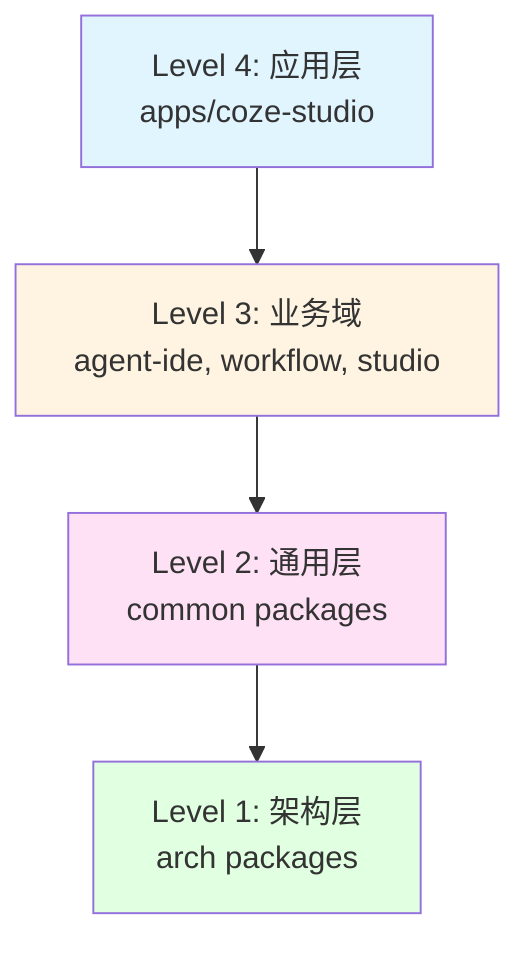
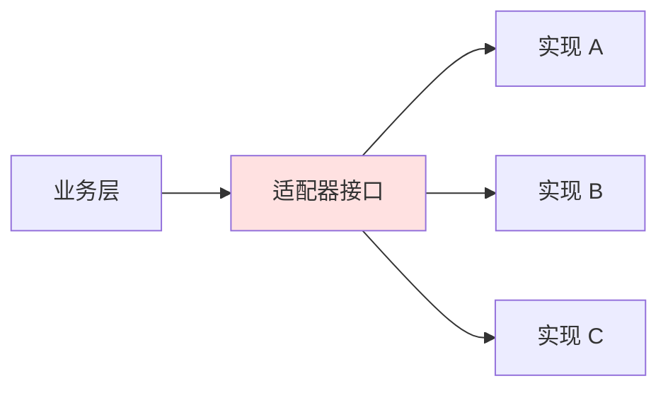

# 前端架构

本文档详细介绍 Coze Plus 前端项目的技术架构、技术栈、包管理和开发规范。

## 技术栈概览

### 核心技术

| 技术 | 版本 | 说明 |
|------|------|------|
| **React** | 18.2.0 | UI 框架 |
| **TypeScript** | 5.8.2 | 类型系统 |
| **Rsbuild** | 1.1.0 | 构建工具（基于 Rspack） |
| **Rspack** | 0.7+ | 高性能打包工具 |
| **Rush.js** | 5.147.1 | Monorepo 管理工具 |
| **pnpm** | 8.15.8 | 包管理器 |
| **Node.js** | >=21 | 运行环境 |

### UI 组件库

- **Semi Design**: 基础 UI 组件库
- **Tailwind CSS**: 原子化 CSS 框架
- **自定义组件**: `@coze-arch/bot-semi`、`@coze-arch/bot-icons`

### 状态管理

- **Zustand**: 轻量级状态管理
- **React Context**: 局部状态共享

### 路由

- **React Router DOM** v6.11.1: 客户端路由

### 构建工具链

- **Rsbuild**: 基于 Rspack 的构建工具，提供极速构建体验
- **Rspack**: Rust 编写的高性能打包工具
- **Vitest**: 单元测试框架
- **ESLint**: 代码检查
- **Stylelint**: 样式检查

## Monorepo 架构

### Rush.js 管理策略

Coze Plus 前端采用 Rush.js 管理的 Monorepo 架构，包含 **240+** 个 npm 包，分为 **4 个依赖层级**。



### 依赖层级说明

#### Level 1: 架构层 (arch/)

基础设施和核心能力，**不依赖**任何业务包。

```
frontend/packages/arch/
├── api-schema/                # API Schema 定义
├── bot-api/                   # API 封装
├── bot-env/                   # 环境配置
├── bot-env-adapter/           # 环境配置适配器
├── bot-error/                 # 错误处理
├── bot-flags/                 # 特性开关
├── bot-hooks/                 # 基础 Hooks
├── bot-hooks-adapter/         # Hooks 适配器
├── bot-hooks-base/            # Hooks 基础
├── bot-http/                  # HTTP 客户端
├── bot-md-box-adapter/        # Markdown 编辑器适配器
├── bot-monaco-editor/         # Monaco 编辑器封装
├── bot-space-api/             # 空间 API
├── bot-store/                 # 状态存储
├── bot-tea/                   # TEA 监控
├── bot-typings/               # 类型定义
├── bot-utils/                 # 工具函数
├── coze-design/               # 设计系统
├── foundation-sdk/            # 基础 SDK
├── i18n/                      # 国际化
├── logger/                    # 日志系统
├── web-context/               # Web 上下文
└── ... (共 39 个包)
```

**特点**:
- 纯技术组件，无业务逻辑
- 可被任何层级的包依赖
- 版本稳定，变更频率低

#### Level 2: 通用层 (common/)

可复用的通用组件和工具，依赖 Level 1。

```
frontend/packages/common/
├── flowgram-adapter/          # 流程图适配器
├── ui-components/             # 通用 UI 组件
├── utils/                     # 工具函数
├── hooks/                     # 通用 Hooks
└── ...
```

**特点**:
- 跨业务域复用
- 可被 Level 3、Level 4 依赖
- 包含适配器模式实现

#### Level 3: 业务域层

特定业务领域的功能模块，依赖 Level 1-2。

```
frontend/packages/
├── agent-ide/                 # Agent 开发 IDE (50+ 个包)
│   ├── entry-adapter/         # 入口适配器
│   ├── layout-adapter/        # 布局适配器
│   └── agent-publish/         # Agent 发布
├── workflow/                  # 工作流编辑器 (16 个包)
│   ├── playground-adapter/    # 工作流调试
│   └── workflow-editor/       # 工作流编辑
├── studio/                    # Studio 核心功能 (22 个包)
│   ├── workspace-adapter/     # 工作区适配器
│   ├── workspace-base/        # 工作区基础
│   └── bot-plugin-store/      # 插件商店
├── project-ide/               # 项目 IDE (15 个包)
│   └── project-editor/        # 项目编辑器
├── community/                 # 社区功能 (5 个包)
│   ├── enterprise/            # 企业功能
│   └── explore/               # 探索功能
├── components/                # 组件库 (12 个包)
│   └── ui-components/         # UI 组件
├── data/                      # 数据层 (5 个包)
│   └── data-models/           # 数据模型
├── devops/                    # DevOps 工具 (7 个包)
│   └── build-tools/           # 构建工具
└── foundation/                # 基础设施 (18 个包)
    └── foundation-utils/      # 基础工具
```

**特点**:
- 领域专属逻辑
- 独立开发和测试
- 可组合成完整应用

#### Level 4: 应用层 (apps/)

最终可部署的应用，依赖 Level 1-3。

```
frontend/apps/
└── coze-studio/               # 主应用
    ├── src/
    │   ├── index.tsx          # 应用入口
    │   ├── App.tsx            # 根组件
    │   ├── pages/             # 页面组件
    │   ├── components/        # 应用级组件
    │   ├── hooks/             # 应用级 Hooks
    │   └── routes/            # 路由配置
    ├── public/                # 静态资源
    ├── rsbuild.config.ts      # 构建配置
    └── package.json
```

**特点**:
- 组装所有业务模块
- 配置路由和全局状态
- 唯一的构建入口

## 项目结构

### 顶层目录

```
coze-plus/frontend/
├── apps/                      # 应用程序
│   └── coze-studio/           # 主应用
├── packages/                  # 所有包 (240+ 个)
│   ├── arch/                  # Level 1: 架构层 (39 个包)
│   ├── common/                # Level 2: 通用层 (15 个包)
│   ├── agent-ide/             # Level 3: Agent IDE (50+ 个包)
│   ├── workflow/              # Level 3: 工作流 (16 个包)
│   ├── studio/                # Level 3: Studio (22 个包)
│   ├── project-ide/           # Level 3: 项目 IDE (15 个包)
│   ├── community/             # Level 3: 社区 (5 个包)
│   ├── components/            # Level 3: 组件库 (12 个包)
│   ├── data/                  # Level 3: 数据层 (5 个包)
│   ├── devops/                # Level 3: DevOps (7 个包)
│   └── foundation/            # Level 3: 基础设施 (18 个包)
├── config/                    # 配置包
│   ├── eslint-config/         # ESLint 配置
│   ├── ts-config/             # TypeScript 配置
│   ├── stylelint-config/      # Stylelint 配置
│   └── ...
├── infra/                     # 基础设施
│   ├── eslint-plugin/         # ESLint 插件
│   └── utils/                 # 工具集
├── scripts/                   # 构建和工具脚本
├── rush.json                  # Rush 配置
└── .rushrc                    # Rush 本地配置
```

### 典型包结构

每个包遵循统一的结构规范：

```
@coze-xxx/package-name/
├── src/                       # 源代码
│   ├── index.ts              # 主入口
│   ├── components/           # 组件
│   ├── hooks/                # Hooks
│   ├── utils/                # 工具函数
│   ├── types/                # 类型定义
│   └── constants/            # 常量
├── __tests__/                # 测试文件
│   └── index.test.ts
├── package.json              # 包配置
├── tsconfig.json             # TypeScript 配置
├── eslint.config.js          # ESLint 配置
├── vitest.config.ts          # Vitest 配置（可选）
└── README.md                 # 文档
```

## 构建系统

### Rsbuild 配置

主应用使用 Rsbuild 进行构建，配置文件位于 `apps/coze-studio/rsbuild.config.ts`。

**核心配置**:

```typescript
import { defineConfig } from '@rsbuild/core';
import { pluginReact } from '@rsbuild/plugin-react';

export default defineConfig({
  // 插件
  plugins: [pluginReact()],

  // 开发服务器
  server: {
    port: 3000,
    proxy: {
      '/api': {
        target: 'http://localhost:8888',
        changeOrigin: true,
      },
    },
  },

  // 源码配置
  source: {
    entry: {
      index: './src/index.tsx',
    },
    alias: {
      '@': './src',
    },
  },

  // 输出配置
  output: {
    distPath: {
      root: 'dist',
    },
    cleanDistPath: true,
  },

  // 性能优化
  performance: {
    chunkSplit: {
      strategy: 'split-by-experience',
    },
  },
});
```

### 构建命令

```bash
# 开发模式（热重载）
npm run dev

# 生产构建
npm run build

# 预览构建结果
npm run preview
```

### 构建优化

- **代码分割**: 自动按路由和模块分割代码
- **Tree Shaking**: 移除未使用的代码
- **压缩**: JavaScript、CSS、HTML 压缩
- **资源优化**: 图片压缩和优化
- **缓存**: 文件名哈希，利用浏览器缓存

## 包管理

### Rush 命令

```bash
# 安装所有包的依赖
rush update

# 完全重新安装
rush update --full

# 构建所有包
rush build

# 构建特定包及其依赖
rush rebuild -o @coze-studio/app

# 添加依赖（在包目录下）
rush add -p <package-name>

# 运行测试
rush test

# 代码检查
rush lint

# 提交代码（使用 conventional commits）
rush commit
```

### 包依赖管理

**工作区依赖**: 使用 `workspace:*` 引用内部包

```json
{
  "dependencies": {
    "@coze-arch/i18n": "workspace:*",
    "@coze-arch/logger": "workspace:*"
  }
}
```

**外部依赖**: 版本统一管理

Rush 会确保所有包使用相同版本的公共依赖，避免重复安装。

### 包版本管理

```bash
# 更新包版本
rush version --bump

# 查看版本变更
rush change

# 发布（如需要）
rush publish
```

## 代码规范

### TypeScript 配置

基础配置在 `@coze-arch/ts-config`:

```json
{
  "compilerOptions": {
    "target": "ES2020",
    "module": "ESNext",
    "lib": ["ES2020", "DOM", "DOM.Iterable"],
    "jsx": "react-jsx",
    "strict": true,
    "moduleResolution": "bundler",
    "esModuleInterop": true,
    "skipLibCheck": true,
    "resolveJsonModule": true,
    "isolatedModules": true,
    "noEmit": true
  }
}
```

### ESLint 规则

基础配置在 `@coze-arch/eslint-config`:

```javascript
module.exports = {
  extends: [
    'eslint:recommended',
    'plugin:react/recommended',
    'plugin:react-hooks/recommended',
    'plugin:@typescript-eslint/recommended',
  ],
  rules: {
    'react/react-in-jsx-scope': 'off',
    '@typescript-eslint/no-explicit-any': 'warn',
    // ... 其他规则
  },
};
```

### 代码风格

- **命名规范**:
  - 组件: PascalCase (`UserProfile.tsx`)
  - Hooks: camelCase with `use` prefix (`useAuth.ts`)
  - 工具函数: camelCase (`formatDate.ts`)
  - 常量: UPPER_SNAKE_CASE (`API_BASE_URL`)
  - 类型: PascalCase (`UserInfo`)

- **文件组织**:
  - 一个文件一个组件
  - 相关文件放在同一目录
  - index.ts 作为目录入口

- **导入顺序**:
  1. React 和第三方库
  2. 内部包依赖
  3. 相对路径导入
  4. 类型导入

```typescript
// 示例
import React, { useState } from 'react';
import { Button } from '@douyinfe/semi-ui';

import { useAuth } from '@coze-arch/foundation-sdk';
import { logger } from '@coze-arch/logger';

import { UserCard } from './components/UserCard';
import { formatDate } from './utils';

import type { User } from '@coze-arch/types';
```

## 测试策略

### 测试框架

使用 **Vitest** 进行单元测试和集成测试。

```typescript
// 示例测试
import { describe, it, expect } from 'vitest';
import { render, screen } from '@testing-library/react';
import { UserCard } from './UserCard';

describe('UserCard', () => {
  it('renders user name', () => {
    const user = { name: 'John Doe', email: 'john@example.com' };
    render(<UserCard user={user} />);
    expect(screen.getByText('John Doe')).toBeInTheDocument();
  });
});
```

### 测试覆盖率要求

根据包的层级设定不同的覆盖率目标：

| 层级 | 覆盖率要求 | 增量覆盖率 |
|------|-----------|-----------|
| Level 1 | 80% | 90% |
| Level 2 | 30% | 60% |
| Level 3-4 | 灵活 | 灵活 |

### 运行测试

```bash
# 运行所有测试
rush test

# 在特定包中运行测试
cd frontend/packages/arch/i18n
npm run test

# 查看覆盖率
npm run test:cov
```

## 性能优化

### 构建性能

- **Rspack 优化**: Rust 实现，构建速度提升 5-10 倍
- **并行构建**: Rush 支持包级别并行构建
- **增量构建**: 只构建变更的包
- **缓存机制**: 构建结果缓存

### 运行时性能

- **代码分割**: 按路由和功能模块分割
- **懒加载**: React.lazy 动态导入组件
- **Tree Shaking**: 移除未使用代码
- **资源优化**: 图片懒加载、CDN 加速

### 打包优化

```typescript
// 懒加载示例
const AgentIDE = React.lazy(() => import('@coze-agent-ide/entry-adapter'));
const WorkflowEditor = React.lazy(() => import('@coze-workflow/playground-adapter'));

// 使用
<Suspense fallback={<Loading />}>
  <AgentIDE />
</Suspense>
```

## 开发工具

### VS Code 推荐扩展

- **ESLint**: 代码检查
- **Prettier**: 代码格式化
- **TypeScript**: TypeScript 支持
- **React DevTools**: React 调试
- **GitLens**: Git 增强

### 调试配置

`.vscode/launch.json`:

```json
{
  "version": "0.2.0",
  "configurations": [
    {
      "name": "Debug Frontend",
      "type": "chrome",
      "request": "launch",
      "url": "http://localhost:3000",
      "webRoot": "${workspaceFolder}/frontend/apps/coze-studio"
    }
  ]
}
```

## 国际化 (i18n)

### 架构

使用 `@coze-arch/i18n` 包提供国际化支持。

```typescript
import { useTranslation } from '@coze-arch/i18n';

function MyComponent() {
  const { t } = useTranslation();

  return <h1>{t('common.welcome')}</h1>;
}
```

### 语言资源

资源文件位于 `@coze-studio/studio-i18n-resource-adapter`:

```
studio-i18n-resource/
├── zh-CN/
│   ├── common.json
│   ├── agent.json
│   └── workflow.json
├── en-US/
│   ├── common.json
│   ├── agent.json
│   └── workflow.json
└── ja-JP/
    └── ...
```

## 适配器模式

### 设计理念

Coze Plus 前端广泛使用**适配器模式**实现解耦和可扩展性。



### 典型适配器包

- `@coze-agent-ide/entry-adapter`: Agent IDE 入口适配
- `@coze-agent-ide/layout-adapter`: 布局适配
- `@coze-workflow/playground-adapter`: 工作流调试适配
- `@coze-studio/workspace-adapter`: 工作区适配

### 适配器示例

```typescript
// 定义适配器接口
export interface WorkspaceAdapter {
  getProjects(): Promise<Project[]>;
  createProject(data: CreateProjectData): Promise<Project>;
  updateProject(id: string, data: UpdateProjectData): Promise<void>;
}

// 实现适配器
export class DefaultWorkspaceAdapter implements WorkspaceAdapter {
  async getProjects() {
    // 实现逻辑
  }

  async createProject(data) {
    // 实现逻辑
  }

  async updateProject(id, data) {
    // 实现逻辑
  }
}
```

## 最佳实践

### 1. 包依赖管理

✅ **推荐**:
```json
{
  "dependencies": {
    "react": "~18.2.0",                    // 固定小版本
    "@coze-arch/i18n": "workspace:*"       // 使用 workspace 协议
  }
}
```

❌ **避免**:
```json
{
  "dependencies": {
    "react": "*",                          // 不要使用 *
    "@coze-arch/i18n": "^1.0.0"           // 不要硬编码内部包版本
  }
}
```

### 2. 组件开发

✅ **推荐**:
```typescript
// 明确的类型定义
interface UserCardProps {
  user: User;
  onEdit?: (user: User) => void;
}

// 使用 React.FC 或直接函数组件
export function UserCard({ user, onEdit }: UserCardProps) {
  // 组件逻辑
}
```

### 3. 性能优化

✅ **推荐**:
```typescript
// 使用 React.memo 避免不必要的重渲染
export const ExpensiveComponent = React.memo(({ data }) => {
  // 组件逻辑
});

// 使用 useMemo 缓存计算结果
const sortedData = useMemo(() => {
  return data.sort((a, b) => a.name.localeCompare(b.name));
}, [data]);

// 使用 useCallback 缓存回调函数
const handleClick = useCallback(() => {
  // 处理逻辑
}, []);
```

### 4. 错误处理

✅ **推荐**:
```typescript
import { ErrorBoundary } from 'react-error-boundary';

<ErrorBoundary FallbackComponent={ErrorFallback}>
  <MyComponent />
</ErrorBoundary>
```

### 5. 代码分割

✅ **推荐**:
```typescript
// 路由级别分割
const AgentPage = React.lazy(() => import('./pages/Agent'));
const WorkflowPage = React.lazy(() => import('./pages/Workflow'));

// 大型组件分割
const HeavyEditor = React.lazy(() => import('./components/HeavyEditor'));
```

## 常见问题

### Rush 相关

**问题**: `rush update` 失败

**解决**:
```bash
# 清理缓存
rush purge

# 重新安装
rush update --full
```

**问题**: 包依赖冲突

**解决**:
检查 `common/config/rush/pnpm-lock.yaml`，确保版本一致。

### 构建相关

**问题**: 构建速度慢

**解决**:
- 启用增量构建
- 检查是否有循环依赖
- 使用 `rush rebuild -o <package>` 只构建特定包

**问题**: 内存溢出

**解决**:
```bash
# 增加 Node.js 内存限制
export NODE_OPTIONS="--max-old-space-size=8192"
rush build
```

## 下一步

- [开发流程](../guide/development-workflow.md) - 了解开发工作流
- [代码结构](./code-structure.md) - 详细的代码组织规范
- [后端架构](./backend.md) - 后端架构设计
- [API 参考](../api/) - API 文档
