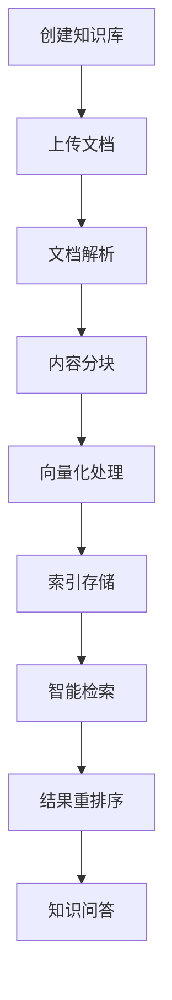
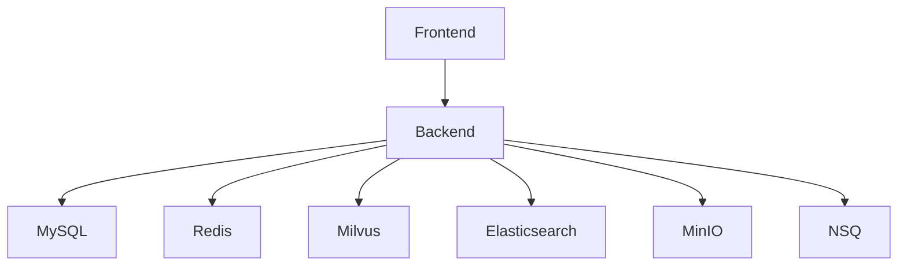

# Coze Studio 知识库技术架构文档

## 📋 文档概述

本文档详细介绍 Coze Studio 知识库系统的完整技术架构、核心组件实现和业务流程。知识库作为 AI Agent 的核心能力之一，为用户提供了文档管理、智能检索和知识问答的完整解决方案。

## 🏗️ 总体架构

### 架构设计原则

- **微服务架构**: 前后端分离，组件解耦
- **事件驱动**: 异步处理文档索引和向量化
- **多存储策略**: 向量库、搜索引擎、对象存储分层协作
- **组件化前端**: Rush.js 管理的 monorepo 架构

### 核心技术栈

**后端技术栈**:
- **语言**: Go 1.24.0
- **框架**: Hertz (字节跳动开源HTTP框架)
- **架构**: DDD (领域驱动设计)
- **消息队列**: NSQ
- **数据库**: MySQL 8.4.5 + Redis 8.0
- **向量数据库**: Milvus v2.5.10
- **搜索引擎**: Elasticsearch 8.18.0
- **对象存储**: MinIO 2025.1.18

**前端技术栈**:
- **语言**: TypeScript
- **框架**: React 18
- **构建工具**: Rsbuild (基于 Rspack)
- **UI库**: Semi Design + Tailwind CSS
- **状态管理**: Zustand
- **包管理**: Rush.js (Microsoft开源)

## 🔄 业务流程概述

### 知识库生命周期



### 核心业务流程

1. **知识库创建流程**
   ```
   用户创建知识库 → 前端表单验证 → 后端创建Knowledge实体 → 生成向量集合 → 返回知识库ID
   ```

2. **文档处理流程**
   ```
   文档上传 → 文件解析(文本/表格/图片) → 分块(Chunking) → 向量化 → 存储到向量库 → 索引完成
   ```

3. **知识检索流程**
   ```
   用户查询 → 查询重写 → 向量检索 + 全文检索 + NL2SQL → 重排序 → 返回相关片段
   ```

## 📁 代码结构说明

### 后端代码结构

```
backend/
├── api/                    # API层
│   ├── handler/coze/knowledge_service.go  # 知识库REST接口
│   └── model/              # API数据模型
├── application/           # 应用层
│   └── knowledge/         # 知识库业务逻辑编排
├── domain/               # 领域层
│   └── knowledge/        # 知识库核心业务模型
│       ├── entity/       # 业务实体
│       ├── internal/     # 内部实现 (dal, convert, events, consts, mock)
│       ├── processor/    # 文档处理器 (interface.go + impl/)
│       ├── repository/   # 数据仓库接口
│       └── service/      # 领域服务
├── infra/                # 基础设施层 (18个功能模块)
│   ├── cache/            # 缓存服务
│   ├── checkpoint/       # 检查点存储
│   ├── document/         # 文档处理
│   ├── embedding/        # 向量化服务
│   ├── es/               # Elasticsearch集成
│   ├── eventbus/         # 事件总线(NSQ)
│   ├── storage/          # 对象存储(MinIO)
│   ├── orm/              # ORM框架
│   ├── rdb/              # 关系数据库
│   └── ...               # 其他9个模块
└── crossdomain/          # 跨域服务
```

### 前端代码结构

```
frontend/packages/data/knowledge/
├── common/                           # 通用组件层 (Level 1)
│   ├── components/                   # 通用UI组件
│   ├── hooks/                       # 通用React Hooks
│   ├── services/                    # 通用业务服务
│   └── stores/                      # 全局状态管理
├── knowledge-resource-processor-*/   # 处理层 (Level 2)
│   ├── core/                        # 核心处理逻辑
│   ├── base/                        # 基础处理组件
│   └── adapter/                     # 适配器模式
├── knowledge-ide-*/                 # IDE层 (Level 3)
│   ├── base/                        # IDE基础框架
│   └── adapter/                     # 业务场景适配
└── knowledge-modal-*/               # 模态层 (Level 4)
    ├── base/                        # 弹窗基础组件
    └── adapter/                     # 弹窗业务适配
```

## 🚀 核心特性

### 文档类型支持

| 类型 | 支持格式 | 特殊功能 |
|------|----------|----------|
| 文本文档 | PDF, Word, Markdown, TXT | 智能分块、语义理解 |
| 表格文档 | Excel, CSV | 结构化查询、NL2SQL |
| 图片文档 | PNG, JPG, GIF | OCR识别、智能描述 |

### 检索能力

- **多路召回**: 向量检索 + 关键词检索 + 结构化查询
- **智能重排**: RRF算法 + 语义重排模型
- **查询优化**: 自动查询重写和扩展

### 性能特性

- **异步处理**: NSQ消息队列支持大文档异步处理
- **缓存策略**: Redis多层缓存提升响应速度
- **并发处理**: Go协程支持高并发文档处理
- **分布式存储**: 向量库、搜索引擎、对象存储分离部署

## 📊 技术指标

### 性能指标

- **文档处理**: 支持单文档100MB以内
- **并发用户**: 支持1000+并发访问
- **检索延迟**: 平均响应时间<200ms
- **存储容量**: 支持TB级文档存储

### 扩展性指标

- **水平扩展**: 支持向量库和搜索引擎集群
- **垂直扩展**: 支持GPU加速向量计算
- **多租户**: 支持工作空间级别隔离

## 🔧 部署架构

### Docker容器化部署

```yaml
services:
  # 核心存储服务
  mysql:          # 元数据存储
  redis:          # 缓存层
  milvus:         # 向量数据库
  elasticsearch:  # 全文搜索
  minio:          # 对象存储
  
  # 消息队列
  nsqlookupd:     # NSQ注册中心
  nsqd:           # NSQ消息代理
  nsqadmin:       # NSQ管理界面
  
  # 应用服务
  coze-backend:   # Go后端服务
  coze-frontend:  # React前端应用
```

### 服务依赖关系



## 📈 监控与运维

### 健康检查

- 每个服务提供 `/health`, `/health/live`, `/health/ready` 端点
- Prometheus指标暴露在 `/metrics` 端点
- 结构化JSON日志，支持文件轮转

### 运维工具

- **Atlas**: 数据库Schema管理和迁移
- **NSQ Admin**: 消息队列监控
- **Milvus Insight**: 向量数据库管理
- **Kibana**: 日志分析和可视化

## 🔗 相关文档

- [文档工程技术详解](./knowledge-document-processing.md)
- [检索工程技术详解](./knowledge-retrieval-system.md)
- [存储工程技术详解](./knowledge-storage-system.md)
- [前端工程技术详解](./knowledge-frontend-architecture.md)
- [快速开始指南](../../guide/getting-started.md)
- [环境配置指南](../../guide/environment-setup.md)

---

**文档版本**: v1.0  
**最后更新**: 2025-10-27  
**维护者**: Coze Studio Team