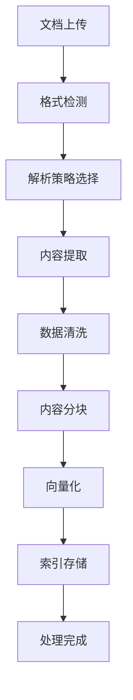
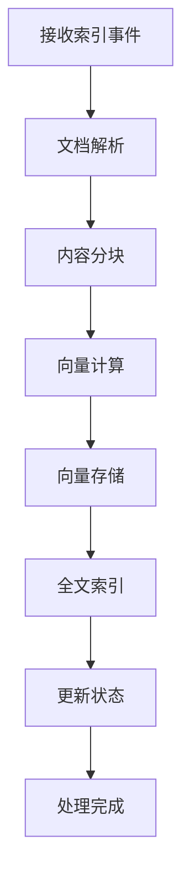

# 知识库文档工程技术详解

## 📋 概述

文档工程是知识库系统的核心模块，负责将用户上传的各种格式文档转换为可检索的结构化数据。本文档详细介绍文档解析、分块处理、向量化等关键技术的实现原理和代码实现。

## 🏗️ 整体架构

### 文档处理流程



### 核心组件

```
文档处理器架构
├── Parser Manager        # 解析器管理
├── Document Processor    # 文档处理器
├── Chunking Strategy     # 分块策略
├── Event System         # 事件系统
└── Progress Tracking    # 进度追踪
```

## 🔧 文档解析实现

### 解析器接口设计

**位置**: `backend/infra/document/parser/`

```go
// 解析器管理器接口
type Manager interface {
    GetParser(config ParseConfig) (Parser, error)
    IsAutoAnnotationSupported() bool
}

// 文档解析器接口
type Parser interface {
    Parse(ctx context.Context, reader io.Reader) ([]*Document, error)
    GetSupportedExtensions() []FileExtension
}

// 解析配置
type ParseConfig struct {
    FileExtension   FileExtension
    DocumentType    DocumentType
    ParsingStrategy *ParsingStrategy
}
```

### 支持的文档类型

| 文档类型 | 文件扩展名 | 解析器实现 | 特殊功能 |
|----------|------------|------------|----------|
| **文本文档** | `.pdf`, `.docx`, `.md`, `.txt` | `builtin.TextParser` | 结构化提取、元数据解析 |
| **表格文档** | `.xlsx`, `.csv` | `builtin.TableParser` | 多Sheet支持、数据类型推断 |
| **图片文档** | `.png`, `.jpg`, `.gif` | `builtin.ImageParser` | OCR识别、智能标注 |

### 解析策略配置

**位置**: `backend/domain/knowledge/entity/strategy.go`

```go
// 解析策略
type ParsingStrategy struct {
    // 图片解析配置
    CaptionType    *parser.ImageAnnotationType  // 标注类型：手动/自动
    
    // PDF解析配置  
    FilterStrategy *FilterStrategy              // 过滤策略
    
    // 表格解析配置
    TableSheet     *TableSheet                  // Sheet配置
}

// 图片标注类型
type ImageAnnotationType int32
const (
    ImageAnnotationTypeManual ImageAnnotationType = 1  // 手动标注
    ImageAnnotationTypeModel  ImageAnnotationType = 2  // AI自动标注
)
```

### 文档解析实现细节

**位置**: `backend/infra/document/parser/impl/builtin/`

#### PDF文档解析

```go
func (p *pdfParser) Parse(ctx context.Context, reader io.Reader) ([]*Document, error) {
    // 1. PDF结构解析
    doc, err := pdf.ReadFrom(reader)
    if err != nil {
        return nil, err
    }
    
    // 2. 文本提取
    var content strings.Builder
    for i := 1; i <= doc.NumPage(); i++ {
        page, err := doc.GetPage(i)
        if err != nil {
            continue
        }
        text, err := page.GetPlainText()
        if err != nil {
            continue
        }
        content.WriteString(text)
    }
    
    // 3. 元数据提取
    metadata := extractPDFMetadata(doc)
    
    return []*Document{{
        Content:  content.String(),
        Metadata: metadata,
    }}, nil
}
```

#### 图片文档解析

```go
func (p *imageParser) Parse(ctx context.Context, reader io.Reader) ([]*Document, error) {
    imageData, err := io.ReadAll(reader)
    if err != nil {
        return nil, err
    }
    
    var content string
    
    // 根据解析策略选择处理方式
    switch p.config.CaptionType {
    case parser.ImageAnnotationTypeModel:
        // AI自动标注
        content, err = p.autoAnnotation(ctx, imageData)
    case parser.ImageAnnotationTypeManual:
        // 手动标注（返回空内容，等待用户输入）
        content = ""
    }
    
    return []*Document{{
        Content: content,
        Type:    DocumentTypeImage,
    }}, err
}

// AI自动标注实现
func (p *imageParser) autoAnnotation(ctx context.Context, imageData []byte) (string, error) {
    // 调用视觉理解模型生成图片描述
    model, err := p.modelFactory.GetVisionModel(ctx)
    if err != nil {
        return "", err
    }
    
    response, err := model.GenerateCaption(ctx, imageData)
    return response.Caption, err
}
```

## ✂️ 文档分块实现

### 分块策略设计

**位置**:
- 分块策略结构: `backend/domain/knowledge/entity/strategy.go`
- 分块类型定义: `backend/infra/document/parser/manager.go`

```go
// 分块策略 (定义在 entity/strategy.go)
type ChunkingStrategy struct {
    ChunkType       parser.ChunkType  // 分块类型
    ChunkSize       int              // 块大小（字符数）
    Separator       string           // 分隔符
    Overlap         int              // 重叠字符数
    TrimSpace       bool             // 去除空格
    TrimURLAndEmail bool             // 去除URL和邮箱
}

// 分块类型 (定义在 infra/document/parser/manager.go)
type ChunkType int64
const (
    ChunkTypeDefault ChunkType = 0  // 默认分块（自动）
    ChunkTypeCustom  ChunkType = 1  // 自定义分块
)
```

### 默认分块策略

**位置**: `backend/domain/knowledge/service/knowledge.go:929`

```go
func getDefaultChunkStrategy() *entity.ChunkingStrategy {
    return &entity.ChunkingStrategy{
        ChunkType:       parser.ChunkTypeDefault,
        ChunkSize:       consts.DefaultChunkSize,      // 1000字符
        Separator:       consts.DefaultSeparator,       // "\n\n"
        Overlap:         consts.DefaultOverlap,         // 100字符
        TrimSpace:       consts.DefaultTrimSpace,       // true
        TrimURLAndEmail: consts.DefaultTrimURLAndEmail, // true
    }
}
```

### 分块算法实现

#### 智能语义分块

```go
func (c *semanticChunker) Chunk(content string) ([]*Chunk, error) {
    // 1. 句子分割
    sentences := c.splitSentences(content)
    
    // 2. 语义相似度计算
    similarities := c.calculateSimilarities(sentences)
    
    // 3. 语义边界检测
    boundaries := c.detectBoundaries(similarities, c.threshold)
    
    // 4. 构建分块
    chunks := make([]*Chunk, 0)
    start := 0
    
    for _, boundary := range boundaries {
        chunkContent := strings.Join(sentences[start:boundary], " ")
        chunks = append(chunks, &Chunk{
            Content:  chunkContent,
            Position: start,
            Size:     len(chunkContent),
        })
        start = boundary
    }
    
    return chunks, nil
}
```

#### 固定长度分块

```go
func (c *fixedChunker) Chunk(content string) ([]*Chunk, error) {
    runes := []rune(content)
    chunks := make([]*Chunk, 0)
    
    for i := 0; i < len(runes); i += c.chunkSize - c.overlap {
        end := i + c.chunkSize
        if end > len(runes) {
            end = len(runes)
        }
        
        chunkContent := string(runes[i:end])
        chunks = append(chunks, &Chunk{
            Content:  chunkContent,
            Position: i,
            Size:     end - i,
        })
        
        if end == len(runes) {
            break
        }
    }
    
    return chunks, nil
}
```

## 🚀 文档处理器实现

### 文档处理器基类

**位置**: `backend/domain/knowledge/processor/impl/base.go`

```go
type baseDocProcessor struct {
    ctx            context.Context
    UserID         int64
    SpaceID        int64
    Documents      []*entity.Document
    documentSource *entity.DocumentSource
    
    // 数据库模型
    TableName   string
    docModels   []*model.KnowledgeDocument
    imageSlices []*model.KnowledgeDocumentSlice
    
    // 依赖注入
    storage       storage.Storage
    knowledgeRepo repository.KnowledgeRepo
    documentRepo  repository.KnowledgeDocumentRepo
    sliceRepo     repository.KnowledgeDocumentSliceRepo
    idgen         idgen.IDGenerator
    rdb           rdb.RDB
    producer      eventbus.Producer
    parseManager  parser.Manager
}
```

### 处理流程实现

#### 1. 构建数据库模型

```go
func (p *baseDocProcessor) BuildDBModel() error {
    p.docModels = make([]*model.KnowledgeDocument, 0, len(p.Documents))
    
    for i := range p.Documents {
        // 生成文档ID
        id, err := p.idgen.GenID(p.ctx)
        if err != nil {
            return errorx.New(errno.ErrKnowledgeIDGenCode)
        }
        
        // 构建文档模型
        docModel := &model.KnowledgeDocument{
            ID:            id,
            KnowledgeID:   p.Documents[i].KnowledgeID,
            Name:          p.Documents[i].Name,
            FileExtension: string(p.Documents[i].FileExtension),
            URI:           p.Documents[i].URI,
            DocumentType:  int32(p.Documents[i].Type),
            CreatorID:     p.UserID,
            SpaceID:       p.SpaceID,
            SourceType:    int32(p.Documents[i].Source),
            Status:        int32(knowledge.KnowledgeStatusInit),
            ParseRule: &model.DocumentParseRule{
                ParsingStrategy:  p.Documents[i].ParsingStrategy,
                ChunkingStrategy: p.Documents[i].ChunkingStrategy,
            },
            CreatedAt: time.Now().UnixMilli(),
            UpdatedAt: time.Now().UnixMilli(),
        }
        
        p.Documents[i].ID = docModel.ID
        p.docModels = append(p.docModels, docModel)
    }
    
    return nil
}
```

#### 2. 表格文档特殊处理

```go
func (p *baseDocProcessor) createTable() error {
    if len(p.Documents) == 1 && p.Documents[0].Type == knowledge.DocumentTypeTable {
        // 表格知识库，创建物理表
        rdbColumns := []*rdbEntity.Column{}
        tableColumns := p.Documents[0].TableInfo.Columns
        
        // 生成列ID
        columnIDs, err := p.idgen.GenMultiIDs(p.ctx, len(tableColumns)+1)
        if err != nil {
            return errorx.New(errno.ErrKnowledgeIDGenCode)
        }
        
        // 构建数据库列定义
        for i := range tableColumns {
            tableColumns[i].ID = columnIDs[i]
            rdbColumns = append(rdbColumns, &rdbEntity.Column{
                Name:     convert.ColumnIDToRDBField(columnIDs[i]),
                DataType: convert.ConvertColumnType(tableColumns[i].Type),
                NotNull:  tableColumns[i].Indexing,
            })
        }
        
        // 添加主键ID列
        rdbColumns = append(rdbColumns, &rdbEntity.Column{
            Name:     consts.RDBFieldID,
            DataType: rdbEntity.TypeBigInt,
            NotNull:  true,
        })
        
        // 创建物理表
        resp, err := p.rdb.CreateTable(p.ctx, &rdb.CreateTableRequest{
            Table: &rdbEntity.Table{
                Columns: rdbColumns,
                Indexes: []*rdbEntity.Index{
                    {
                        Name:    "pk",
                        Type:    rdbEntity.PrimaryKey,
                        Columns: []string{consts.RDBFieldID},
                    },
                },
            },
        })
        
        if err != nil {
            return errorx.New(errno.ErrKnowledgeCrossDomainCode, errorx.KV("msg", err.Error()))
        }
        
        p.TableName = resp.Table.Name
        p.Documents[0].TableInfo.PhysicalTableName = p.TableName
    }
    
    return nil
}
```

## ⚡ 异步向量化处理

### 事件驱动架构

**位置**: `backend/domain/knowledge/internal/events/`

```go
// 文档索引事件
type IndexDocumentEvent struct {
    KnowledgeID int64              `json:"knowledge_id"`
    Document    *entity.Document   `json:"document"`
}

// 文档片段索引事件
type IndexSliceEvent struct {
    Slice    *entity.Slice      `json:"slice"`
    Document *entity.Document   `json:"document"`
}

// 删除知识库数据事件
type DeleteKnowledgeDataEvent struct {
    KnowledgeID int64   `json:"knowledge_id"`
    SliceIDs    []int64 `json:"slice_ids"`
}
```

### 异步处理触发

**位置**: `backend/domain/knowledge/processor/impl/base.go:253`

```go
func (p *baseDocProcessor) Indexing() error {
    // 创建文档索引事件
    event := events.NewIndexDocumentsEvent(p.Documents[0].KnowledgeID, p.Documents)
    
    // 序列化事件
    body, err := sonic.Marshal(event)
    if err != nil {
        return errorx.New(errno.ErrKnowledgeParseJSONCode, errorx.KV("msg", err.Error()))
    }
    
    // 发送到NSQ消息队列
    if err = p.producer.Send(p.ctx, body); err != nil {
        logs.CtxErrorf(p.ctx, "send message failed, err: %v", err)
        return errorx.New(errno.ErrKnowledgeMQSendFailCode, errorx.KV("msg", err.Error()))
    }
    
    return nil
}
```

### 向量化处理流程



## 📊 进度追踪实现

### 进度缓存设计

**位置**: `backend/infra/document/progressbar/`

```go
type ProgressBar struct {
    documentID int64
    totalSteps int
    cacheCli   cache.Cmdable
    inMemory   bool
}

func (p *ProgressBar) UpdateProgress(ctx context.Context, step int, message string) error {
    percent := float64(step) / float64(p.totalSteps) * 100
    
    progress := ProgressInfo{
        Percent:     percent,
        Step:        step,
        TotalSteps:  p.totalSteps,
        Message:     message,
        UpdatedAt:   time.Now().Unix(),
    }
    
    // 缓存进度信息
    key := fmt.Sprintf("doc_progress:%d", p.documentID)
    data, _ := json.Marshal(progress)
    
    return p.cacheCli.Set(ctx, key, data, 30*time.Minute).Err()
}
```

### 实时进度查询

**位置**: `backend/domain/knowledge/service/knowledge.go:554`

```go
func (k *knowledgeSVC) getProgressFromCache(ctx context.Context, documentProgress *DocumentProgress) error {
    progressBar := progressbar.NewProgressBar(ctx, documentProgress.ID, 0, k.cacheCli, false)
    percent, remainSec, errMsg := progressBar.GetProgress(ctx)
    
    documentProgress.Progress = int(percent)
    documentProgress.RemainingSec = int64(remainSec)
    
    if len(errMsg) != 0 {
        documentProgress.Status = entity.DocumentStatusFailed
        documentProgress.StatusMsg = errMsg
    }
    
    return nil
}
```

## 🔧 配置和优化

### 解析器配置

```go
// 解析器配置常量
const (
    DefaultChunkSize        = 1000        // 默认分块大小
    DefaultSeparator        = "\n\n"      // 默认分隔符
    DefaultOverlap          = 100         // 默认重叠字符数
    DefaultTrimSpace        = true        // 默认去除空格
    DefaultTrimURLAndEmail  = true        // 默认去除URL和邮箱
    
    MaxDocumentSize         = 100 * 1024 * 1024  // 最大文档大小 100MB
    MaxConcurrentParsing    = 10                 // 最大并发解析数
)
```

### 性能优化策略

1. **并发处理**: 多个文档并行解析
2. **内存优化**: 流式处理大文件
3. **缓存机制**: 解析结果缓存复用
4. **错误重试**: 解析失败自动重试
5. **进度反馈**: 实时进度更新

## 🚨 错误处理和监控

### 错误分类

| 错误类型 | 错误码 | 处理策略 |
|----------|--------|----------|
| 文件格式不支持 | `ErrKnowledgeUnsupportedFormat` | 返回用户友好提示 |
| 文件过大 | `ErrKnowledgeFileTooLarge` | 建议分割上传 |
| 解析失败 | `ErrKnowledgeParseFailCode` | 自动重试3次 |
| 向量化失败 | `ErrKnowledgeVectorizeFailCode` | 降级处理 |

### 监控指标

- 文档处理成功率
- 平均处理时间
- 并发处理数量
- 错误分布统计
- 资源使用情况

---

**文档版本**: v1.0  
**最后更新**: 2025-10-27  
**相关文档**: [知识库架构总览](./knowledge-base-architecture.md)