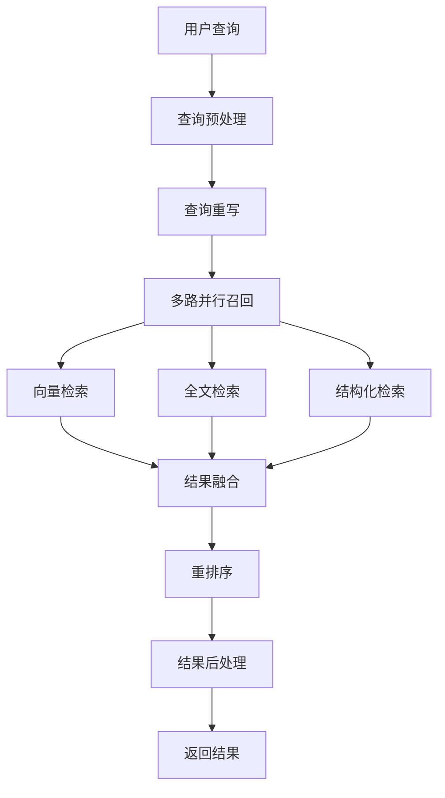

# 知识库检索工程技术详解

## 📋 概述

检索工程是知识库系统的核心能力，负责将用户的自然语言查询转换为精准的知识检索结果。本文档详细介绍多路召回、重排序、缓存等关键技术的实现原理和代码架构。

## 🏗️ 检索架构设计

### 检索流程概览



### 核心技术框架

本项目使用 **字节跳动开源的 Eino 框架** 构建检索链，这是一个专为 AI 应用设计的组合式编程框架。

**Eino 框架优势**:
- **组合式编程**: 链式和并行组合
- **类型安全**: 强类型检查
- **高性能**: 支持并发执行
- **可观测性**: 内置链路追踪

## 🔧 检索链实现

### 检索链构建

**位置**: `backend/domain/knowledge/service/retrieve.go:55`

```go
func (k *knowledgeSVC) Retrieve(ctx context.Context, request *RetrieveRequest) (*RetrieveResponse, error) {
    // 1. 构建检索上下文
    retrieveContext, err := k.newRetrieveContext(ctx, request)
    if err != nil {
        return nil, err
    }
    
    // 2. 构建 Eino 检索链
    chain := compose.NewChain[*RetrieveContext, []*knowledgeModel.RetrieveSlice]()
    
    // 3. 定义处理节点
    rewriteNode := compose.InvokableLambda(k.queryRewriteNode)           // 查询重写
    vectorRetrieveNode := compose.InvokableLambda(k.vectorRetrieveNode)  // 向量检索
    esRetrieveNode := compose.InvokableLambda(k.esRetrieveNode)         // ES检索
    nl2SqlRetrieveNode := compose.InvokableLambda(k.nl2SqlRetrieveNode) // NL2SQL检索
    passRequestContextNode := compose.InvokableLambda(k.passRequestContext) // 上下文传递
    reRankNode := compose.InvokableLambda(k.reRankNode)                 // 重排序
    packResult := compose.InvokableLambda(k.packResults)                // 结果打包
    
    // 4. 构建并行召回节点
    parallelNode := compose.NewParallel().
        AddLambda("vectorRetrieveNode", vectorRetrieveNode).
        AddLambda("esRetrieveNode", esRetrieveNode).
        AddLambda("nl2SqlRetrieveNode", nl2SqlRetrieveNode).
        AddLambda("passRequestContext", passRequestContextNode)
    
    // 5. 组装完整检索链
    r, err := chain.
        AppendLambda(rewriteNode).          // 查询重写
        AppendParallel(parallelNode).       // 并行召回
        AppendLambda(reRankNode).           // 重排序
        AppendLambda(packResult).           // 结果打包
        Compile(ctx)
    
    if err != nil {
        return nil, errorx.New(errno.ErrKnowledgeBuildRetrieveChainFailCode, errorx.KV("msg", err.Error()))
    }
    
    // 6. 执行检索链
    output, err := r.Invoke(ctx, retrieveContext)
    return &RetrieveResponse{Slices: output}, err
}
```

### 检索上下文设计

```go
type RetrieveContext struct {
    // 原始查询信息
    Query               string
    KnowledgeIDs        []int64
    TopK                int
    ScoreThreshold      float64
    
    // 重写后的查询
    RewrittenQueries    []string
    
    // 检索结果
    VectorResults       []*VectorRetrieveResult
    ESResults          []*ESRetrieveResult
    NL2SQLResults      []*NL2SQLRetrieveResult
    
    // 上下文信息
    Documents          []*entity.Document
    SearchStoreMap     map[int64]searchstore.SearchStore
    
    // 配置参数
    EnableRewrite      bool
    EnableRerank       bool
    RerankTopK         int
}
```

## 🚀 多路召回实现

### 1. 向量检索

**核心思想**: 基于语义相似度的密集检索

```go
func (k *knowledgeSVC) vectorRetrieveNode(ctx context.Context, retrieveCtx *RetrieveContext) (*RetrieveContext, error) {
    var allResults []*VectorRetrieveResult
    
    // 对每个知识库并行检索
    for knowledgeID, searchStore := range retrieveCtx.SearchStoreMap {
        // 构建检索请求
        retrieveRequest := &retriever.RetrieveRequest{
            Query:  retrieveCtx.Query,
            TopK:   retrieveCtx.TopK,
            Option: map[string]interface{}{
                "score_threshold": retrieveCtx.ScoreThreshold,
                "collection_name": getCollectionName(knowledgeID),
            },
        }
        
        // 执行向量检索
        retrieveResp, err := searchStore.Retrieve(ctx, retrieveRequest)
        if err != nil {
            logs.CtxErrorf(ctx, "vector retrieve failed: %v", err)
            continue
        }
        
        // 转换检索结果
        for _, doc := range retrieveResp.Documents {
            result := &VectorRetrieveResult{
                SliceID:     extractSliceID(doc.ID),
                Score:       doc.Score,
                Content:     doc.Content,
                KnowledgeID: knowledgeID,
                Source:      "vector",
            }
            allResults = append(allResults, result)
        }
    }
    
    // 按分数排序
    sort.Slice(allResults, func(i, j int) bool {
        return allResults[i].Score > allResults[j].Score
    })
    
    retrieveCtx.VectorResults = allResults
    return retrieveCtx, nil
}
```

### 2. 全文检索 (Elasticsearch)

**核心思想**: 基于关键词匹配的稀疏检索

```go
func (k *knowledgeSVC) esRetrieveNode(ctx context.Context, retrieveCtx *RetrieveContext) (*RetrieveContext, error) {
    var allResults []*ESRetrieveResult
    
    for knowledgeID, searchStore := range retrieveCtx.SearchStoreMap {
        // 构建ES查询
        query := buildESQuery(retrieveCtx.Query)
        
        retrieveRequest := &retriever.RetrieveRequest{
            Query:  query,
            TopK:   retrieveCtx.TopK,
            Option: map[string]interface{}{
                "index_name": getIndexName(knowledgeID),
                "highlight": map[string]interface{}{
                    "fields": map[string]interface{}{
                        "content": map[string]interface{}{},
                    },
                },
            },
        }
        
        // 执行ES检索
        retrieveResp, err := searchStore.Retrieve(ctx, retrieveRequest)
        if err != nil {
            logs.CtxErrorf(ctx, "es retrieve failed: %v", err)
            continue
        }
        
        // 处理检索结果
        for _, doc := range retrieveResp.Documents {
            result := &ESRetrieveResult{
                SliceID:     extractSliceID(doc.ID),
                Score:       doc.Score,
                Content:     doc.Content,
                Highlight:   extractHighlight(doc.Metadata),
                KnowledgeID: knowledgeID,
                Source:      "elasticsearch",
            }
            allResults = append(allResults, result)
        }
    }
    
    retrieveCtx.ESResults = allResults
    return retrieveCtx, nil
}

// 构建ES查询DSL
func buildESQuery(userQuery string) string {
    queryDSL := map[string]interface{}{
        "query": map[string]interface{}{
            "bool": map[string]interface{}{
                "should": []interface{}{
                    // 精确匹配
                    map[string]interface{}{
                        "match_phrase": map[string]interface{}{
                            "content": map[string]interface{}{
                                "query": userQuery,
                                "boost": 3.0,
                            },
                        },
                    },
                    // 模糊匹配
                    map[string]interface{}{
                        "match": map[string]interface{}{
                            "content": map[string]interface{}{
                                "query":     userQuery,
                                "boost":     2.0,
                                "fuzziness": "AUTO",
                            },
                        },
                    },
                    // 多字段匹配
                    map[string]interface{}{
                        "multi_match": map[string]interface{}{
                            "query":  userQuery,
                            "fields": []string{"title^2", "content"},
                            "boost":  1.0,
                        },
                    },
                },
                "minimum_should_match": 1,
            },
        },
    }
    
    jsonBytes, _ := json.Marshal(queryDSL)
    return string(jsonBytes)
}
```

### 3. 结构化检索 (NL2SQL)

**核心思想**: 自然语言转SQL查询表格数据

```go
func (k *knowledgeSVC) nl2SqlRetrieveNode(ctx context.Context, retrieveCtx *RetrieveContext) (*RetrieveContext, error) {
    var allResults []*NL2SQLRetrieveResult
    
    // 只对表格类型文档执行NL2SQL检索
    tableDocuments := filterTableDocuments(retrieveCtx.Documents)
    if len(tableDocuments) == 0 {
        retrieveCtx.NL2SQLResults = allResults
        return retrieveCtx, nil
    }
    
    for _, doc := range tableDocuments {
        // 构建表结构描述
        schema := buildTableSchema(doc.TableInfo)
        
        // 调用NL2SQL服务
        nl2sqlRequest := &nl2sql.TranslateRequest{
            Query:        retrieveCtx.Query,
            TableSchema:  schema,
            DatabaseType: "mysql",
        }
        
        sqlResponse, err := k.nl2Sql.Translate(ctx, nl2sqlRequest)
        if err != nil {
            logs.CtxErrorf(ctx, "nl2sql translate failed: %v", err)
            continue
        }
        
        // 执行SQL查询
        queryRequest := &rdb.QueryDataRequest{
            TableName: doc.TableInfo.PhysicalTableName,
            SQL:       sqlResponse.SQL,
            Limit:     retrieveCtx.TopK,
        }
        
        queryResponse, err := k.rdb.QueryData(ctx, queryRequest)
        if err != nil {
            logs.CtxErrorf(ctx, "sql query failed: %v", err)
            continue
        }
        
        // 构建结果
        for _, row := range queryResponse.Rows {
            result := &NL2SQLRetrieveResult{
                SliceID:     extractSliceIDFromRow(row),
                Content:     formatRowAsText(row, doc.TableInfo.Columns),
                SQL:         sqlResponse.SQL,
                KnowledgeID: doc.KnowledgeID,
                Source:      "nl2sql",
                Score:       1.0, // NL2SQL结果固定高分
            }
            allResults = append(allResults, result)
        }
    }
    
    retrieveCtx.NL2SQLResults = allResults
    return retrieveCtx, nil
}

// 构建表结构描述
func buildTableSchema(tableInfo *entity.TableInfo) *nl2sql.TableSchema {
    columns := make([]*nl2sql.Column, 0, len(tableInfo.Columns))
    
    for _, col := range tableInfo.Columns {
        columns = append(columns, &nl2sql.Column{
            Name:        col.Name,
            Type:        convertColumnType(col.Type),
            Description: col.Description,
            IsPrimary:   col.Name == "id",
            IsNullable:  !col.Indexing,
        })
    }
    
    return &nl2sql.TableSchema{
        TableName:   tableInfo.VirtualTableName,
        Description: tableInfo.TableDesc,
        Columns:     columns,
    }
}
```

## 🎯 查询重写实现

### 查询重写策略

```go
func (k *knowledgeSVC) queryRewriteNode(ctx context.Context, retrieveCtx *RetrieveContext) (*RetrieveContext, error) {
    if !retrieveCtx.EnableRewrite || k.rewriter == nil {
        retrieveCtx.RewrittenQueries = []string{retrieveCtx.Query}
        return retrieveCtx, nil
    }
    
    // 构建重写请求
    rewriteRequest := &messages2query.MessagesToQueryRequest{
        Messages: []*messages2query.Message{
            {
                Role:    "user",
                Content: retrieveCtx.Query,
            },
        },
        Context: buildRewriteContext(retrieveCtx),
    }
    
    // 执行查询重写
    rewriteResponse, err := k.rewriter.Rewrite(ctx, rewriteRequest)
    if err != nil {
        logs.CtxErrorf(ctx, "query rewrite failed: %v", err)
        retrieveCtx.RewrittenQueries = []string{retrieveCtx.Query}
        return retrieveCtx, nil
    }
    
    // 合并原查询和重写查询
    queries := []string{retrieveCtx.Query}
    for _, query := range rewriteResponse.Queries {
        if query != retrieveCtx.Query {
            queries = append(queries, query)
        }
    }
    
    retrieveCtx.RewrittenQueries = queries
    return retrieveCtx, nil
}

// 构建重写上下文
func buildRewriteContext(retrieveCtx *RetrieveContext) map[string]interface{} {
    return map[string]interface{}{
        "knowledge_domains": extractDomains(retrieveCtx.Documents),
        "document_types":    extractDocumentTypes(retrieveCtx.Documents),
        "table_schemas":     extractTableSchemas(retrieveCtx.Documents),
    }
}
```

## 🔄 重排序实现

### 重排序策略

```go
func (k *knowledgeSVC) reRankNode(ctx context.Context, retrieveCtx *RetrieveContext) (*RetrieveContext, error) {
    if !retrieveCtx.EnableRerank {
        return retrieveCtx, nil
    }
    
    // 1. 收集所有检索结果
    allResults := collectAllResults(retrieveCtx)
    if len(allResults) == 0 {
        return retrieveCtx, nil
    }
    
    // 2. RRF 算法融合多路结果
    rrfResults := k.applyRRF(allResults)
    
    // 3. 语义重排序
    if k.reranker != nil && len(rrfResults) > 1 {
        rerankResults, err := k.applySemanticRerank(ctx, retrieveCtx.Query, rrfResults)
        if err != nil {
            logs.CtxErrorf(ctx, "semantic rerank failed: %v", err)
        } else {
            rrfResults = rerankResults
        }
    }
    
    // 4. 更新检索上下文
    retrieveCtx.FinalResults = rrfResults[:min(len(rrfResults), retrieveCtx.RerankTopK)]
    return retrieveCtx, nil
}

// RRF (Reciprocal Rank Fusion) 算法实现
func (k *knowledgeSVC) applyRRF(allResults []*RetrieveResult) []*RetrieveResult {
    const k = 60.0 // RRF 常数
    
    // 按来源分组
    sourceGroups := make(map[string][]*RetrieveResult)
    for _, result := range allResults {
        sourceGroups[result.Source] = append(sourceGroups[result.Source], result)
    }
    
    // 为每个来源的结果排序
    for source, results := range sourceGroups {
        sort.Slice(results, func(i, j int) bool {
            return results[i].Score > results[j].Score
        })
    }
    
    // 计算RRF分数
    rrfScores := make(map[string]float64)
    for source, results := range sourceGroups {
        for rank, result := range results {
            key := fmt.Sprintf("%d_%s", result.SliceID, result.Source)
            rrfScores[key] += 1.0 / (k + float64(rank+1))
        }
    }
    
    // 去重并按RRF分数排序
    uniqueResults := make(map[int64]*RetrieveResult)
    for _, result := range allResults {
        key := fmt.Sprintf("%d_%s", result.SliceID, result.Source)
        if existing, exists := uniqueResults[result.SliceID]; !exists || rrfScores[key] > existing.RRFScore {
            result.RRFScore = rrfScores[key]
            uniqueResults[result.SliceID] = result
        }
    }
    
    // 转换为切片并排序
    finalResults := make([]*RetrieveResult, 0, len(uniqueResults))
    for _, result := range uniqueResults {
        finalResults = append(finalResults, result)
    }
    
    sort.Slice(finalResults, func(i, j int) bool {
        return finalResults[i].RRFScore > finalResults[j].RRFScore
    })
    
    return finalResults
}

// 语义重排序实现
func (k *knowledgeSVC) applySemanticRerank(ctx context.Context, query string, results []*RetrieveResult) ([]*RetrieveResult, error) {
    // 构建重排序文档
    documents := make([]rerank.Document, 0, len(results))
    for i, result := range results {
        documents = append(documents, rerank.Document{
            ID:      strconv.Itoa(i),
            Content: result.Content,
        })
    }
    
    // 执行重排序
    rerankRequest := &rerank.RerankRequest{
        Query:     query,
        Documents: documents,
        TopK:      len(documents),
    }
    
    rerankResponse, err := k.reranker.Rerank(ctx, rerankRequest)
    if err != nil {
        return nil, err
    }
    
    // 重新排序结果
    rerankedResults := make([]*RetrieveResult, 0, len(rerankResponse.Documents))
    for _, doc := range rerankResponse.Documents {
        index, _ := strconv.Atoi(doc.ID)
        if index < len(results) {
            result := results[index]
            result.RerankScore = doc.Score
            rerankedResults = append(rerankedResults, result)
        }
    }
    
    return rerankedResults, nil
}
```

## 💾 缓存策略实现

### 多层缓存架构

```go
type CacheManager struct {
    // L1: 内存缓存 (进程内)
    memoryCache *sync.Map
    
    // L2: Redis缓存 (分布式)
    redisCache cache.Cmdable
    
    // 缓存配置
    config CacheConfig
}

type CacheConfig struct {
    MemoryCacheSize    int           // 内存缓存大小
    MemoryExpire      time.Duration // 内存缓存过期时间
    RedisExpire       time.Duration // Redis缓存过期时间
    EnableCompression bool          // 是否启用压缩
}
```

### 检索结果缓存

```go
func (k *knowledgeSVC) getCachedResults(ctx context.Context, cacheKey string) ([]*RetrieveResult, bool) {
    // L1: 检查内存缓存
    if value, ok := k.memoryCache.Load(cacheKey); ok {
        if cachedResults, ok := value.([]*RetrieveResult); ok {
            return cachedResults, true
        }
    }
    
    // L2: 检查Redis缓存
    cmd := k.redisCache.Get(ctx, cacheKey)
    if cmd.Err() == nil {
        var cachedResults []*RetrieveResult
        if err := json.Unmarshal([]byte(cmd.Val()), &cachedResults); err == nil {
            // 回填内存缓存
            k.memoryCache.Store(cacheKey, cachedResults)
            return cachedResults, true
        }
    }
    
    return nil, false
}

func (k *knowledgeSVC) setCachedResults(ctx context.Context, cacheKey string, results []*RetrieveResult) {
    // 存储到内存缓存
    k.memoryCache.Store(cacheKey, results)
    
    // 存储到Redis缓存
    if data, err := json.Marshal(results); err == nil {
        k.redisCache.Set(ctx, cacheKey, data, k.config.RedisExpire)
    }
}

// 生成缓存键
func generateCacheKey(request *RetrieveRequest) string {
    hasher := sha256.New()
    hasher.Write([]byte(request.Query))
    hasher.Write([]byte(fmt.Sprintf("%v", request.KnowledgeIDs)))
    hasher.Write([]byte(fmt.Sprintf("%d_%f", request.TopK, request.ScoreThreshold)))
    
    return fmt.Sprintf("retrieve:%x", hasher.Sum(nil))
}
```

### 预热策略

```go
// 热点查询预热
func (k *knowledgeSVC) warmupCache(ctx context.Context) {
    // 获取热点查询
    hotQueries := k.getHotQueries(ctx)
    
    // 并发预热
    var wg sync.WaitGroup
    semaphore := make(chan struct{}, 10) // 限制并发数
    
    for _, query := range hotQueries {
        wg.Add(1)
        go func(q string) {
            defer wg.Done()
            semaphore <- struct{}{}
            defer func() { <-semaphore }()
            
            // 执行预热查询
            request := &RetrieveRequest{
                Query:        q,
                KnowledgeIDs: k.getAllKnowledgeIDs(ctx),
                TopK:         20,
            }
            
            _, _ = k.Retrieve(ctx, request)
        }(query)
    }
    
    wg.Wait()
}
```

## 📊 性能监控

### 性能指标收集

```go
type RetrieveMetrics struct {
    // 延迟指标
    TotalLatency       time.Duration
    RewriteLatency     time.Duration
    VectorLatency      time.Duration
    ESLatency          time.Duration
    NL2SQLLatency      time.Duration
    RerankLatency      time.Duration
    
    // 召回指标
    VectorRecallCount  int
    ESRecallCount      int
    NL2SQLRecallCount  int
    FinalResultCount   int
    
    // 缓存指标
    CacheHitRate       float64
    CacheQueryCount    int
    
    // 错误指标
    ErrorCount         int
    ErrorRate          float64
}

func (k *knowledgeSVC) recordMetrics(ctx context.Context, metrics *RetrieveMetrics) {
    // 记录到Prometheus
    retrieveLatencyHistogram.Observe(metrics.TotalLatency.Seconds())
    cacheHitRateGauge.Set(metrics.CacheHitRate)
    
    // 记录到日志
    logs.CtxInfof(ctx, "retrieve metrics: %+v", metrics)
}
```

## 🚨 故障处理

### 降级策略

```go
func (k *knowledgeSVC) handleRetrieveFailure(ctx context.Context, retrieveCtx *RetrieveContext, err error) *RetrieveResponse {
    logs.CtxErrorf(ctx, "retrieve failed, applying fallback strategy: %v", err)
    
    // 1. 尝试缓存降级
    if cachedResults := k.getCachedFallbackResults(ctx, retrieveCtx.Query); len(cachedResults) > 0 {
        return &RetrieveResponse{Slices: cachedResults}
    }
    
    // 2. 简化检索策略
    if simpleResults := k.simpleKeywordSearch(ctx, retrieveCtx); len(simpleResults) > 0 {
        return &RetrieveResponse{Slices: simpleResults}
    }
    
    // 3. 返回空结果
    return &RetrieveResponse{Slices: []*knowledgeModel.RetrieveSlice{}}
}

// 简化关键词搜索
func (k *knowledgeSVC) simpleKeywordSearch(ctx context.Context, retrieveCtx *RetrieveContext) []*knowledgeModel.RetrieveSlice {
    // 使用数据库LIKE查询作为最后的降级方案
    keywords := extractKeywords(retrieveCtx.Query)
    
    var results []*knowledgeModel.RetrieveSlice
    for _, keyword := range keywords {
        slices, err := k.sliceRepo.SearchByKeyword(ctx, keyword, 10)
        if err == nil {
            for _, slice := range slices {
                results = append(results, convertSliceToRetrieveSlice(slice))
            }
        }
    }
    
    return results
}
```

---

**文档版本**: v1.0  
**最后更新**: 2025-10-27  
**相关文档**: [知识库架构总览](./knowledge-base-architecture.md)