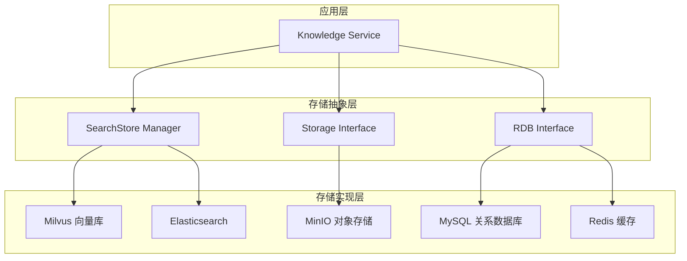
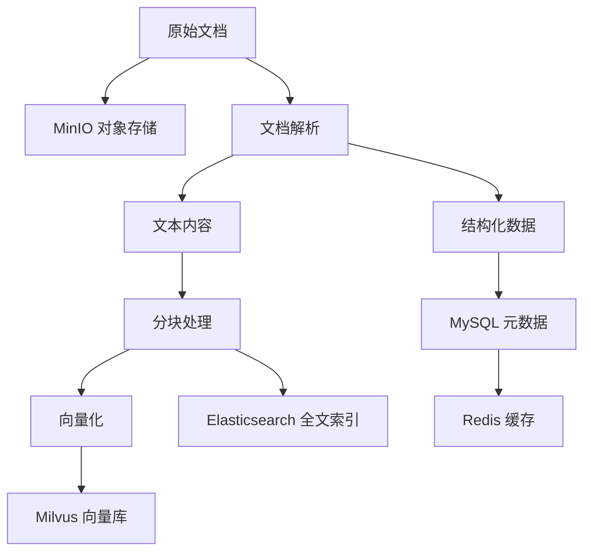

# 知识库存储工程技术详解

## 📋 概述

存储工程是知识库系统的数据底座，采用分层存储架构设计，包括向量数据库、搜索引擎、对象存储和关系数据库。本文档详细介绍各存储组件的技术实现、配置优化和运维方案。

## 🏗️ 存储架构设计

### 分层存储架构



### 数据流向设计



## 🗃️ 向量数据库实现

### Milvus 配置

**Docker 配置位置**: `docker/docker-compose.yml`

```yaml
milvus-standalone:
  image: milvusdb/milvus:v2.5.10
  container_name: coze-milvus-standalone
  security_opt:
    - seccomp:unconfined
  environment:
    ETCD_ENDPOINTS: etcd:2379
    MINIO_ADDRESS: minio:9000
    MINIO_ACCESS_KEY: minioadmin
    MINIO_SECRET_KEY: minioadmin
  volumes:
    - ./volumes/milvus.yaml:/milvus/configs/milvus.yaml
    - ./data/milvus:/var/lib/milvus
  healthcheck:
    test: ["CMD", "curl", "-f", "http://localhost:9091/healthz"]
    interval: 30s
    start_period: 90s
    timeout: 20s
    retries: 3
  ports:
    - "19530:19530"
    - "9091:9091"
  depends_on:
    - etcd
    - minio
```

### 向量存储接口设计

**位置**: `backend/infra/document/searchstore/`

```go
// 搜索存储管理器接口
type Manager interface {
    GetSearchStore(collectionName string) (SearchStore, error)
    CreateCollection(ctx context.Context, req *CreateCollectionRequest) error
    Drop(ctx context.Context, req *DropRequest) error
    ListCollections(ctx context.Context) ([]string, error)
}

// 搜索存储接口 (继承 Eino 框架接口)
type SearchStore interface {
    indexer.Indexer    // 索引接口
    retriever.Retriever // 检索接口
    Delete(ctx context.Context, ids []string) error
}

// 集合创建请求
type CreateCollectionRequest struct {
    CollectionName string
    Dimension      int
    MetricType     string
    IndexType      string
    IndexParams    map[string]interface{}
}
```

### 向量索引策略

```go
// 向量索引配置
type VectorIndexConfig struct {
    // 索引类型
    IndexType string `json:"index_type"` // IVF_FLAT, IVF_SQ8, HNSW
    
    // 距离度量
    MetricType string `json:"metric_type"` // L2, IP, COSINE
    
    // 索引参数
    IndexParams map[string]interface{} `json:"index_params"`
}

// 常用索引配置
var (
    // HNSW 索引 - 高精度场景
    HNSWIndexConfig = VectorIndexConfig{
        IndexType:  "HNSW",
        MetricType: "COSINE",
        IndexParams: map[string]interface{}{
            "M":              16,   // 构图时每个节点的最大连接数
            "efConstruction": 200,  // 构图时的候选列表大小
        },
    }
    
    // IVF_FLAT 索引 - 平衡场景
    IVFFlatIndexConfig = VectorIndexConfig{
        IndexType:  "IVF_FLAT",
        MetricType: "COSINE", 
        IndexParams: map[string]interface{}{
            "nlist": 1024, // 聚类中心数量
        },
    }
    
    // IVF_SQ8 索引 - 大规模场景
    IVFSQ8IndexConfig = VectorIndexConfig{
        IndexType:  "IVF_SQ8",
        MetricType: "COSINE",
        IndexParams: map[string]interface{}{
            "nlist": 1024,
        },
    }
)
```

### 向量数据操作

#### 向量索引实现

```go
func (m *milvusManager) Index(ctx context.Context, request *indexer.IndexRequest) error {
    collectionName := request.Options["collection_name"].(string)
    
    // 1. 获取或创建集合
    collection, err := m.getOrCreateCollection(ctx, collectionName)
    if err != nil {
        return err
    }
    
    // 2. 构建向量数据
    var vectors [][]float32
    var ids []string
    var metadataList []map[string]interface{}
    
    for _, doc := range request.Documents {
        vectors = append(vectors, doc.Vector)
        ids = append(ids, doc.ID)
        metadataList = append(metadataList, doc.Metadata)
    }
    
    // 3. 批量插入向量
    insertReq := &milvuspb.InsertRequest{
        CollectionName: collectionName,
        FieldsData: []*schemapb.FieldData{
            {
                FieldName: "id",
                Type:      schemapb.DataType_VarChar,
                Field: &schemapb.FieldData_Scalars{
                    Scalars: &schemapb.ScalarField{
                        Data: &schemapb.ScalarField_StringData{
                            StringData: &schemapb.StringArray{Data: ids},
                        },
                    },
                },
            },
            {
                FieldName: "vector",
                Type:      schemapb.DataType_FloatVector,
                Field: &schemapb.FieldData_Vectors{
                    Vectors: &schemapb.VectorField{
                        Data: &schemapb.VectorField_FloatVector{
                            FloatVector: &schemapb.FloatArray{
                                Data: flattenVectors(vectors),
                            },
                        },
                    },
                },
            },
            {
                FieldName: "content",
                Type:      schemapb.DataType_VarChar,
                Field: &schemapb.FieldData_Scalars{
                    Scalars: &schemapb.ScalarField{
                        Data: &schemapb.ScalarField_StringData{
                            StringData: &schemapb.StringArray{
                                Data: extractContent(request.Documents),
                            },
                        },
                    },
                },
            },
        },
    }
    
    _, err = m.client.Insert(ctx, insertReq)
    if err != nil {
        return fmt.Errorf("failed to insert vectors: %w", err)
    }
    
    // 4. 刷新集合确保数据可见
    flushReq := &milvuspb.FlushRequest{
        CollectionNames: []string{collectionName},
    }
    
    _, err = m.client.Flush(ctx, flushReq)
    return err
}
```

#### 向量检索实现

```go
func (m *milvusManager) Retrieve(ctx context.Context, request *retriever.RetrieveRequest) (*retriever.RetrieveResponse, error) {
    collectionName := request.Options["collection_name"].(string)
    topK := request.TopK
    scoreThreshold := request.Options["score_threshold"].(float64)
    
    // 1. 查询向量编码
    queryVector, err := m.encodeQuery(ctx, request.Query)
    if err != nil {
        return nil, err
    }
    
    // 2. 构建搜索请求
    searchReq := &milvuspb.SearchRequest{
        CollectionName: collectionName,
        SearchParams: []*commonpb.KeyValuePair{
            {Key: "anns_field", Value: "vector"},
            {Key: "topk", Value: strconv.Itoa(topK)},
            {Key: "params", Value: `{"ef": 64}`}, // HNSW 搜索参数
            {Key: "metric_type", Value: "COSINE"},
        },
        PlaceholderGroup: buildPlaceholderGroup(queryVector),
        OutputFields:     []string{"id", "content"},
    }
    
    // 3. 执行向量搜索
    searchResp, err := m.client.Search(ctx, searchReq)
    if err != nil {
        return nil, fmt.Errorf("vector search failed: %w", err)
    }
    
    // 4. 解析搜索结果
    var documents []*retriever.Document
    for i, result := range searchResp.Results.GetResults() {
        score := result.Scores[i]
        if score < scoreThreshold {
            continue
        }
        
        doc := &retriever.Document{
            ID:      result.Ids.GetStrId().Data[i],
            Content: extractContentFromResult(result, i),
            Score:   score,
            Metadata: map[string]interface{}{
                "collection": collectionName,
                "vector_score": score,
            },
        }
        documents = append(documents, doc)
    }
    
    return &retriever.RetrieveResponse{
        Documents: documents,
    }, nil
}
```

## 🔍 搜索引擎实现

### Elasticsearch 配置

**Docker 配置位置**: `docker/docker-compose.yml`

```yaml
elasticsearch:
  image: elasticsearch:8.18.0
  container_name: coze-elasticsearch
  restart: always
  environment:
    discovery.type: single-node
    xpack.security.enabled: false
    xpack.security.enrollment.enabled: false
    cluster.routing.allocation.disk.threshold_enabled: false
    bootstrap.memory_lock: true
    ES_JAVA_OPTS: "-Xms512m -Xmx1g"
  ulimits:
    memlock:
      soft: -1
      hard: -1
  volumes:
    - ./data/elasticsearch:/usr/share/elasticsearch/data
    - ./volumes/elasticsearch/analysis-smartcn.zip:/tmp/analysis-smartcn.zip
  command: >
    bash -c "
      if [ ! -f /usr/share/elasticsearch/plugins/analysis-smartcn/plugin-descriptor.properties ]; then
        echo 'Installing SmartCN plugin...'
        /usr/share/elasticsearch/bin/elasticsearch-plugin install file:///tmp/analysis-smartcn.zip --batch
      fi
      /usr/local/bin/docker-entrypoint.sh eswrapper
    "
  ports:
    - "9200:9200"
  healthcheck:
    test: ["CMD-SHELL", "curl -f http://localhost:9200/_cluster/health || exit 1"]
    interval: 30s
    timeout: 10s
    retries: 5
    start_period: 40s
```

### 索引模板设计

```json
{
  "template": {
    "settings": {
      "analysis": {
        "analyzer": {
          "smartcn_analyzer": {
            "type": "custom",
            "tokenizer": "smartcn_tokenizer",
            "filter": ["lowercase", "stop"]
          },
          "ik_smart_analyzer": {
            "type": "custom", 
            "tokenizer": "ik_smart",
            "filter": ["lowercase"]
          }
        }
      },
      "index": {
        "number_of_shards": 1,
        "number_of_replicas": 1,
        "refresh_interval": "5s"
      }
    },
    "mappings": {
      "properties": {
        "slice_id": {
          "type": "keyword"
        },
        "knowledge_id": {
          "type": "long"
        },
        "document_id": {
          "type": "long"
        },
        "title": {
          "type": "text",
          "analyzer": "smartcn_analyzer",
          "fields": {
            "keyword": {
              "type": "keyword",
              "ignore_above": 256
            }
          }
        },
        "content": {
          "type": "text",
          "analyzer": "smartcn_analyzer",
          "fields": {
            "ik": {
              "type": "text",
              "analyzer": "ik_smart_analyzer"
            }
          }
        },
        "metadata": {
          "type": "object",
          "enabled": true
        },
        "created_at": {
          "type": "date",
          "format": "epoch_millis"
        },
        "updated_at": {
          "type": "date", 
          "format": "epoch_millis"
        }
      }
    }
  }
}
```

### 全文检索实现

```go
// ES 索引实现
func (e *elasticsearchManager) Index(ctx context.Context, request *indexer.IndexRequest) error {
    indexName := request.Options["index_name"].(string)
    
    // 1. 确保索引存在
    exists, err := e.client.Indices.Exists([]string{indexName})
    if err != nil {
        return err
    }
    
    if !exists.StatusCode == 200 {
        if err := e.createIndex(ctx, indexName); err != nil {
            return err
        }
    }
    
    // 2. 批量索引文档
    var buf bytes.Buffer
    for _, doc := range request.Documents {
        // 构建索引操作
        meta := map[string]interface{}{
            "index": map[string]interface{}{
                "_index": indexName,
                "_id":    doc.ID,
            },
        }
        
        // 构建文档内容
        docContent := map[string]interface{}{
            "slice_id":     doc.ID,
            "knowledge_id": doc.Metadata["knowledge_id"],
            "document_id":  doc.Metadata["document_id"],
            "title":        doc.Metadata["title"],
            "content":      doc.Content,
            "metadata":     doc.Metadata,
            "created_at":   time.Now().UnixMilli(),
            "updated_at":   time.Now().UnixMilli(),
        }
        
        // 序列化到批量操作缓冲区
        if err := json.NewEncoder(&buf).Encode(meta); err != nil {
            return err
        }
        if err := json.NewEncoder(&buf).Encode(docContent); err != nil {
            return err
        }
    }
    
    // 3. 执行批量索引
    res, err := e.client.Bulk(
        &buf,
        e.client.Bulk.WithIndex(indexName),
        e.client.Bulk.WithRefresh("true"),
    )
    
    if err != nil {
        return fmt.Errorf("bulk index failed: %w", err)
    }
    defer res.Body.Close()
    
    return e.handleBulkResponse(res)
}

// ES 检索实现
func (e *elasticsearchManager) Retrieve(ctx context.Context, request *retriever.RetrieveRequest) (*retriever.RetrieveResponse, error) {
    indexName := request.Options["index_name"].(string)
    
    // 1. 构建搜索查询
    query := map[string]interface{}{
        "query": map[string]interface{}{
            "bool": map[string]interface{}{
                "should": []interface{}{
                    // 精确短语匹配
                    map[string]interface{}{
                        "match_phrase": map[string]interface{}{
                            "content": map[string]interface{}{
                                "query": request.Query,
                                "boost": 3.0,
                            },
                        },
                    },
                    // 模糊匹配
                    map[string]interface{}{
                        "match": map[string]interface{}{
                            "content": map[string]interface{}{
                                "query":     request.Query,
                                "boost":     2.0,
                                "fuzziness": "AUTO",
                                "operator":  "and",
                            },
                        },
                    },
                    // 多字段匹配
                    map[string]interface{}{
                        "multi_match": map[string]interface{}{
                            "query":  request.Query,
                            "fields": []string{"title^2", "content"},
                            "boost":  1.0,
                        },
                    },
                },
                "minimum_should_match": 1,
            },
        },
        "size": request.TopK,
        "highlight": map[string]interface{}{
            "fields": map[string]interface{}{
                "content": map[string]interface{}{
                    "fragment_size": 150,
                    "number_of_fragments": 3,
                },
            },
        },
        "sort": []interface{}{
            map[string]interface{}{
                "_score": map[string]interface{}{
                    "order": "desc",
                },
            },
        },
    }
    
    // 2. 执行搜索
    var buf bytes.Buffer
    if err := json.NewEncoder(&buf).Encode(query); err != nil {
        return nil, err
    }
    
    res, err := e.client.Search(
        e.client.Search.WithContext(ctx),
        e.client.Search.WithIndex(indexName),
        e.client.Search.WithBody(&buf),
    )
    
    if err != nil {
        return nil, fmt.Errorf("search failed: %w", err)
    }
    defer res.Body.Close()
    
    // 3. 解析搜索结果
    return e.parseSearchResponse(res)
}
```

## 📦 对象存储实现

### MinIO 配置

**Docker 配置位置**: `docker/docker-compose.yml`

```yaml
minio:
  image: bitnami/minio:2025.1.18
  container_name: coze-minio
  restart: always
  environment:
    MINIO_ROOT_USER: minioadmin
    MINIO_ROOT_PASSWORD: minioadmin
    MINIO_DEFAULT_BUCKETS: coze-studio
    MINIO_SCHEME: http
  volumes:
    - ./data/minio:/bitnami/minio/data
  ports:
    - "9000:9000"
    - "9001:9001"
  healthcheck:
    test: ["CMD-SHELL", "curl -f http://localhost:9000/minio/health/live || exit 1"]
    interval: 30s
    timeout: 20s
    retries: 3
    start_period: 30s
```

### 对象存储接口

**位置**: `backend/infra/storage/`

```go
// 存储接口
type Storage interface {
    // 上传对象
    PutObject(ctx context.Context, key string, data []byte, options ...Option) error
    
    // 获取对象
    GetObject(ctx context.Context, key string) ([]byte, error)
    
    // 获取对象URL (带签名)
    GetObjectUrl(ctx context.Context, key string, options ...Option) (string, error)
    
    // 删除对象
    DeleteObject(ctx context.Context, key string) error
    
    // 列出对象
    ListObjects(ctx context.Context, prefix string) ([]ObjectInfo, error)
    
    // 检查对象是否存在
    ObjectExists(ctx context.Context, key string) (bool, error)
}

// 存储选项
type Option func(*Options)

type Options struct {
    ContentType string
    Expire      int64
    Metadata    map[string]string
}

// 对象信息
type ObjectInfo struct {
    Key          string
    Size         int64
    ContentType  string
    LastModified time.Time
    ETag         string
}
```

### 文件存储策略

```go
// MinIO 存储实现
type minioStorage struct {
    client     *minio.Client
    bucketName string
    config     Config
}

type Config struct {
    Endpoint        string
    AccessKeyID     string
    SecretAccessKey string
    BucketName      string
    UseSSL          bool
    Region          string
}

// 上传文件实现
func (m *minioStorage) PutObject(ctx context.Context, key string, data []byte, options ...Option) error {
    opts := &Options{}
    for _, option := range options {
        option(opts)
    }
    
    // 设置默认内容类型
    contentType := opts.ContentType
    if contentType == "" {
        contentType = detectContentType(key, data)
    }
    
    // 构建上传选项
    putOptions := minio.PutObjectOptions{
        ContentType:  contentType,
        UserMetadata: opts.Metadata,
    }
    
    // 执行上传
    reader := bytes.NewReader(data)
    _, err := m.client.PutObject(ctx, m.bucketName, key, reader, int64(len(data)), putOptions)
    
    if err != nil {
        return fmt.Errorf("failed to put object %s: %w", key, err)
    }
    
    return nil
}

// 获取签名URL实现
func (m *minioStorage) GetObjectUrl(ctx context.Context, key string, options ...Option) (string, error) {
    opts := &Options{
        Expire: 3600, // 默认1小时过期
    }
    for _, option := range options {
        option(opts)
    }
    
    // 生成预签名URL
    presignedURL, err := m.client.PresignedGetObject(
        ctx,
        m.bucketName,
        key,
        time.Duration(opts.Expire)*time.Second,
        nil,
    )
    
    if err != nil {
        return "", fmt.Errorf("failed to generate presigned URL for %s: %w", key, err)
    }
    
    return presignedURL.String(), nil
}

// 内容类型检测
func detectContentType(key string, data []byte) string {
    // 1. 根据文件扩展名判断
    ext := strings.ToLower(filepath.Ext(key))
    switch ext {
    case ".pdf":
        return "application/pdf"
    case ".docx":
        return "application/vnd.openxmlformats-officedocument.wordprocessingml.document"
    case ".xlsx":
        return "application/vnd.openxmlformats-officedocument.spreadsheetml.sheet"
    case ".jpg", ".jpeg":
        return "image/jpeg"
    case ".png":
        return "image/png"
    case ".txt":
        return "text/plain"
    case ".md":
        return "text/markdown"
    }
    
    // 2. 根据文件内容判断
    contentType := http.DetectContentType(data)
    if contentType != "application/octet-stream" {
        return contentType
    }
    
    // 3. 默认类型
    return "application/octet-stream"
}
```

### 文件组织策略

```go
// 文件路径生成策略
type FilePathGenerator struct {
    baseWord string
}

func NewFilePathGenerator() *FilePathGenerator {
    return &FilePathGenerator{
        baseWord: "1Aa2Bb3Cc4Dd5Ee6Ff7Gg8Hh9Ii0JjKkLlMmNnOoPpQqRrSsTtUuVvWwXxYyZz",
    }
}

// 生成文件URI
func (g *FilePathGenerator) GenerateURI(userID int64, fileType string, bizType string) string {
    // 1. 生成随机标识符
    input := fmt.Sprintf("upload_%d_Ma*9)fhi_%d_gou_%s_rand_%d", 
        userID, time.Now().Unix(), fileType, rand.Intn(100000))
    
    // 2. 计算哈希
    hash := sha256.Sum256([]byte(input))
    hashString := base64.StdEncoding.EncodeToString(hash[:])
    
    // 3. 转换为自定义字符集
    secret := ""
    for _, char := range hashString[:10] {
        index := int(char) % 62
        secret += string(g.baseWord[index])
    }
    
    // 4. 构建最终路径
    suffix := fmt.Sprintf("%d_%d_%s.%s", userID, time.Now().UnixNano(), secret, fileType)
    return fmt.Sprintf("%s/%s", bizType, suffix)
}

// 业务类型常量
const (
    BizTypeBotDataset   = "bot_dataset"     // 机器人知识库
    BizTypeUserUpload   = "user_upload"     // 用户上传
    BizTypeDocReview    = "doc_review"      // 文档审核
    BizTypeImagePreview = "image_preview"   // 图片预览
)
```

## 🗄️ 关系数据库实现

### MySQL 表结构设计

**Schema 位置**: `docker/volumes/mysql/schema.sql`

```sql
-- 知识库表
CREATE TABLE knowledge (
    id BIGINT PRIMARY KEY,
    name VARCHAR(255) NOT NULL,
    description TEXT,
    icon_uri VARCHAR(512),
    creator_id BIGINT NOT NULL,
    space_id BIGINT NOT NULL,
    app_id BIGINT,
    format_type INT NOT NULL DEFAULT 1, -- 1:文本 2:表格 3:图片
    status INT NOT NULL DEFAULT 1,
    created_at BIGINT NOT NULL,
    updated_at BIGINT NOT NULL,
    INDEX idx_creator_space (creator_id, space_id),
    INDEX idx_app_id (app_id),
    INDEX idx_created_at (created_at)
);

-- 知识库文档表
CREATE TABLE knowledge_document (
    id BIGINT PRIMARY KEY,
    knowledge_id BIGINT NOT NULL,
    name VARCHAR(255) NOT NULL,
    uri VARCHAR(512) NOT NULL,
    file_extension VARCHAR(32),
    document_type INT NOT NULL,
    size BIGINT DEFAULT 0,
    slice_count INT DEFAULT 0,
    char_count BIGINT DEFAULT 0,
    creator_id BIGINT NOT NULL,
    space_id BIGINT NOT NULL,
    source_type INT NOT NULL DEFAULT 1,
    status INT NOT NULL DEFAULT 1,
    fail_reason TEXT,
    parse_rule JSON,  -- 解析规则
    table_info JSON,  -- 表格信息
    created_at BIGINT NOT NULL,
    updated_at BIGINT NOT NULL,
    INDEX idx_knowledge_id (knowledge_id),
    INDEX idx_creator_space (creator_id, space_id),
    INDEX idx_status (status),
    INDEX idx_created_at (created_at)
);

-- 知识库文档片段表
CREATE TABLE knowledge_document_slice (
    id BIGINT PRIMARY KEY,
    knowledge_id BIGINT NOT NULL,
    document_id BIGINT NOT NULL,
    content TEXT,
    sequence DOUBLE DEFAULT 0,
    hit BIGINT DEFAULT 0,
    creator_id BIGINT NOT NULL,
    space_id BIGINT NOT NULL,
    status INT NOT NULL DEFAULT 1,
    created_at BIGINT NOT NULL,
    updated_at BIGINT NOT NULL,
    INDEX idx_knowledge_id (knowledge_id),
    INDEX idx_document_id (document_id),
    INDEX idx_sequence (sequence),
    INDEX idx_creator_space (creator_id, space_id),
    INDEX idx_created_at (created_at)
);
```

### 动态表管理

```go
// RDB 接口定义
type RDB interface {
    // 表管理
    CreateTable(ctx context.Context, req *CreateTableRequest) (*CreateTableResponse, error)
    DropTable(ctx context.Context, req *DropTableRequest) (*DropTableResponse, error)
    
    // 数据操作
    InsertData(ctx context.Context, req *InsertDataRequest) (*InsertDataResponse, error)
    QueryData(ctx context.Context, req *QueryDataRequest) (*QueryDataResponse, error)
    UpdateData(ctx context.Context, req *UpdateDataRequest) (*UpdateDataResponse, error)
    DeleteData(ctx context.Context, req *DeleteDataRequest) (*DeleteDataResponse, error)
}

// 动态建表实现
func (r *mysqlRDB) CreateTable(ctx context.Context, req *CreateTableRequest) (*CreateTableResponse, error) {
    // 1. 生成表名
    tableName := r.generateTableName()
    
    // 2. 构建CREATE TABLE语句
    var columns []string
    var indexes []string
    
    for _, col := range req.Table.Columns {
        columnDef := fmt.Sprintf("`%s` %s", col.Name, convertDataType(col.DataType))
        if col.NotNull {
            columnDef += " NOT NULL"
        }
        if col.DefaultValue != "" {
            columnDef += fmt.Sprintf(" DEFAULT %s", col.DefaultValue)
        }
        columns = append(columns, columnDef)
    }
    
    // 3. 处理索引
    for _, idx := range req.Table.Indexes {
        switch idx.Type {
        case entity.PrimaryKey:
            indexes = append(indexes, fmt.Sprintf("PRIMARY KEY (%s)", 
                strings.Join(quoteColumns(idx.Columns), ", ")))
        case entity.UniqueKey:
            indexes = append(indexes, fmt.Sprintf("UNIQUE KEY `%s` (%s)", 
                idx.Name, strings.Join(quoteColumns(idx.Columns), ", ")))
        case entity.Index:
            indexes = append(indexes, fmt.Sprintf("KEY `%s` (%s)", 
                idx.Name, strings.Join(quoteColumns(idx.Columns), ", ")))
        }
    }
    
    // 4. 执行建表SQL
    createSQL := fmt.Sprintf("CREATE TABLE `%s` (\n  %s\n) ENGINE=InnoDB DEFAULT CHARSET=utf8mb4 COLLATE=utf8mb4_unicode_ci",
        tableName, strings.Join(append(columns, indexes...), ",\n  "))
    
    _, err := r.db.ExecContext(ctx, createSQL)
    if err != nil {
        return nil, fmt.Errorf("create table failed: %w", err)
    }
    
    return &CreateTableResponse{
        Table: &entity.Table{
            Name:    tableName,
            Columns: req.Table.Columns,
            Indexes: req.Table.Indexes,
        },
    }, nil
}

// 表名生成策略
func (r *mysqlRDB) generateTableName() string {
    timestamp := time.Now().Unix()
    randomNum := rand.Intn(1000000)
    return fmt.Sprintf("table_%d_%d", timestamp, randomNum)
}
```

## 💾 缓存层实现

### Redis 配置

**Docker 配置位置**: `docker/docker-compose.yml`

```yaml
redis:
  image: bitnami/redis:8.0
  container_name: coze-redis
  restart: always
  environment:
    - REDIS_AOF_ENABLED=no
    - REDIS_PORT_NUMBER=6379
    - REDIS_IO_THREADS=4
    - ALLOW_EMPTY_PASSWORD=yes
  volumes:
    - ./data/bitnami/redis:/bitnami/redis/data:rw,Z
  ports:
    - "6379:6379"
```

### 缓存策略实现

```go
// 缓存管理器
type CacheManager struct {
    client cache.Cmdable
    config CacheConfig
}

type CacheConfig struct {
    DefaultExpire time.Duration
    LongExpire    time.Duration
    ShortExpire   time.Duration
}

// 多级缓存实现
func (c *CacheManager) GetWithFallback(ctx context.Context, key string, fallback func() (interface{}, error)) (interface{}, error) {
    // 1. 尝试从缓存获取
    result := c.client.Get(ctx, key)
    if result.Err() == nil {
        var data interface{}
        if err := json.Unmarshal([]byte(result.Val()), &data); err == nil {
            return data, nil
        }
    }
    
    // 2. 缓存未命中，调用回调函数
    data, err := fallback()
    if err != nil {
        return nil, err
    }
    
    // 3. 设置缓存
    jsonData, _ := json.Marshal(data)
    c.client.Set(ctx, key, jsonData, c.config.DefaultExpire)
    
    return data, nil
}

// 批量缓存操作
func (c *CacheManager) MGetWithFallback(ctx context.Context, keys []string, fallback func([]string) (map[string]interface{}, error)) (map[string]interface{}, error) {
    result := make(map[string]interface{})
    var missedKeys []string
    
    // 1. 批量获取缓存
    if len(keys) > 0 {
        cached := c.client.MGet(ctx, keys...)
        for i, key := range keys {
            if i < len(cached.Val()) && cached.Val()[i] != nil {
                var data interface{}
                if err := json.Unmarshal([]byte(cached.Val()[i].(string)), &data); err == nil {
                    result[key] = data
                } else {
                    missedKeys = append(missedKeys, key)
                }
            } else {
                missedKeys = append(missedKeys, key)
            }
        }
    }
    
    // 2. 处理缓存未命中的键
    if len(missedKeys) > 0 {
        fallbackData, err := fallback(missedKeys)
        if err != nil {
            return nil, err
        }
        
        // 3. 批量设置缓存
        pipeline := c.client.Pipeline()
        for key, data := range fallbackData {
            jsonData, _ := json.Marshal(data)
            pipeline.Set(ctx, key, jsonData, c.config.DefaultExpire)
            result[key] = data
        }
        pipeline.Exec(ctx)
    }
    
    return result, nil
}
```

## 🔧 存储优化策略

### 数据分区策略

```go
// 知识库数据分区
func getCollectionName(knowledgeID int64) string {
    return fmt.Sprintf("knowledge_%d", knowledgeID)
}

func getIndexName(knowledgeID int64) string {
    return fmt.Sprintf("knowledge_doc_%d", knowledgeID)
}

// 时间分区策略 (日志表)
func getLogTableName(date time.Time) string {
    return fmt.Sprintf("retrieval_log_%s", date.Format("200601"))
}
```

### 存储压缩策略

```go
// 表格数据压缩
func (k *knowledgeSVC) compressTableData(data []map[string]interface{}) ([]byte, error) {
    if !k.enableCompactTable {
        return json.Marshal(data)
    }
    
    // 1. JSON序列化
    jsonData, err := json.Marshal(data)
    if err != nil {
        return nil, err
    }
    
    // 2. Gzip压缩
    var buf bytes.Buffer
    gzipWriter := gzip.NewWriter(&buf)
    
    if _, err := gzipWriter.Write(jsonData); err != nil {
        return nil, err
    }
    
    if err := gzipWriter.Close(); err != nil {
        return nil, err
    }
    
    return buf.Bytes(), nil
}

// 表格数据解压
func (k *knowledgeSVC) decompressTableData(compressedData []byte) ([]map[string]interface{}, error) {
    if !k.enableCompactTable {
        var data []map[string]interface{}
        err := json.Unmarshal(compressedData, &data)
        return data, err
    }
    
    // 1. Gzip解压
    reader := bytes.NewReader(compressedData)
    gzipReader, err := gzip.NewReader(reader)
    if err != nil {
        return nil, err
    }
    defer gzipReader.Close()
    
    jsonData, err := io.ReadAll(gzipReader)
    if err != nil {
        return nil, err
    }
    
    // 2. JSON反序列化
    var data []map[string]interface{}
    err = json.Unmarshal(jsonData, &data)
    return data, err
}
```

## 📊 监控和运维

### 存储监控指标

```go
// 存储性能指标
type StorageMetrics struct {
    // Milvus 指标
    VectorInsertQPS     float64
    VectorSearchQPS     float64 
    VectorSearchLatency time.Duration
    CollectionCount     int64
    VectorCount         int64
    
    // Elasticsearch 指标  
    ESIndexQPS          float64
    ESSearchQPS         float64
    ESSearchLatency     time.Duration
    IndexSize           int64
    DocumentCount       int64
    
    // MinIO 指标
    ObjectUploadQPS     float64
    ObjectDownloadQPS   float64
    StorageUsage        int64
    ObjectCount         int64
    
    // MySQL 指标
    ConnectionCount     int64
    SlowQueryCount      int64
    TableSize           int64
    
    // Redis 指标
    CacheHitRate        float64
    MemoryUsage         int64
    ConnectionCount     int64
}
```

### 存储健康检查

```go
func (s *StorageManager) HealthCheck(ctx context.Context) error {
    var errs []error
    
    // 检查 Milvus
    if err := s.checkMilvusHealth(ctx); err != nil {
        errs = append(errs, fmt.Errorf("milvus health check failed: %w", err))
    }
    
    // 检查 Elasticsearch
    if err := s.checkElasticsearchHealth(ctx); err != nil {
        errs = append(errs, fmt.Errorf("elasticsearch health check failed: %w", err))
    }
    
    // 检查 MinIO
    if err := s.checkMinIOHealth(ctx); err != nil {
        errs = append(errs, fmt.Errorf("minio health check failed: %w", err))
    }
    
    // 检查 MySQL
    if err := s.checkMySQLHealth(ctx); err != nil {
        errs = append(errs, fmt.Errorf("mysql health check failed: %w", err))
    }
    
    // 检查 Redis
    if err := s.checkRedisHealth(ctx); err != nil {
        errs = append(errs, fmt.Errorf("redis health check failed: %w", err))
    }
    
    if len(errs) > 0 {
        return fmt.Errorf("storage health check failed: %v", errs)
    }
    
    return nil
}
```

---

**文档版本**: v1.0  
**最后更新**: 2025-10-27  
**相关文档**: [知识库架构总览](./knowledge-base-architecture.md)