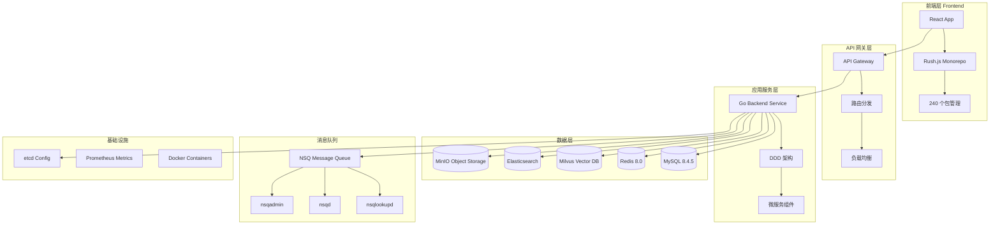

# Coze Plus 项目架构文档

## 📋 文档概述

本文档详细介绍 Coze Plus 项目的整体技术架构、核心组件和开发规范。Coze Plus 是一个企业级 AI 代理开发平台，采用前后端分离的微服务架构设计。

## 🏗️ 项目架构总览

### 架构设计原则

- **微服务架构**: 前后端分离，服务组件化
- **容器化部署**: Docker容器化，支持K8s编排
- **分层架构**: 严格的分层设计，职责清晰
- **可扩展性**: 水平扩展支持，高并发处理
- **模块化设计**: Rush.js monorepo 管理，依赖层次化

### 系统架构图



## 🔧 核心技术栈

### 前端技术栈

| 技术组件 | 版本 | 用途说明 | 特性优势 |
|---------|------|----------|----------|
| **Node.js** | 20.x LTS (Iron) | JavaScript运行时 | LTS长期支持版本 |
| **React** | 18+ | UI框架 | Hooks、Concurrent Features |
| **TypeScript** | 5.0+ | 类型系统 | 强类型检查、IDE支持 |
| **Rush.js** | 5.147.1 | Monorepo管理 | 微软开源、企业级规模 |
| **pnpm** | 8.15.8 | 包管理器 | 节省磁盘空间、快速安装 |
| **Rsbuild** | 1.0+ | 构建工具 | 基于Rspack、极速构建 |
| **Semi Design** | 2.0+ | UI组件库 | 字节跳动出品、企业级 |
| **Tailwind CSS** | 3.0+ | 样式框架 | 原子化CSS、快速开发 |
| **Zustand** | 4.0+ | 状态管理 | 轻量级、TypeScript友好 |

### 后端技术栈

| 技术组件 | 版本 | 用途说明 | 特性优势 |
|---------|------|----------|----------|
| **Go** | 1.24.0 | 编程语言 | 高性能、并发友好 |
| **Hertz** | 0.11+ | HTTP框架 | 字节跳动开源、高性能 |
| **CloudWeGo** | - | 微服务套件 | Hertz、Kitex、Volo生态 |
| **GORM** | 1.25+ | ORM框架 | Go生态最流行ORM |
| **NSQ** | 1.3+ | 消息队列 | 分布式、实时消息传递 |
| **etcd** | 3.5+ | 配置中心 | 分布式配置管理 |

### 数据存储技术栈

| 存储组件 | 版本 | 用途说明 | 特性优势 |
|---------|------|----------|----------|
| **MySQL** | 8.4.5 | 关系型数据库 | 事务支持、数据一致性 |
| **Redis** | 8.0 | 缓存数据库 | 高性能缓存、会话存储 |
| **Milvus** | 2.5.10 | 向量数据库 | AI Embedding存储检索 |
| **Elasticsearch** | 8.18.0 | 搜索引擎 | 全文检索、日志分析 |
| **MinIO** | 2025.1.18 | 对象存储 | S3兼容、文件存储 |

## 📂 项目目录结构

```
coze-plus/
├── 📁 frontend/                    # 前端工程
│   ├── 📁 apps/                    # 应用层 (Level 4)
│   │   └── 📁 coze-studio/         # 主应用
│   ├── 📁 packages/                # 包管理
│   │   ├── 📁 arch/                # 架构层 (Level 1)
│   │   ├── 📁 common/              # 通用层 (Level 2)
│   │   ├── 📁 data/knowledge/      # 数据层 (Level 3)
│   │   ├── 📁 studio/              # 工作室 (Level 3)
│   │   └── 📁 workflow/            # 工作流 (Level 3)
│   ├── 📁 config/                  # 配置文件
│   └── 📁 scripts/                 # 构建脚本
├── 📁 backend/                     # 后端工程
│   ├── 📁 api/                     # API层
│   │   ├── 📁 handler/             # HTTP处理器
│   │   └── 📁 model/               # API模型
│   ├── 📁 application/             # 应用层
│   ├── 📁 domain/                  # 领域层
│   │   ├── 📁 knowledge/           # 知识库领域
│   │   ├── 📁 workflow/            # 工作流领域
│   │   └── 📁 agent/               # 代理领域
│   ├── 📁 infra/                   # 基础设施层 (18个功能模块)
│   │   ├── 📁 cache/               # 缓存
│   │   ├── 📁 document/            # 文档处理
│   │   ├── 📁 embedding/           # 向量化
│   │   ├── 📁 es/                  # Elasticsearch
│   │   ├── 📁 eventbus/            # 事件总线
│   │   ├── 📁 storage/             # 对象存储
│   │   └── 📁 ... (其他12个模块)   # orm, rdb, idgen等
│   ├── 📁 crossdomain/             # 跨域服务
│   └── 📁 pkg/                     # 通用包
├── 📁 idl/                         # 接口定义语言
├── 📁 docker/                      # Docker配置
├── 📁 scripts/                     # 部署脚本
├── 📁 docs/                        # 项目文档
└── 📁 common/                      # 通用配置
```

## 🔄 分层架构设计

### 前端分层架构 (Rush.js Monorepo)

**4层依赖架构**:

```
Level 4: Apps Layer (应用层)
├── coze-studio/                    # 主应用入口
└── 依赖 Level 1-3 所有包

Level 3: Domain Layer (领域层)
├── agent-ide/                     # AI代理IDE
├── workflow/                      # 工作流编辑器
├── studio/                        # 工作室功能
└── data/knowledge/                # 知识库数据层

Level 2: Common Layer (通用层)
├── common-components/             # 通用组件
├── common-hooks/                  # 通用Hooks
├── common-services/               # 通用服务
└── stores/                        # 状态管理

Level 1: Architecture Layer (架构层)
├── arch/                          # 核心架构
├── idl/                           # 接口定义
├── eslint-config/                 # 代码规范
└── ts-config/                     # TypeScript配置
```

### 后端分层架构 (DDD)

**4层DDD架构**:

```
📁 API Layer (接口层)
├── handler/                       # HTTP处理器
├── middleware/                    # 中间件
└── router/                        # 路由配置

📁 Application Layer (应用层)
├── service/                       # 应用服务
├── dto/                          # 数据传输对象
└── assembler/                    # 对象组装器

📁 Domain Layer (领域层)
├── entity/                       # 领域实体
├── service/                      # 领域服务
├── repository/                   # 仓储接口
└── valueobject/                  # 值对象

📁 Infrastructure Layer (基础设施层)
├── cache/                        # 缓存实现
├── document/                     # 文档处理
├── embedding/                    # 向量化服务
├── es/                          # Elasticsearch
├── eventbus/                    # 事件总线/消息队列
├── storage/                     # 对象存储
├── orm/                         # ORM工具
└── ... (共18个功能模块)         # 其他基础设施
```

## 🚀 核心特性架构

### 知识库系统架构

**核心组件**:
- **文档处理引擎**: 多格式文档解析、分块处理
- **向量化服务**: 文本Embedding、语义检索
- **混合检索**: 向量检索 + 全文检索 + NL2SQL
- **智能重排**: RRF算法 + 语义重排模型

### AI Agent 架构

**核心组件**:
- **对话引擎**: 多轮对话、上下文管理
- **工具调用**: Function Call、Plugin集成
- **工作流引擎**: 复杂任务编排、条件分支
- **模型适配**: 多模型支持、统一接口

### 工作流编排架构

**核心组件**:
- **可视化编辑器**: 拖拽式工作流设计
- **节点系统**: LLM节点、工具节点、条件节点
- **执行引擎**: 并行执行、错误处理
- **状态管理**: 实时状态更新、历史追踪

## 🔒 安全架构

### 认证授权

- **OAuth 2.0**: 标准化认证流程
- **JWT Token**: 无状态会话管理
- **RBAC**: 角色基础访问控制
- **多租户**: 工作空间级别隔离

### 数据安全

- **传输加密**: HTTPS/TLS 1.3
- **存储加密**: 数据库字段级加密
- **敏感信息**: 配置中心集中管理
- **审计日志**: 操作记录完整追踪

## 📊 性能与监控

### 性能指标

- **并发用户**: 支持10,000+并发
- **响应时间**: API平均响应<100ms
- **吞吐量**: 支持10,000 QPS
- **可用性**: 99.9%服务可用性

### 监控体系

- **应用监控**: Prometheus + Grafana
- **日志监控**: ELK Stack (Elasticsearch + Logstash + Kibana)
- **链路追踪**: Jaeger 分布式追踪
- **告警系统**: AlertManager 规则告警

## 🌐 部署架构

### 容器化部署

```yaml
# Docker Compose 服务编排
services:
  # 应用服务
  coze-backend:
    image: coze-plus/backend:latest
    replicas: 3

  coze-frontend:
    image: coze-plus/frontend:latest
    replicas: 2

  # 数据存储
  mysql:
    image: mysql:8.4.5

  redis:
    image: redis:8.0-alpine

  milvus:
    image: milvusdb/milvus:v2.5.10

  elasticsearch:
    image: docker.elastic.co/elasticsearch/elasticsearch:8.18.0

  # 消息队列
  nsqlookupd:
    image: nsqio/nsq:v1.3.0

  nsqd:
    image: nsqio/nsq:v1.3.0
```

### K8s生产部署

- **命名空间隔离**: 多环境部署隔离
- **服务发现**: Kubernetes DNS
- **负载均衡**: Ingress Controller
- **弹性伸缩**: HPA 水平自动扩缩容
- **滚动更新**: 零停机部署策略

## 🔧 开发工具链

### 构建与部署

- **前端构建**: Rsbuild (Rspack) 极速构建
- **后端构建**: Go Build 原生编译
- **容器构建**: Multi-stage Docker Build
- **CI/CD**: GitHub Actions 自动化流水线

### 代码质量

- **代码规范**: ESLint + Prettier (前端) + golangci-lint (后端)
- **类型检查**: TypeScript (前端) + Go强类型 (后端)
- **单元测试**: Vitest (前端) + Go Test (后端)
- **覆盖率**: 分级覆盖率要求

## 🔗 相关文档

- [代码结构文档](./code-structure.md)
- [开发规范](./development-guidelines.md)
- [API接口文档](../idl/)
- [部署指南](./deployment-guide.md)
- [知识库架构详解](./knowledge-base-architecture.md)

---

**文档版本**: v1.0
**最后更新**: 2025-10-27
**维护者**: Coze Plus Team