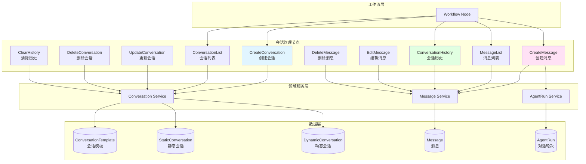
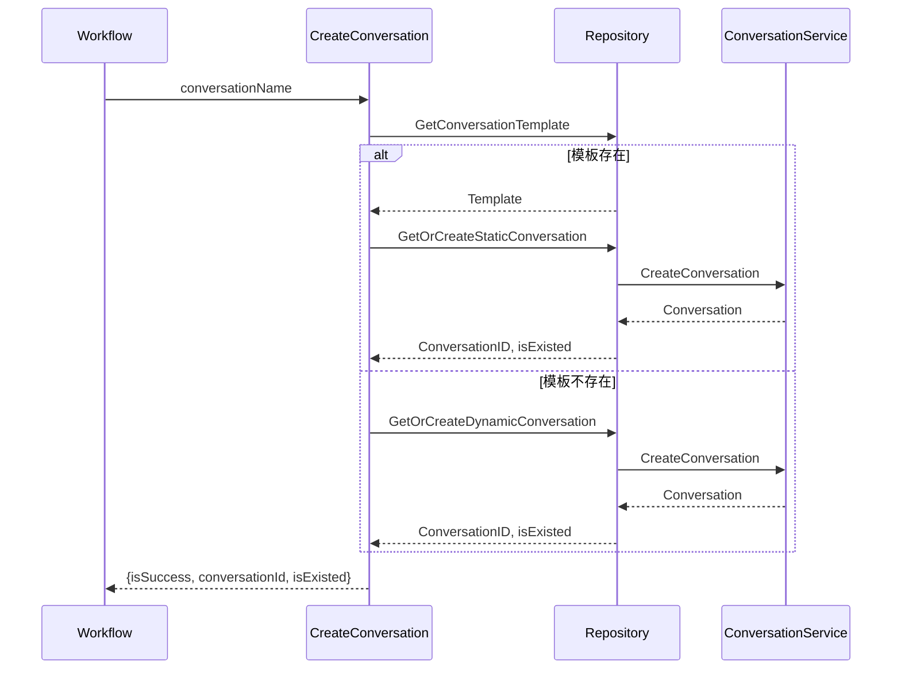
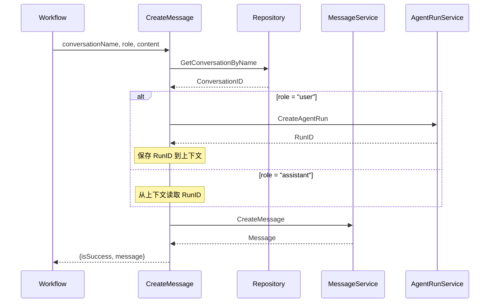
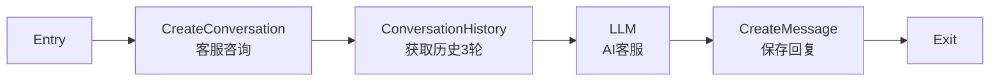
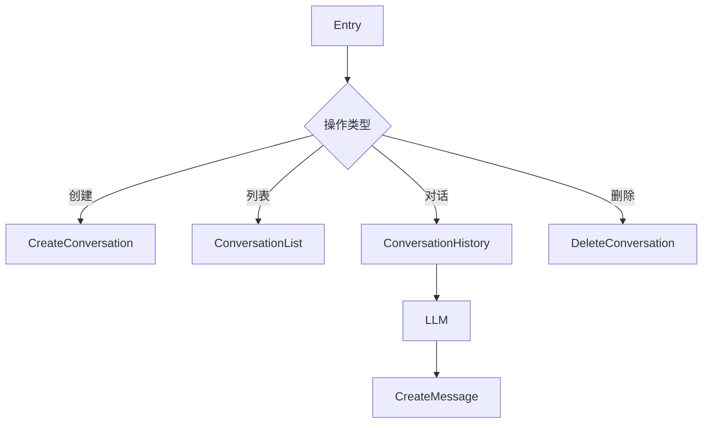
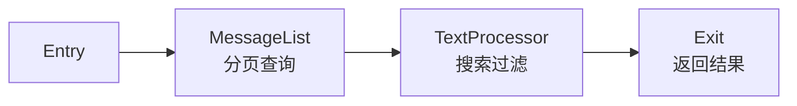
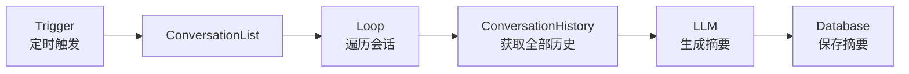

# 会话管理节点设计方案

## 概述

会话管理节点是 Coze Plus 工作流系统中用于管理对话会话和消息的核心组件。它提供了一套完整的会话生命周期管理能力，使工作流能够创建、查询、编辑和删除会话及消息，实现复杂的多轮对话场景。

### 核心价值

- **多渠道支持**：统一管理来自不同渠道（Web、微信、企业微信等）的会话
- **会话持久化**：保存用户对话历史，支持会话恢复和上下文延续
- **灵活性**：支持静态模板会话和动态创建会话两种模式
- **可追溯性**：完整记录对话轮次（Run）和会话片段（Section）
- **场景适配**：区分 Agent 场景和 Workflow 场景，提供不同的会话策略

## 架构设计

### 系统架构



### 核心概念

#### 1. 会话模板（ConversationTemplate）

会话模板是预定义的会话蓝图，在工作流设计时创建。

```go
type ConversationTemplate struct {
    SpaceID    int64   // 空间 ID
    AppID      int64   // 应用 ID
    Name       string  // 模板名称（唯一标识）
    TemplateID int64   // 模板 ID
}
```

**特点**：
- 在工作流设计阶段定义
- 绑定到特定应用和版本
- 提供会话名称的约束和验证
- 用于创建静态会话

#### 2. 静态会话（StaticConversation）

基于会话模板创建的会话实例，与用户一一对应。

```go
type StaticConversation struct {
    UserID         int64  // 用户 ID
    ConnectorID    int64  // 渠道 ID
    TemplateID     int64  // 模板 ID
    ConversationID int64  // 实际会话 ID
}
```

**特点**：
- 用户 + 渠道 + 模板 = 唯一会话
- 不可修改和删除（由模板约束）
- 适用于固定场景的对话
- 自动创建，幂等性保证

**使用场景**：
- 客服咨询会话
- 产品反馈会话
- 技术支持会话

#### 3. 动态会话（DynamicConversation）

运行时动态创建的会话，灵活可变。

```go
type DynamicConversation struct {
    ID             int64   // 记录 ID
    UserID         int64   // 用户 ID
    ConnectorID    int64   // 渠道 ID
    ConversationID int64   // 实际会话 ID
    Name           string  // 会话名称
}
```

**特点**：
- 用户 + 渠道 + 名称 = 唯一会话
- 可修改和删除
- 适用于临时性对话
- 运行时创建

**使用场景**：
- 临时咨询
- 一次性任务
- 用户自定义对话主题

#### 4. 对话轮次（AgentRun）

表示一次完整的对话交互（一问一答）。

```go
type AgentRunMeta struct {
    AgentID        int64   // Agent/App ID
    ConversationID int64   // 会话 ID
    UserID         string  // 用户 ID
    ConnectorID    int64   // 渠道 ID
    SectionID      int64   // 会话片段 ID
}
```

**特点**：
- 每轮对话创建一个 Run
- User 消息创建新 Run
- Assistant 消息复用 Run
- 支持会话片段隔离

#### 5. 会话片段（Section）

用于隔离同一会话内的不同对话阶段。

**特点**：
- 同一会话可以有多个 Section
- 清空历史时创建新 Section
- 查询历史时按 Section 过滤

### 数据流设计

#### 创建会话流程



#### 创建消息流程



## 节点详解

### 1. CreateConversation - 创建会话

**功能**：创建或获取会话实例

**输入参数**：
```typescript
{
  conversationName: string  // 会话名称
}
```

**输出参数**：
```typescript
{
  isSuccess: boolean       // 是否成功
  conversationId: string   // 会话 ID
  isExisted: boolean       // 是否已存在
}
```

**实现逻辑**：
1. 根据 `conversationName` 查找会话模板
2. 如果模板存在，创建/获取静态会话
3. 如果模板不存在，创建/获取动态会话
4. 返回会话 ID 和是否已存在标志

**代码示例**：
```go
func (c *CreateConversation) Invoke(ctx context.Context, input map[string]any) (map[string]any, error) {
    execCtx := execute.GetExeCtx(ctx)
    env := ternary.IFElse(execCtx.ExeCfg.Mode == workflowModel.ExecuteModeRelease, vo.Online, vo.Draft)

    conversationName := input["conversationName"].(string)

    // 查找模板
    template, existed, err := workflow.GetRepository().GetConversationTemplate(ctx, env, vo.GetConversationTemplatePolicy{
        AppID:   appID,
        Name:    ptr.Of(conversationName),
        Version: ptr.Of(version),
    })

    if existed {
        // 静态会话
        cID, _, existed, err := workflow.GetRepository().GetOrCreateStaticConversation(
            ctx, env, conversationIDGenerator, &vo.CreateStaticConversation{
                BizID:       ptr.From(appID),
                TemplateID:  template.TemplateID,
                UserID:      userID,
                ConnectorID: connectorID,
            })
        return map[string]any{
            "isSuccess":      true,
            "conversationId": cID,
            "isExisted":      existed,
        }, nil
    }

    // 动态会话
    cID, _, existed, err := workflow.GetRepository().GetOrCreateDynamicConversation(
        ctx, env, conversationIDGenerator, &vo.CreateDynamicConversation{
            BizID:       ptr.From(appID),
            UserID:      userID,
            ConnectorID: connectorID,
            Name:        conversationName,
        })

    return map[string]any{
        "isSuccess":      true,
        "conversationId": cID,
        "isExisted":      existed,
    }, nil
}
```

**使用场景**：
- 工作流开始时创建会话
- 多渠道客服系统初始化会话
- 用户登录后恢复会话

**配置示例**：
```json
{
  "type": "CreateConversation",
  "inputs": {
    "conversationName": {"val": "客服咨询"}
  },
  "outputs": {
    "isSuccess": {},
    "conversationId": {},
    "isExisted": {}
  }
}
```

### 2. CreateMessage - 创建消息

**功能**：在指定会话中创建消息

**输入参数**：
```typescript
{
  conversationName: string  // 会话名称
  role: "user" | "assistant"  // 消息角色
  content: string           // 消息内容
}
```

**输出参数**：
```typescript
{
  isSuccess: boolean       // 是否成功
  message: {
    messageId: string      // 消息 ID
    role: string           // 角色
    contentType: string    // 内容类型
    content: string        // 内容
  }
}
```

**实现逻辑**：
1. 根据 `conversationName` 获取会话 ID
2. 如果 `role = "user"`，创建新的 AgentRun
3. 如果 `role = "assistant"`，复用当前 Run
4. 创建消息并关联到 Run
5. 返回消息信息

**RunID 管理策略**：

```go
if role == "user" {
    // 用户消息：创建新 Run
    runRecord, _ := crossagentrun.DefaultSVC().Create(ctx, &agententity.AgentRunMeta{
        AgentID:        bizID,
        ConversationID: conversationID,
        UserID:         strconv.FormatInt(userID, 10),
        ConnectorID:    connectorID,
        SectionID:      sectionID,
    })
    runID = runRecord.ID

    // 保存到执行上下文
    atomic.StoreInt64(execCtx.ExeCfg.RoundID, newRunID)

} else if isCurrentConversation {
    // 助手消息（同一会话）：复用上下文 Run
    runID = *execCtx.ExeCfg.RoundID

} else {
    // 助手消息（不同会话）：查找最新 Run 或创建新 Run
    runIDs, _ := crossmessage.DefaultSVC().GetLatestRunIDs(ctx, &crossmessage.GetLatestRunIDsRequest{
        ConversationID: conversationID,
        UserID:         userID,
        BizID:          bizID,
        Rounds:         1,
    })
    if len(runIDs) > 0 {
        runID = runIDs[0]
    } else {
        // 创建新 Run
    }
}
```

**使用场景**：
- 记录用户输入消息
- 保存 AI 回复消息
- 构建对话历史
- 多轮对话管理

**配置示例**：
```json
{
  "type": "CreateMessage",
  "inputs": {
    "conversationName": {"val": "客服咨询"},
    "role": {"val": "user"},
    "content": {"ref": {"from_node_key": "entry", "from_path": "query"}}
  },
  "outputs": {
    "isSuccess": {},
    "message": {}
  }
}
```

### 3. ConversationHistory - 会话历史

**功能**：获取指定会话的最近 N 轮对话

**输入参数**：
```typescript
{
  conversationName: string  // 会话名称
  rounds: number            // 获取轮数
}
```

**输出参数**：
```typescript
{
  messageList: Array<{
    role: string     // 角色
    content: string  // 内容
  }>
}
```

**实现逻辑**：
1. 根据会话名称查找会话 ID
2. 获取最近 N 轮的 RunID 列表
3. 根据 RunID 列表批量查询消息
4. 转换消息格式并返回

**代码示例**：
```go
func (ch *ConversationHistory) Invoke(ctx context.Context, input map[string]any) (map[string]any, error) {
    conversationName := input["conversationName"].(string)
    rounds := input["rounds"].(int64)

    // 获取会话 ID
    conversationID := getConversationIDByName(...)

    // 获取最近 N 轮的 RunID
    runIDs, err := crossmessage.DefaultSVC().GetLatestRunIDs(ctx, &crossmessage.GetLatestRunIDsRequest{
        ConversationID: conversationID,
        UserID:         userID,
        BizID:          *appID,
        Rounds:         rounds,
        InitRunID:      initRunID,
        SectionID:      sectionID,
    })

    // 批量查询消息
    response, err := crossmessage.DefaultSVC().GetMessagesByRunIDs(ctx, &crossmessage.GetMessagesByRunIDsRequest{
        ConversationID: conversationID,
        RunIDs:         runIDs,
    })

    // 转换消息格式
    var messageList []any
    for _, msg := range response.Messages {
        content, _ := nodes.ConvertMessageToString(ctx, msg)
        messageList = append(messageList, map[string]any{
            "role":    string(msg.Role),
            "content": content,
        })
    }

    return map[string]any{
        "messageList": messageList,
    }, nil
}
```

**使用场景**：
- 向 LLM 提供上下文历史
- 展示对话记录
- 会话摘要生成

**配置示例**：
```json
{
  "type": "ConversationHistory",
  "inputs": {
    "conversationName": {"val": "客服咨询"},
    "rounds": {"val": 3}
  },
  "outputs": {
    "messageList": {}
  }
}
```

### 4. MessageList - 消息列表

**功能**：分页查询会话中的消息

**输入参数**：
```typescript
{
  conversationName: string  // 会话名称
  limit?: number            // 每页数量（1-50，默认 50）
  beforeId?: string         // 查询此 ID 之前的消息
  afterId?: string          // 查询此 ID 之后的消息
}
```

**输出参数**：
```typescript
{
  messageList: Array<{
    messageId: string     // 消息 ID
    role: string          // 角色
    contentType: string   // 内容类型
    content: string       // 内容
  }>,
  firstId: string         // 第一条消息 ID
  lastId: string          // 最后一条消息 ID
  hasMore: boolean        // 是否有更多
}
```

**分页策略**：
- 基于游标的分页（Cursor-based Pagination）
- 支持向前翻页（beforeId）和向后翻页（afterId）
- beforeId 和 afterId 不能同时设置
- 默认返回最新的 50 条消息

**使用场景**：
- 消息历史浏览
- 无限滚动加载
- 消息搜索结果展示

**配置示例**：
```json
{
  "type": "MessageList",
  "inputs": {
    "conversationName": {"val": "客服咨询"},
    "limit": {"val": 20},
    "beforeId": {"ref": {"from_node_key": "entry", "from_path": "lastMessageId"}}
  },
  "outputs": {
    "messageList": {},
    "firstId": {},
    "lastId": {},
    "hasMore": {}
  }
}
```

### 5. ConversationList - 会话列表

**功能**：获取当前用户的所有会话

**输入参数**：无

**输出参数**：
```typescript
{
  conversationList: Array<{
    conversationName: string  // 会话名称
    conversationId: string    // 会话 ID
  }>
}
```

**实现逻辑**：
1. 查询所有会话模板
2. 获取用户的静态会话实例
3. 获取用户的动态会话列表
4. 合并并返回

**代码示例**：
```go
func (c *ConversationList) Invoke(ctx context.Context, _ map[string]any) (map[string]any, error) {
    // 1. 查询模板
    templates, _ := workflow.GetRepository().ListConversationTemplate(ctx, env, &vo.ListConversationTemplatePolicy{
        AppID:   *appID,
        Version: ptr.Of(version),
    })

    // 2. 获取静态会话
    staticConversations, _ := workflow.GetRepository().MGetStaticConversation(ctx, env, userID, connectorID, templateIds)

    // 3. 组装静态会话列表
    for _, template := range templates {
        convID := templateIDToConvID[template.TemplateID]
        conversationList = append(conversationList, conversationInfo{
            conversationName: template.Name,
            conversationId:   strconv.FormatInt(convID, 10),
        })
    }

    // 4. 获取动态会话
    dynamicConversations, _ := workflow.GetRepository().ListDynamicConversation(ctx, env, &vo.ListConversationPolicy{...})

    // 5. 追加动态会话
    for _, conv := range dynamicConversations {
        conversationList = append(conversationList, conversationInfo{
            conversationName: conv.Name,
            conversationId:   strconv.FormatInt(conv.ConversationID, 10),
        })
    }

    return map[string]any{
        "conversationList": resultList,
    }, nil
}
```

**使用场景**：
- 展示用户的对话列表
- 会话切换
- 会话管理面板

### 6. DeleteConversation - 删除会话

**功能**：删除动态创建的会话

**输入参数**：
```typescript
{
  conversationName: string  // 会话名称
}
```

**输出参数**：
```typescript
{
  isSuccess: boolean  // 是否成功
}
```

**限制**：
- 只能删除动态会话
- 静态会话（基于模板）不可删除
- 删除会话会同时删除所有消息

**使用场景**：
- 用户主动删除对话
- 清理临时会话
- 会话管理

### 7. EditMessage - 编辑消息

**功能**：编辑已存在的消息内容

**输入参数**：
```typescript
{
  conversationName: string  // 会话名称
  messageId: string         // 消息 ID
  newContent: string        // 新内容
}
```

**输出参数**：
```typescript
{
  isSuccess: boolean  // 是否成功
}
```

**使用场景**：
- 修正错误消息
- 更新消息内容
- 消息编辑功能

### 8. DeleteMessage - 删除消息

**功能**：删除指定消息

**输入参数**：
```typescript
{
  conversationName: string  // 会话名称
  messageId: string         // 消息 ID
}
```

**输出参数**：
```typescript
{
  isSuccess: boolean  // 是否成功
}
```

**使用场景**：
- 撤回消息
- 删除敏感信息
- 消息管理

### 9. UpdateConversation - 更新会话

**功能**：更新会话元数据

**输入参数**：
```typescript
{
  conversationName: string     // 会话名称
  newConversationName: string  // 新会话名称
}
```

**输出参数**：
```typescript
{
  isSuccess: boolean  // 是否成功
}
```

**限制**：
- 只能更新动态会话
- 静态会话不可更新

**使用场景**：
- 重命名会话
- 更新会话属性

### 10. ClearConversationHistory - 清除会话历史

**功能**：清除会话的所有历史消息

**输入参数**：
```typescript
{
  conversationName: string  // 会话名称
}
```

**输出参数**：
```typescript
{
  isSuccess: boolean  // 是否成功
}
```

**实现方式**：
- 创建新的 Section
- 之后的查询只在新 Section 中进行
- 原有消息仍然保留，但不再可见

**使用场景**：
- 用户清除对话历史
- 开始新话题
- 重置对话上下文

## 应用场景

### 场景 1：多渠道客服系统

**需求**：
- 用户通过 Web、微信、企业微信等渠道咨询
- 每个渠道需要独立的会话
- 保存完整的对话历史

**工作流设计**：



**节点配置**：

```json
{
  "nodes": [
    {
      "key": "create_conv",
      "type": "CreateConversation",
      "data": {
        "inputs": {
          "conversationName": {"val": "客服咨询"}
        }
      }
    },
    {
      "key": "get_history",
      "type": "ConversationHistory",
      "data": {
        "inputs": {
          "conversationName": {"val": "客服咨询"},
          "rounds": {"val": 3}
        }
      }
    },
    {
      "key": "llm_response",
      "type": "LLM",
      "data": {
        "inputs": {
          "model_id": {"val": "gpt-4"},
          "prompt": {"val": "你是专业的客服助手"},
          "user_query": {"ref": {"from_node_key": "entry", "from_path": "query"}},
          "history": {"ref": {"from_node_key": "get_history", "from_path": "messageList"}}
        }
      }
    },
    {
      "key": "save_user_msg",
      "type": "CreateMessage",
      "data": {
        "inputs": {
          "conversationName": {"val": "客服咨询"},
          "role": {"val": "user"},
          "content": {"ref": {"from_node_key": "entry", "from_path": "query"}}
        }
      }
    },
    {
      "key": "save_assistant_msg",
      "type": "CreateMessage",
      "data": {
        "inputs": {
          "conversationName": {"val": "客服咨询"},
          "role": {"val": "assistant"},
          "content": {"ref": {"from_node_key": "llm_response", "from_path": "output"}}
        }
      }
    }
  ]
}
```

### 场景 2：多主题对话管理

**需求**：
- 用户可以创建多个对话主题
- 每个主题独立管理
- 支持主题列表和切换

**工作流设计**：



**实现要点**：
- 使用动态会话支持自定义主题名
- ConversationList 展示所有主题
- 根据主题名路由到不同会话

### 场景 3：对话历史回溯

**需求**：
- 查看完整对话历史
- 支持分页加载
- 搜索历史消息

**工作流设计**：



**节点配置**：

```json
{
  "nodes": [
    {
      "key": "message_list",
      "type": "MessageList",
      "data": {
        "inputs": {
          "conversationName": {"val": "客服咨询"},
          "limit": {"val": 20},
          "beforeId": {"ref": {"from_node_key": "entry", "from_path": "cursor"}}
        }
      }
    }
  ]
}
```

### 场景 4：会话摘要生成

**需求**：
- 定期生成会话摘要
- 提取关键信息
- 存储摘要供后续查询

**工作流设计**：



## 设计原则

### 1. 会话隔离

- **用户隔离**：不同用户的会话完全隔离
- **渠道隔离**：同一用户在不同渠道的会话独立
- **Section 隔离**：支持会话内的片段隔离

### 2. 幂等性保证

- **CreateConversation**：多次调用返回同一会话
- **CreateMessage**：依赖 RunID 保证消息不重复
- **GetOrCreate 模式**：避免重复创建

### 3. 上下文传递

```go
type ExecuteConfig struct {
    ConversationID *int64  // 当前会话 ID
    SectionID      *int64  // 当前 Section ID
    RoundID        *int64  // 当前 Run ID（原子变量）
    InitRoundID    *int64  // 初始 Run ID
    // ...
}
```

**关键点**：
- `RoundID` 使用原子变量，支持并发安全更新
- User 消息创建新 Run 后更新 `RoundID`
- Assistant 消息读取 `RoundID` 关联到同一轮

### 4. 场景区分

```go
if agentID != nil {
    // Agent 场景：只支持 Default 会话
    if conversationName != "Default" {
        return error
    }
}

if appID != nil {
    // Workflow 场景：支持多会话管理
}
```

**Agent 场景限制**：
- 不支持创建会话
- 只能使用 Default 会话
- 会话由 Agent 运行时管理

**Workflow 场景支持**：
- 支持多会话管理
- 支持静态和动态会话
- 完整的 CRUD 操作

### 5. 错误处理

```go
// 统一错误包装
return nil, vo.WrapError(
    errno.ErrConversationNodeOperationFail,
    err,
    errorx.KV("cause", vo.UnwrapRootErr(err).Error()),
)

// 业务错误
return nil, vo.WrapError(
    errno.ErrConversationOfAppNotFound,
    fmt.Errorf("the conversation name does not exist: '%v'", conversationName),
)
```

## 性能优化

### 1. 批量查询

```go
// 批量获取静态会话
staticConversations, err := workflow.GetRepository().MGetStaticConversation(
    ctx, env, userID, connectorID, templateIds,
)

// 批量查询消息
response, err := crossmessage.DefaultSVC().GetMessagesByRunIDs(
    ctx, &crossmessage.GetMessagesByRunIDsRequest{
        ConversationID: conversationID,
        RunIDs:         runIDs,
    },
)
```

### 2. 缓存策略

- **会话模板**：应用级缓存，发布时刷新
- **静态会话映射**：用户级缓存
- **RunID**：上下文缓存，工作流执行期间有效

### 3. 索引设计

```sql
-- 静态会话索引
CREATE INDEX idx_static_conv ON static_conversation(user_id, connector_id, template_id);

-- 动态会话索引
CREATE INDEX idx_dynamic_conv ON dynamic_conversation(app_id, connector_id, user_id, name);

-- 消息索引
CREATE INDEX idx_message_conv ON message(conversation_id, run_id, created_at);

-- RunID 索引
CREATE INDEX idx_run ON agent_run(conversation_id, section_id, created_at);
```

### 4. 分页优化

- 使用游标分页避免深度翻页问题
- 按创建时间倒序，支持快速查询最新消息
- Limit 限制在 1-50 范围内

## 最佳实践

### 1. 会话命名规范

```go
// 推荐：使用语义化名称
"客服咨询"
"产品反馈"
"技术支持"

// 避免：使用动态 ID
"conversation_" + timestamp  // ❌
```

### 2. 消息角色约定

```go
// User 消息：用户输入
{
  "role": "user",
  "content": "我想咨询产品价格"
}

// Assistant 消息：AI 回复
{
  "role": "assistant",
  "content": "产品价格为 999 元"
}
```

### 3. 历史轮数控制

```go
// 推荐：根据模型上下文窗口设置
rounds := 3  // GPT-4: 3-5 轮
rounds := 5  // Claude: 5-10 轮

// 避免：过大的轮数
rounds := 100  // ❌ 超出上下文窗口
```

### 4. 错误处理

```go
// 检查会话是否存在
output, err := createConversation.Invoke(ctx, input)
if !output["isSuccess"].(bool) {
    // 处理失败
}

// 检查消息是否创建成功
if output["message"].(map[string]any)["messageId"] == "0" {
    // 会话不存在或其他错误
}
```

### 5. 会话清理

```go
// 定期清理过期会话
if conversationAge > 30 * 24 * time.Hour {
    // 执行 DeleteConversation
}

// 或使用 ClearConversationHistory
// 保留会话但清除历史消息
```

## 故障排查

### 问题 1：消息没有关联到正确的 Run

**现象**：消息创建成功，但查询历史时看不到

**原因**：RunID 管理错误

**排查步骤**：
1. 检查 User 消息是否创建了新 Run
2. 检查 Assistant 消息是否使用了正确的 RunID
3. 检查 `execCtx.ExeCfg.RoundID` 是否正确传递

**解决方案**：
```go
// User 消息必须先执行
CreateMessage(role: "user") -> 创建 RunID -> 存入上下文
// 然后 Assistant 消息
CreateMessage(role: "assistant") -> 读取 RunID -> 关联消息
```

### 问题 2：静态会话无法删除

**现象**：DeleteConversation 返回错误

**原因**：静态会话（基于模板）不可删除

**解决方案**：
- 只删除动态会话
- 静态会话通过清除历史实现"删除"效果

### 问题 3：会话历史查询为空

**现象**：ConversationHistory 返回空列表

**原因**：
1. 会话不存在
2. SectionID 不匹配
3. 指定轮数内没有消息

**排查步骤**：
1. 检查会话是否创建成功
2. 检查 SectionID 是否正确
3. 尝试增加 `rounds` 参数

### 问题 4：分页查询重复数据

**现象**：MessageList 返回重复消息

**原因**：
- beforeId/afterId 使用错误
- 消息在查询期间被修改

**解决方案**：
- 使用正确的游标 ID
- 客户端去重

## 扩展方向

### 1. 会话标签

```go
type ConversationTag struct {
    ConversationID int64
    Tag            string
}

// 支持按标签过滤会话
ConversationList(tags: ["重要", "待处理"])
```

### 2. 消息搜索

```go
// 全文搜索消息
MessageSearch(
    conversationName: "客服咨询",
    keyword: "退款",
    limit: 20
)
```

### 3. 会话分享

```go
// 生成会话分享链接
ShareConversation(
    conversationName: "技术支持",
    expireTime: 7 * 24 * time.Hour
)
```

### 4. 消息反应

```go
// 为消息添加反应（点赞、标记等）
AddMessageReaction(
    messageId: "123",
    reaction: "👍"
)
```

### 5. 会话导出

```go
// 导出会话为 JSON/Markdown
ExportConversation(
    conversationName: "客服咨询",
    format: "markdown"
)
```

## 总结

会话管理节点是 Coze Plus 工作流系统中用于实现多轮对话和会话持久化的核心能力。通过静态会话和动态会话两种模式，以及完善的 Run/Section 机制，提供了灵活且强大的对话管理能力。

**核心优势**：
- **完整性**：覆盖会话和消息的完整生命周期
- **灵活性**：支持多种会话创建模式和管理策略
- **可扩展性**：清晰的架构设计，易于扩展新功能
- **高性能**：批量查询、索引优化、缓存策略保证高性能
- **易用性**：简洁的 API 设计，降低使用门槛

**适用场景**：
- 智能客服系统
- 多轮对话应用
- 会话式 AI 应用
- 对话历史管理
- 多渠道消息同步

## 下一步

- [工作流开发指南](./workflow-development.md) - 工作流系统概览
- [节点开发教程](./workflow-node-development.md) - 开发自定义节点
- [后端架构](../architecture/backend.md) - 后端架构设计
