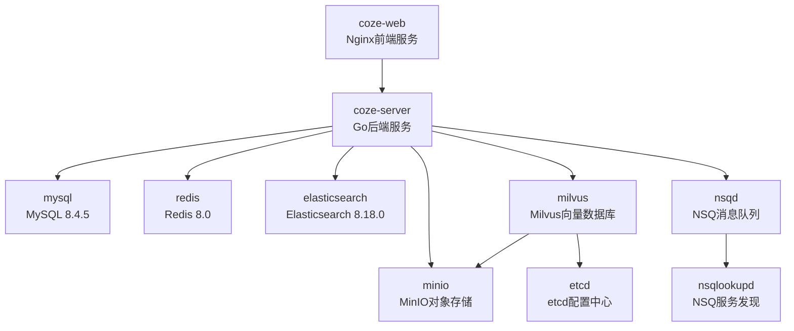

# 环境配置

本指南详细介绍如何使用 Docker 和 Docker Compose 部署 Coze Plus 开发和生产环境。

## 系统要求

### 硬件要求

| 组件 | 最低配置 | 推荐配置 |
|------|---------|---------|
| CPU | 2 Core | 4 Core+ |
| 内存 | 4 GB | 8 GB+ |
| 磁盘空间 | 20 GB | 50 GB+ |

### 软件要求

- **Docker**: 20.10.0 或更高版本
- **Docker Compose**: 2.0.0 或更高版本
- **操作系统**: Linux、macOS 或 Windows (WSL2)

### 检查环境

```bash
# 检查 Docker 版本
docker --version

# 检查 Docker Compose 版本
docker compose version

# 验证 Docker 服务运行状态
docker info
```

## Docker 架构概览

Coze Plus 采用微服务架构，包含以下核心服务：



### 服务清单

| 服务名称 | 镜像版本 | 端口 | 说明 |
|---------|---------|------|------|
| coze-web | nginx:latest | 80, 443 | 前端 Web 服务 |
| coze-server | 自构建 | 8888, 8889 | 后端 API 服务 |
| mysql | mysql:8.4.5 | 3306 | 主数据库 |
| redis | bitnamilegacy/redis:8.0 | 6379 | 缓存服务 |
| elasticsearch | bitnamilegacy/elasticsearch:8.18.0 | 9200 | 搜索引擎 |
| minio | minio/minio:RELEASE.2025-06-13T11-33-47Z-cpuv1 | 9000, 9001 | 对象存储 |
| etcd | bitnamilegacy/etcd:3.5 | 2379, 2380 | 配置中心 |
| milvus | milvusdb/milvus:v2.5.10 | 19530, 9091 | 向量数据库 |
| nsqlookupd | nsqio/nsq:v1.2.1 | 4160, 4161 | NSQ 服务发现 |
| nsqd | nsqio/nsq:v1.2.1 | 4150, 4151 | NSQ 消息服务 |
| nsqadmin | nsqio/nsq:v1.2.1 | 4171 | NSQ 管理界面 |

## 快速部署

### 1. 获取源码

```bash
# 克隆代码仓库
git clone https://github.com/coze-plus-dev/coze-plus.git

# 进入项目目录
cd coze-plus
```

### 2. 配置环境变量

```bash
# 进入 Docker 配置目录
cd docker

# 复制环境变量配置模板
cp .env.example .env
```

编辑 `.env` 文件，配置关键参数：

```bash
# 编辑环境变量文件
vim .env  # 或使用其他编辑器
```

### 3. 配置 AI 模型

Coze Plus 需要接入大语言模型才能正常工作。

```bash
# 复制模型配置模板
cp backend/conf/model/template/model_template_ark_doubao-seed-1.6.yaml \
   backend/conf/model/ark_doubao-seed-1.6.yaml
```

编辑模型配置文件：

```yaml
# backend/conf/model/ark_doubao-seed-1.6.yaml

id: 100001  # 模型 ID，非零整数，全局唯一

meta:
  conn_config:
    api_key: "your-api-key-here"     # 模型服务的 API Key
    model: "ep-xxx-xxx"               # 模型名称或 Endpoint ID
    base_url: "https://ark.cn-beijing.volces.com/api/v3"
```

支持的模型提供商：
- **火山方舟 (Ark)**: Volcengine/BytePlus 提供的模型服务
- **OpenAI**: GPT-3.5/GPT-4 等模型
- **通义千问 (Qwen)**: 阿里云提供的大模型
- **DeepSeek**: DeepSeek AI 提供的模型
- **Ollama**: 本地部署的开源模型
- **Gemini**: Google 提供的大模型

### 4. 启动服务

```bash
# 启动所有服务（首次启动会拉取镜像和构建，需要 10-15 分钟）
docker compose up -d

# 查看服务状态
docker compose ps

# 查看服务日志
docker compose logs -f
```

### 5. 访问系统

等待所有服务启动完成后（所有服务状态显示为 `healthy`）：

- **Web 界面**: http://localhost:8888
- **默认账号**:
  - 邮箱: `administrator@coze-plus.cn`
  - 密码: `coze-plus123456`

## 环境变量详解

### 服务器配置

```bash
# 服务监听地址
export LISTEN_ADDR=":8888"

# 日志级别: debug / info / warn / error
export LOG_LEVEL="debug"

# 最大请求体大小（字节）
export MAX_REQUEST_BODY_SIZE=1073741824

# 服务器域名
export SERVER_HOST="http://localhost:8888"

# SSL 配置
export USE_SSL="0"
export SSL_CERT_FILE=""
export SSL_KEY_FILE=""

# Web 服务监听地址
export WEB_LISTEN_ADDR="0.0.0.0:80"
```

### MySQL 数据库

```bash
# MySQL 连接配置
export MYSQL_ROOT_PASSWORD=root
export MYSQL_DATABASE=opencoze
export MYSQL_USER=coze
export MYSQL_PASSWORD=coze123
export MYSQL_HOST=mysql
export MYSQL_PORT=3306

# MySQL DSN 连接字符串
export MYSQL_DSN="${MYSQL_USER}:${MYSQL_PASSWORD}@tcp(${MYSQL_HOST}:${MYSQL_PORT})/${MYSQL_DATABASE}?charset=utf8mb4&parseTime=True"
```

### Redis 缓存

```bash
# Redis 配置
export REDIS_AOF_ENABLED=no
export REDIS_IO_THREADS=4
export ALLOW_EMPTY_PASSWORD=yes
export REDIS_ADDR="redis:6379"
export REDIS_PASSWORD=""
```

### Elasticsearch 搜索引擎

```bash
# Elasticsearch 配置
export ES_ADDR="http://elasticsearch:9200"
export ES_VERSION="v8"
export ES_USERNAME=""
export ES_PASSWORD=""
export ES_NUMBER_OF_SHARDS="1"
export ES_NUMBER_OF_REPLICAS="1"
```

### MinIO 对象存储

```bash
# 存储类型: minio / tos / s3
export STORAGE_TYPE="minio"
export STORAGE_UPLOAD_HTTP_SCHEME="http"
export STORAGE_BUCKET="opencoze"

# MinIO 配置
export MINIO_ROOT_USER=minioadmin
export MINIO_ROOT_PASSWORD=minioadmin123
export MINIO_DEFAULT_BUCKETS=milvus
export MINIO_ENDPOINT="minio:9000"
export MINIO_API_HOST="http://${MINIO_ENDPOINT}"
```

### Milvus 向量数据库

```bash
# 向量存储类型: milvus / vikingdb / oceanbase
export VECTOR_STORE_TYPE="milvus"

# Milvus 配置
export MILVUS_ADDR="milvus:19530"
export MILVUS_USER=""
export MILVUS_PASSWORD=""
export MILVUS_TOKEN=""
```

### NSQ 消息队列

```bash
# 消息队列类型: nsq / kafka / rmq / pulsar
export COZE_MQ_TYPE="nsq"
export MQ_NAME_SERVER="nsqd:4150"
```

### Embedding 模型配置

```bash
# Embedding 类型: ark / openai / ollama / gemini / http
export EMBEDDING_TYPE="ark"
export EMBEDDING_MAX_BATCH_SIZE=100

# Ark Embedding (火山方舟)
export ARK_EMBEDDING_BASE_URL=""
export ARK_EMBEDDING_MODEL=""
export ARK_EMBEDDING_API_KEY=""
export ARK_EMBEDDING_DIMS="2048"

# OpenAI Embedding
export OPENAI_EMBEDDING_BASE_URL=""
export OPENAI_EMBEDDING_MODEL=""
export OPENAI_EMBEDDING_API_KEY=""
export OPENAI_EMBEDDING_DIMS=1024
```

## Docker Compose 配置

### 主配置文件

项目提供多个 Docker Compose 配置文件：

| 文件名 | 用途 |
|-------|------|
| `docker-compose.yml` | 生产环境配置（默认） |
| `docker-compose-debug.yml` | 调试环境配置 |
| `docker-compose-oceanbase.yml` | OceanBase 集成配置 |
| `docker-compose-oceanbase_debug.yml` | OceanBase 调试配置 |

### 使用不同的配置文件

```bash
# 使用默认配置
docker compose up -d

# 使用调试配置
docker compose -f docker-compose-debug.yml up -d

# 使用 OceanBase 配置
docker compose -f docker-compose-oceanbase.yml up -d

# 组合多个配置文件
docker compose -f docker-compose.yml -f docker-compose-debug.yml up -d
```

### 健康检查

所有服务都配置了健康检查，确保服务正常运行：

```bash
# 查看服务健康状态
docker compose ps

# 查看特定服务的健康状态
docker inspect coze-mysql --format='{{.State.Health.Status}}'
```

健康状态说明：
- **starting**: 服务正在启动
- **healthy**: 服务运行正常
- **unhealthy**: 服务异常

## 数据持久化

### 数据卷映射

所有服务的数据都挂载到 `docker/data/` 目录：

```bash
docker/data/
├── mysql/              # MySQL 数据库文件
├── bitnami/
│   ├── redis/         # Redis 数据文件
│   ├── elasticsearch/ # Elasticsearch 数据
│   └── etcd/          # etcd 数据
├── minio/             # MinIO 对象存储
└── milvus/            # Milvus 向量数据
```

### 备份与恢复

#### 备份数据

```bash
# 备份整个数据目录
tar -czf coze-plus-backup-$(date +%Y%m%d).tar.gz docker/data/

# 备份 MySQL 数据库
docker exec coze-mysql mysqldump -u root -proot opencoze > backup-$(date +%Y%m%d).sql

# 备份 MinIO 对象存储
docker exec coze-minio mc mirror localminio/opencoze /backup/minio/
```

#### 恢复数据

```bash
# 停止服务
docker compose down

# 恢复数据目录
tar -xzf coze-plus-backup-20250126.tar.gz

# 重新启动服务
docker compose up -d
```

## 服务管理

### 启动服务

```bash
# 启动所有服务
docker compose up -d

# 启动特定服务
docker compose up -d mysql redis

# 启动并查看日志
docker compose up
```

### 停止服务

```bash
# 停止所有服务
docker compose stop

# 停止特定服务
docker compose stop coze-server

# 停止并删除容器
docker compose down

# 停止并删除容器、网络、数据卷
docker compose down -v
```

### 重启服务

```bash
# 重启所有服务
docker compose restart

# 重启特定服务
docker compose restart coze-server

# 重新构建并启动
docker compose up -d --build
```

### 查看日志

```bash
# 查看所有服务日志
docker compose logs

# 实时查看日志
docker compose logs -f

# 查看特定服务日志
docker compose logs -f coze-server

# 查看最近 100 行日志
docker compose logs --tail=100 coze-server
```

### 扩展服务

```bash
# 扩展 coze-server 到 3 个实例
docker compose up -d --scale coze-server=3

# 查看运行的实例
docker compose ps coze-server
```

## 性能优化

### 资源限制

编辑 `docker-compose.yml` 添加资源限制：

```yaml
services:
  mysql:
    # ... 其他配置
    deploy:
      resources:
        limits:
          cpus: '2.0'
          memory: 4G
        reservations:
          cpus: '1.0'
          memory: 2G
```

### Elasticsearch 配置优化

```bash
# 调整 JVM 堆内存（在 .env 文件中）
ES_JAVA_OPTS="-Xms4g -Xmx4g"
```

### Redis 性能调优

```bash
# 启用 AOF 持久化
export REDIS_AOF_ENABLED=yes

# 增加 IO 线程数
export REDIS_IO_THREADS=8
```

## 常见问题

### 服务启动失败

**问题**: 容器一直处于 `starting` 状态

**解决方法**:
```bash
# 查看容器日志
docker compose logs <service-name>

# 检查端口占用
sudo lsof -i :<port>

# 重启 Docker 服务
sudo systemctl restart docker
```

### 磁盘空间不足

**问题**: Docker 磁盘空间占用过大

**解决方法**:
```bash
# 清理未使用的镜像
docker image prune -a

# 清理未使用的容器
docker container prune

# 清理未使用的数据卷
docker volume prune

# 清理所有未使用的资源
docker system prune -a --volumes
```

### MySQL 连接失败

**问题**: 无法连接到 MySQL 数据库

**解决方法**:
```bash
# 检查 MySQL 服务状态
docker compose ps mysql

# 进入 MySQL 容器
docker exec -it coze-mysql mysql -u root -p

# 检查数据库是否存在
SHOW DATABASES;

# 重新初始化数据库
docker compose down
docker volume rm coze-studio_mysql_data
docker compose up -d
```

### Elasticsearch 内存不足

**问题**: Elasticsearch 因内存不足而崩溃

**解决方法**:
```bash
# 增加 Docker 内存限制
# Docker Desktop -> Settings -> Resources -> Memory

# 调整 Elasticsearch JVM 设置
# 在 .env 文件中添加
ES_JAVA_OPTS="-Xms2g -Xmx2g"
```

### 网络连接问题

**问题**: 容器之间无法通信

**解决方法**:
```bash
# 检查网络
docker network ls
docker network inspect coze-studio_coze-network

# 重建网络
docker compose down
docker network prune
docker compose up -d
```

## 开发环境配置

### 使用调试模式

```bash
# 使用调试配置文件
docker compose -f docker-compose-debug.yml up -d

# 挂载本地代码进行开发
# 在 docker-compose-debug.yml 中添加 volumes
volumes:
  - ../backend:/app/backend
  - ../frontend:/app/frontend
```

### 端口映射

调试模式下可以暴露所有端口：

```yaml
# docker-compose-debug.yml
services:
  mysql:
    ports:
      - "3306:3306"
  redis:
    ports:
      - "6379:6379"
  elasticsearch:
    ports:
      - "9200:9200"
```

## 生产环境部署建议

### 安全加固

1. **修改默认密码**
   ```bash
   # 修改 MySQL root 密码
   export MYSQL_ROOT_PASSWORD="strong-password-here"

   # 修改 MinIO 密码
   export MINIO_ROOT_PASSWORD="strong-password-here"
   ```

2. **启用 SSL/TLS**
   ```bash
   export USE_SSL="1"
   export SSL_CERT_FILE="/path/to/cert.pem"
   export SSL_KEY_FILE="/path/to/key.pem"
   ```

3. **配置防火墙**
   ```bash
   # 只允许必要的端口
   sudo ufw allow 80/tcp
   sudo ufw allow 443/tcp
   sudo ufw enable
   ```

### 监控和日志

1. **启用日志收集**
   ```bash
   # 使用 JSON 格式日志
   export LOG_FORMAT="json"

   # 配置日志级别
   export LOG_LEVEL="info"
   ```

2. **集成监控系统**
   - Prometheus + Grafana
   - ELK Stack (Elasticsearch, Logstash, Kibana)
   - DataDog / New Relic

### 高可用配置

1. **MySQL 主从复制**
2. **Redis 哨兵模式**
3. **Elasticsearch 集群**
4. **负载均衡器**（Nginx, HAProxy）

## 下一步

- [开发流程](./development-workflow.md) - 了解开发工作流程
- [权限系统指南](./permission-guide.md) - 配置权限管理
- [架构设计](../architecture/) - 深入了解系统架构
