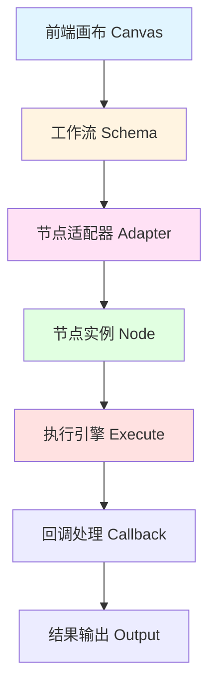
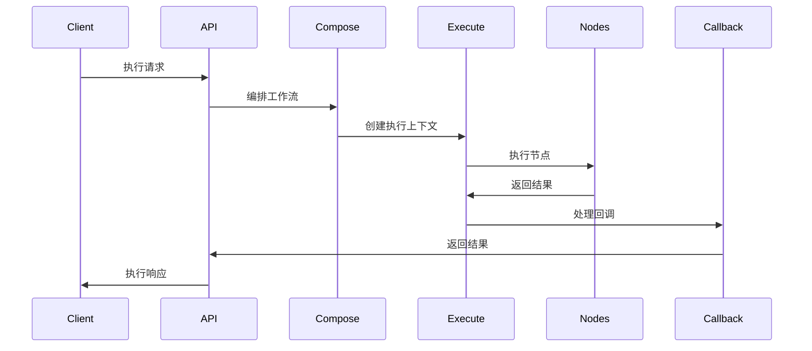
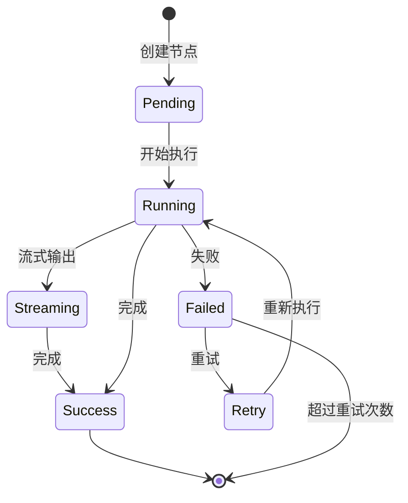

# 工作流开发指南

本文档详细介绍 Coze Plus 工作流系统的开发流程、节点类型、执行机制和最佳实践。

## 工作流概述

### 什么是工作流

工作流（Workflow）是一种可视化的任务编排系统，通过连接不同的节点来实现复杂的业务逻辑。每个节点代表一个特定的功能单元，节点之间通过数据流连接。

### 核心特性

- **可视化编排**：通过拖拽方式构建工作流
- **节点化设计**：每个功能封装为独立节点
- **数据流驱动**：节点间通过变量传递数据
- **支持流式处理**：支持实时数据流处理
- **嵌套执行**：支持子工作流调用
- **批量处理**：支持数据批量执行

### 应用场景

- **AI Agent 编排**：组合 LLM、知识库、插件构建智能助手
- **数据处理流程**：文档处理、数据清洗、ETL 任务
- **业务自动化**：审批流程、通知系统、定时任务
- **对话管理**：多轮对话、上下文管理、会话存储

## 工作流架构

### 整体架构



### 核心组件

| 组件 | 路径 | 职责 |
|------|------|------|
| **Canvas** | `entity/vo/canvas.go` | 前端画布数据结构 |
| **Schema** | `internal/schema/` | 后端工作流模式 |
| **Nodes** | `internal/nodes/` | 节点实现 |
| **Compose** | `internal/compose/` | 工作流编排 |
| **Execute** | `internal/execute/` | 执行引擎 |
| **Service** | `service/` | 工作流服务 |

## 节点系统

### 节点分类

#### 1. 输入输出节点

| 节点类型 | 中文名称 | 说明 | 使用场景 |
|---------|---------|------|---------|
| **Entry** (Start) | 开始 | 工作流起始节点 | 定义工作流输入参数 |
| **Exit** (End) | 结束 | 工作流结束节点 | 返回工作流执行结果 |
| **InputReceiver** | 输入接收 | 接收外部输入 | API 调用、用户输入 |
| **OutputEmitter** | 输出 | 中间过程输出 | 流式输出、消息推送 |

**示例**：

```go
// 开始节点配置
{
  "node_type": "Entry",
  "data": {
    "inputs": {
      "query": {"type": "string", "required": true},
      "user_id": {"type": "number", "required": false}
    }
  }
}

// 结束节点配置
{
  "node_type": "Exit",
  "data": {
    "inputs": {
      "result": {"ref": {"from_node_key": "llm_1", "from_path": "output"}},
      "status": {"val": "success"}
    }
  }
}
```

#### 2. AI 模型节点

| 节点类型 | 中文名称 | 说明 | 特性 |
|---------|---------|------|------|
| **LLM** | 大模型 | 调用大语言模型 | 支持流式、工具调用、思维链 |
| **Plugin** | 插件 | 调用第三方 API | 支持 OAuth、鉴权、重试 |

**LLM 节点配置**：

```go
{
  "node_type": "LLM",
  "data": {
    "inputs": {
      "model_id": {"val": "gpt-4"},
      "prompt": {"val": "你是一个专业的助手"},
      "user_query": {"ref": {"from_node_key": "entry", "from_path": "query"}},
      "temperature": {"val": 0.7},
      "max_tokens": {"val": 2000},
      "response_format": {"val": "text"}, // text, markdown, json
      "tools": {"val": ["tool_1", "tool_2"]}
    },
    "outputs": {
      "output": {"type": "string"},
      "reasoning_content": {"type": "string"}, // 思维链输出
      "tool_calls": {"type": "array"} // 工具调用记录
    }
  }
}
```

**Plugin 节点配置**：

```go
{
  "node_type": "Plugin",
  "data": {
    "inputs": {
      "plugin_id": {"val": 12345},
      "api_id": {"val": 67890},
      "parameters": {
        "city": {"ref": {"from_node_key": "entry", "from_path": "city"}},
        "date": {"val": "2025-01-01"}
      }
    },
    "outputs": {
      "result": {"type": "object"},
      "status_code": {"type": "number"}
    }
  }
}
```

#### 3. 知识库节点

| 节点类型 | 中文名称 | 说明 | 使用场景 |
|---------|---------|------|---------|
| **KnowledgeRetriever** | 知识库检索 | 检索知识库内容 | RAG、语义搜索 |
| **KnowledgeIndexer** | 知识库索引 | 添加文档到知识库 | 文档上传、内容更新 |
| **KnowledgeDeleter** | 知识库删除 | 删除知识库文档 | 内容清理 |

**知识库检索示例**：

```go
{
  "node_type": "KnowledgeRetriever",
  "data": {
    "inputs": {
      "dataset_id": {"val": 123},
      "query": {"ref": {"from_node_key": "entry", "from_path": "question"}},
      "top_k": {"val": 5},
      "score_threshold": {"val": 0.7},
      "rerank": {"val": true}
    },
    "outputs": {
      "documents": {"type": "array"},
      "scores": {"type": "array"}
    }
  }
}
```

#### 4. 数据库节点

| 节点类型 | 中文名称 | 说明 | 操作 |
|---------|---------|------|------|
| **DatabaseQuery** | 数据库查询 | 查询数据库 | SELECT |
| **DatabaseInsert** | 数据库插入 | 插入数据 | INSERT |
| **DatabaseUpdate** | 数据库更新 | 更新数据 | UPDATE |
| **DatabaseDelete** | 数据库删除 | 删除数据 | DELETE |
| **DatabaseCustomSQL** | SQL 自定义 | 自定义 SQL | 任意 SQL |

**数据库查询示例**：

```go
{
  "node_type": "DatabaseQuery",
  "data": {
    "inputs": {
      "database_id": {"val": 456},
      "table": {"val": "users"},
      "columns": {"val": ["id", "name", "email"]},
      "where": {
        "conditions": [
          {"field": "status", "operator": "=", "value": "active"},
          {"field": "age", "operator": ">", "value": 18}
        ],
        "logic": "AND"
      },
      "limit": {"val": 100},
      "offset": {"val": 0}
    },
    "outputs": {
      "rows": {"type": "array"},
      "count": {"type": "number"}
    }
  }
}
```

**自定义 SQL 示例**：

```go
{
  "node_type": "DatabaseCustomSQL",
  "data": {
    "inputs": {
      "database_id": {"val": 456},
      "sql": {"val": "SELECT * FROM orders WHERE user_id = :user_id AND created_at > :start_date"},
      "parameters": {
        "user_id": {"ref": {"from_node_key": "entry", "from_path": "user_id"}},
        "start_date": {"val": "2025-01-01"}
      }
    },
    "outputs": {
      "result": {"type": "array"}
    }
  }
}
```

#### 5. 逻辑控制节点

| 节点类型 | 中文名称 | 说明 | 使用场景 |
|---------|---------|------|---------|
| **Selector** (If) | 选择器 | 条件分支 | if-else 逻辑 |
| **Loop** | 循环 | 循环执行 | 数组遍历、批量处理 |
| **Break** | 终止循环 | 跳出循环 | 提前结束循环 |
| **Continue** | 继续循环 | 跳过本次循环 | 条件跳过 |

**选择器节点示例**：

```go
{
  "node_type": "Selector",
  "data": {
    "inputs": {
      "branches": [
        {
          "name": "高优先级",
          "condition": {
            "field": {"ref": {"from_node_key": "entry", "from_path": "priority"}},
            "operator": ">=",
            "value": 8
          },
          "port": "branch_1"
        },
        {
          "name": "中优先级",
          "condition": {
            "field": {"ref": {"from_node_key": "entry", "from_path": "priority"}},
            "operator": ">=",
            "value": 5
          },
          "port": "branch_2"
        }
      ],
      "else_port": "branch_else"
    }
  }
}
```

**循环节点示例**：

```go
{
  "node_type": "Loop",
  "data": {
    "inputs": {
      "array": {"ref": {"from_node_key": "query", "from_path": "items"}},
      "max_iterations": {"val": 100},
      "loop_variable": {"val": "item"}
    },
    "outputs": {
      "results": {"type": "array"},
      "iteration_count": {"type": "number"}
    }
  }
}
```

#### 6. 工具节点

| 节点类型 | 中文名称 | 说明 | 使用场景 |
|---------|---------|------|---------|
| **CodeRunner** | 代码 | 执行 Python 代码 | 自定义逻辑、数据处理 |
| **HTTPRequester** | HTTP 请求 | 发送 HTTP 请求 | API 调用、Webhook |
| **TextProcessor** | 文本处理 | 文本格式化 | 字符串拼接、模板渲染 |
| **VariableAssigner** | 变量赋值 | 设置变量值 | 中间变量 |
| **JsonSerialization** | JSON 序列化 | 对象转 JSON | 数据格式化 |
| **JsonDeserialization** | JSON 反序列化 | JSON 转对象 | 数据解析 |

**代码节点示例**：

```go
{
  "node_type": "CodeRunner",
  "data": {
    "inputs": {
      "code": {"val": `
def main(params):
    data = params['data']
    result = []
    for item in data:
        if item['score'] > 0.8:
            result.append(item)
    return {'filtered_data': result}
`},
      "params": {
        "data": {"ref": {"from_node_key": "query", "from_path": "items"}}
      }
    },
    "outputs": {
      "filtered_data": {"type": "array"}
    }
  }
}
```

**HTTP 请求示例**：

```go
{
  "node_type": "HTTPRequester",
  "data": {
    "inputs": {
      "method": {"val": "POST"},
      "url": {"val": "https://api.example.com/data"},
      "headers": {
        "Content-Type": {"val": "application/json"},
        "Authorization": {"val": "Bearer TOKEN"}
      },
      "body": {
        "query": {"ref": {"from_node_key": "entry", "from_path": "query"}},
        "limit": {"val": 10}
      },
      "timeout": {"val": 30000}
    },
    "outputs": {
      "response": {"type": "object"},
      "status_code": {"type": "number"}
    }
  }
}
```

#### 7. 会话管理节点

| 节点类型 | 中文名称 | 说明 | 使用场景 |
|---------|---------|------|---------|
| **CreateConversation** | 创建会话 | 创建新会话 | 对话开始 |
| **ConversationList** | 会话列表 | 查询会话列表 | 历史会话 |
| **CreateMessage** | 创建消息 | 添加消息 | 消息记录 |
| **MessageList** | 消息列表 | 查询消息 | 对话历史 |
| **ConversationHistory** | 会话历史 | 获取历史消息 | 上下文管理 |

#### 8. 其他节点

| 节点类型 | 中文名称 | 说明 |
|---------|---------|------|
| **SubWorkflow** | 子工作流 | 嵌套调用其他工作流 |
| **Batch** | 批量处理 | 并行处理多个任务 |
| **QuestionAnswer** | 问答 | 向用户提问 |
| **IntentDetector** | 意图检测 | 识别用户意图 |
| **VariableAggregator** | 变量聚合 | 聚合多个变量 |

### 节点接口定义

每个节点必须实现以下接口之一：

```go
// 1. 基本调用接口（非流式输入、非流式输出）
type InvokableNode interface {
    Invoke(ctx context.Context, input map[string]any) (
        output map[string]any, err error)
}

// 2. 带选项的调用接口
type InvokableNodeWOpt interface {
    Invoke(ctx context.Context, in map[string]any, opts ...NodeOption) (
        map[string]any, error)
}

// 3. 流式输出接口（非流式输入、流式输出）
type StreamableNodeWOpt interface {
    Stream(ctx context.Context, in map[string]any, opts ...NodeOption) (
        *StreamReader[map[string]any], error)
}

// 4. 流式转换接口（流式输入、流式输出）
type TransformableNode interface {
    Transform(ctx context.Context, in *StreamReader[map[string]any]) (
        *StreamReader[map[string]any], error)
}

// 5. 节点适配器接口
type NodeAdaptor interface {
    Adapt(ctx context.Context, n *vo.Node, opts ...AdaptOption) (
        *schema.NodeSchema, error)
}
```

## 工作流开发流程

### 1. 创建工作流

**API 调用**：

```bash
POST /api/workflow_api/create
Content-Type: application/json

{
  "name": "客户服务助手",
  "desc": "智能客服工作流",
  "space_id": "123"
}
```

**Go 代码**：

```go
// application/workflow/create.go
func (app *WorkflowApp) CreateWorkflow(
    ctx context.Context,
    req *CreateWorkflowRequest,
) (*WorkflowDTO, error) {
    // 1. 创建元数据
    id, err := app.workflowService.Create(ctx, &vo.MetaCreate{
        Name:        req.Name,
        Description: req.Description,
        SpaceID:     req.SpaceID,
    })

    return &WorkflowDTO{ID: id}, nil
}
```

### 2. 设计工作流画布

**前端画布数据结构**：

```typescript
// Canvas 结构
interface Canvas {
  nodes: Node[];      // 节点列表
  edges: Edge[];      // 连接线
  variables: Variable[]; // 全局变量
}

// 节点结构
interface Node {
  key: string;        // 节点唯一标识
  type: NodeType;     // 节点类型
  data: {
    inputs: Record<string, FieldSource>;  // 输入配置
    outputs: Record<string, TypeInfo>;    // 输出定义
  };
  position: { x: number; y: number };     // 位置
}

// 边结构
interface Edge {
  source: string;     // 源节点
  target: string;     // 目标节点
  sourcePort?: string; // 源端口（条件分支）
  targetPort?: string; // 目标端口
}
```

**示例工作流**：

```json
{
  "nodes": [
    {
      "key": "entry",
      "type": "Entry",
      "data": {
        "inputs": {
          "question": {"type": "string"},
          "user_id": {"type": "number"}
        }
      },
      "position": {"x": 100, "y": 100}
    },
    {
      "key": "knowledge_1",
      "type": "KnowledgeRetriever",
      "data": {
        "inputs": {
          "dataset_id": {"val": 123},
          "query": {"ref": {"from_node_key": "entry", "from_path": "question"}},
          "top_k": {"val": 3}
        }
      },
      "position": {"x": 300, "y": 100}
    },
    {
      "key": "llm_1",
      "type": "LLM",
      "data": {
        "inputs": {
          "model_id": {"val": "gpt-4"},
          "prompt": {"val": "根据以下知识库内容回答问题"},
          "context": {"ref": {"from_node_key": "knowledge_1", "from_path": "documents"}},
          "query": {"ref": {"from_node_key": "entry", "from_path": "question"}}
        }
      },
      "position": {"x": 500, "y": 100}
    },
    {
      "key": "exit",
      "type": "Exit",
      "data": {
        "inputs": {
          "answer": {"ref": {"from_node_key": "llm_1", "from_path": "output"}}
        }
      },
      "position": {"x": 700, "y": 100}
    }
  ],
  "edges": [
    {"source": "entry", "target": "knowledge_1"},
    {"source": "knowledge_1", "target": "llm_1"},
    {"source": "llm_1", "target": "exit"}
  ]
}
```

### 3. 保存工作流

**API 调用**：

```bash
POST /api/workflow_api/save
Content-Type: application/json

{
  "workflow_id": "123",
  "schema": {
    "nodes": [...],
    "edges": [...]
  }
}
```

**Go 代码**：

```go
// service/workflow_impl.go
func (s *workflowServiceImpl) Save(
    ctx context.Context,
    id int64,
    schema string,
) error {
    // 1. 解析 schema
    canvas, err := parseCanvas(schema)
    if err != nil {
        return err
    }

    // 2. 验证工作流
    if err := s.validateWorkflow(ctx, canvas); err != nil {
        return err
    }

    // 3. 保存草稿
    return s.repo.CreateOrUpdateDraft(ctx, id, &vo.DraftInfo{
        Schema: schema,
    })
}
```

### 4. 发布工作流

**发布流程**：

```go
// service/workflow_impl.go
func (s *workflowServiceImpl) Publish(
    ctx context.Context,
    policy *vo.PublishPolicy,
) error {
    // 1. 获取草稿
    draft, err := s.repo.GetEntity(ctx, &vo.GetPolicy{
        ID:      policy.ID,
        Version: "draft",
    })

    // 2. 验证工作流
    checks, err := s.WorkflowSchemaCheck(ctx, draft, []workflow.CheckType{
        workflow.CheckTypeNodeConnection,
        workflow.CheckTypeVariableReference,
        workflow.CheckTypeCircularDependency,
    })

    // 3. 创建版本
    version := generateVersion()
    err = s.repo.CreateVersion(ctx, policy.ID, &vo.VersionInfo{
        Version: version,
        Schema:  draft.Schema,
    }, nil)

    // 4. 发布事件
    s.publishEvent(ctx, &WorkflowPublishedEvent{
        WorkflowID: policy.ID,
        Version:    version,
    })

    return nil
}
```

### 5. 执行工作流

**执行流程**：



**执行代码**：

```go
// service/executable_impl.go
func (s *executableServiceImpl) Execute(
    ctx context.Context,
    id int64,
    input map[string]interface{},
    opts *ExecuteOptions,
) (*ExecutionResult, error) {
    // 1. 获取工作流
    workflow, err := s.repo.GetEntity(ctx, &vo.GetPolicy{
        ID:      id,
        Version: opts.Version,
    })

    // 2. 构建执行图
    graph, err := s.composeWorkflow(ctx, workflow)
    if err != nil {
        return nil, err
    }

    // 3. 创建执行上下文
    execCtx := execute.NewContext(ctx, &execute.Options{
        WorkflowID:  id,
        ExecutionID: generateExecutionID(),
        Stream:      opts.Stream,
        Callback:    opts.Callback,
    })

    // 4. 执行工作流
    output, err := graph.Invoke(execCtx, input)
    if err != nil {
        return nil, err
    }

    // 5. 保存执行历史
    s.saveExecutionHistory(ctx, execCtx)

    return &ExecutionResult{
        Output:      output,
        ExecutionID: execCtx.ExecutionID,
    }, nil
}
```

## 节点开发指南

### 开发新节点的步骤

#### 1. 定义节点类型

```go
// backend/domain/workflow/entity/node_meta.go

const (
    NodeTypeCustomProcessor NodeType = "CustomProcessor"
)

var NodeTypeMetas = map[NodeType]*NodeTypeMeta{
    NodeTypeCustomProcessor: {
        ID:           100,
        Key:          NodeTypeCustomProcessor,
        Name:         "自定义处理器",
        Category:     "utilities",
        Desc:         "自定义数据处理节点",
        Color:        "#3071F2",
        IconURI:      "default_icon/workflow_icon/icon-custom.jpg",
        SupportBatch: false,
        ExecutableMeta: ExecutableMeta{
            PreFillZero: true,
            PostFillNil: true,
        },
    },
}
```

#### 2. 实现节点逻辑

```go
// backend/domain/workflow/internal/nodes/custom/processor.go

package custom

type CustomProcessor struct {
    config *ProcessorConfig
}

func NewCustomProcessor(config *ProcessorConfig) *CustomProcessor {
    return &CustomProcessor{config: config}
}

// 实现 InvokableNode 接口
func (p *CustomProcessor) Invoke(
    ctx context.Context,
    input map[string]any,
) (map[string]any, error) {
    // 1. 获取输入
    data := input["data"]

    // 2. 处理数据
    result, err := p.processData(ctx, data)
    if err != nil {
        return nil, err
    }

    // 3. 返回输出
    return map[string]any{
        "result": result,
        "status": "success",
    }, nil
}

func (p *CustomProcessor) processData(
    ctx context.Context,
    data any,
) (any, error) {
    // 自定义处理逻辑
    // ...
    return data, nil
}
```

#### 3. 实现节点适配器

```go
// backend/domain/workflow/internal/nodes/custom/adapt.go

type CustomProcessorAdaptor struct{}

func (a *CustomProcessorAdaptor) Adapt(
    ctx context.Context,
    n *vo.Node,
    opts ...nodes.AdaptOption,
) (*schema.NodeSchema, error) {
    // 1. 解析配置
    config, err := a.parseConfig(n.Data.Inputs)
    if err != nil {
        return nil, err
    }

    // 2. 创建节点实例
    processor := NewCustomProcessor(config)

    // 3. 创建 NodeSchema
    return &schema.NodeSchema{
        Key:  n.Key,
        Type: entity.NodeTypeCustomProcessor,
        Node: processor,
        Inputs:  a.parseInputs(n.Data.Inputs),
        Outputs: a.parseOutputs(n.Data.Outputs),
    }, nil
}

func (a *CustomProcessorAdaptor) parseConfig(
    inputs map[string]*vo.FieldSource,
) (*ProcessorConfig, error) {
    return &ProcessorConfig{
        // 解析配置参数
    }, nil
}
```

#### 4. 注册节点

```go
// backend/domain/workflow/internal/nodes/init.go

func init() {
    // 注册节点适配器
    nodes.RegisterNodeAdaptor(
        entity.NodeTypeCustomProcessor,
        func() nodes.NodeAdaptor {
            return &custom.CustomProcessorAdaptor{}
        },
    )
}
```

### 节点开发最佳实践

#### 1. 输入验证

```go
func (p *CustomProcessor) Invoke(
    ctx context.Context,
    input map[string]any,
) (map[string]any, error) {
    // 验证必需输入
    data, ok := input["data"]
    if !ok {
        return nil, errors.New("missing required input: data")
    }

    // 类型检查
    dataStr, ok := data.(string)
    if !ok {
        return nil, errors.New("input 'data' must be string")
    }

    // 验证输入值
    if len(dataStr) == 0 {
        return nil, errors.New("input 'data' cannot be empty")
    }

    // ... 处理逻辑
}
```

#### 2. 错误处理

```go
func (p *CustomProcessor) Invoke(
    ctx context.Context,
    input map[string]any,
) (map[string]any, error) {
    data := input["data"]

    // 使用业务错误
    result, err := p.processData(ctx, data)
    if err != nil {
        return nil, vo.NewWorkflowError(
            errno.WorkflowNodeExecutionError,
            fmt.Sprintf("failed to process data: %v", err),
            vo.LevelError,
        )
    }

    return map[string]any{"result": result}, nil
}
```

#### 3. 上下文管理

```go
func (p *CustomProcessor) Invoke(
    ctx context.Context,
    input map[string]any,
) (map[string]any, error) {
    // 检查上下文取消
    select {
    case <-ctx.Done():
        return nil, ctx.Err()
    default:
    }

    // 传递上下文
    result, err := p.callExternalService(ctx, input)
    if err != nil {
        return nil, err
    }

    return map[string]any{"result": result}, nil
}
```

#### 4. 支持流式输出

```go
// 实现 StreamableNodeWOpt 接口
func (p *CustomProcessor) Stream(
    ctx context.Context,
    in map[string]any,
    opts ...nodes.NodeOption,
) (*einoschema.StreamReader[map[string]any], error) {
    // 创建流式输出
    reader := einoschema.NewStreamReader[map[string]any]()

    go func() {
        defer reader.Close()

        // 分批处理数据
        chunks := p.splitData(in["data"])
        for _, chunk := range chunks {
            // 检查上下文
            select {
            case <-ctx.Done():
                return
            default:
            }

            // 处理并发送
            result := p.processChunk(chunk)
            reader.Send(map[string]any{
                "chunk": result,
            }, nil)
        }
    }()

    return reader, nil
}
```

## 工作流执行机制

### 执行模式

#### 1. 同步执行

```go
// 阻塞等待结果
result, err := workflowService.Execute(ctx, workflowID, input, &ExecuteOptions{
    Stream: false,
})
```

#### 2. 异步执行

```go
// 返回 ExecutionID，后台执行
executionID, err := workflowService.ExecuteAsync(ctx, workflowID, input)

// 查询执行状态
status, err := workflowService.GetExecutionStatus(ctx, executionID)
```

#### 3. 流式执行

```go
// 流式返回中间结果
stream, err := workflowService.ExecuteStream(ctx, workflowID, input)

for {
    chunk, err := stream.Recv()
    if err == io.EOF {
        break
    }
    // 处理流式输出
    handleChunk(chunk)
}
```

### 执行上下文

```go
type ExecuteContext struct {
    context.Context

    WorkflowID  int64
    ExecutionID string
    SpaceID     int64
    UserID      int64

    // 执行选项
    Stream      bool
    Timeout     time.Duration
    MaxRetries  int

    // 回调
    OnNodeStart  func(nodeKey string)
    OnNodeEnd    func(nodeKey string, output map[string]any)
    OnError      func(err error)

    // 缓存
    cache       map[string]any
    cacheMutex  sync.RWMutex
}
```

### 节点执行生命周期



## 常见问题

### Q1: 如何处理循环依赖？

**检测方法**：

```go
func (s *workflowServiceImpl) detectCycle(
    canvas *vo.Canvas,
) error {
    graph := buildGraph(canvas)

    visited := make(map[string]bool)
    recStack := make(map[string]bool)

    for nodeKey := range graph {
        if detectCycleUtil(graph, nodeKey, visited, recStack) {
            return errors.New("circular dependency detected")
        }
    }

    return nil
}
```

### Q2: 如何实现节点超时？

```go
func (e *executor) executeNode(
    ctx context.Context,
    node *schema.NodeSchema,
    input map[string]any,
) (map[string]any, error) {
    // 设置超时
    timeout := node.Meta.DefaultTimeoutMS
    if timeout == 0 {
        timeout = 30000 // 默认 30 秒
    }

    ctx, cancel := context.WithTimeout(ctx, time.Duration(timeout)*time.Millisecond)
    defer cancel()

    // 执行节点
    return node.Node.Invoke(ctx, input)
}
```

### Q3: 如何实现断点续传？

```go
// 保存检查点
func (e *executor) saveCheckpoint(
    ctx context.Context,
    execID string,
    nodeKey string,
    state map[string]any,
) error {
    checkpoint := &Checkpoint{
        ExecutionID: execID,
        NodeKey:     nodeKey,
        State:       state,
        Timestamp:   time.Now(),
    }

    return e.checkpointRepo.Save(ctx, checkpoint)
}

// 恢复执行
func (e *executor) resume(
    ctx context.Context,
    execID string,
) error {
    // 加载检查点
    checkpoint, err := e.checkpointRepo.Load(ctx, execID)
    if err != nil {
        return err
    }

    // 从检查点继续执行
    return e.executeFromNode(ctx, checkpoint.NodeKey, checkpoint.State)
}
```

### Q4: 如何处理大数据量？

**批量处理**：

```go
// 使用 Batch 节点
{
  "node_type": "Batch",
  "data": {
    "inputs": {
      "array": {"ref": {"from_node_key": "query", "from_path": "items"}},
      "batch_size": {"val": 100},
      "max_parallelism": {"val": 5}
    }
  }
}
```

**流式处理**：

```go
// 使用流式节点避免内存溢出
func (p *Processor) Stream(
    ctx context.Context,
    in map[string]any,
    opts ...nodes.NodeOption,
) (*StreamReader[map[string]any], error) {
    reader := NewStreamReader()

    go func() {
        defer reader.Close()

        // 分批读取和处理
        for batch := range p.readBatches(in["data"]) {
            result := p.processBatch(batch)
            reader.Send(result, nil)
        }
    }()

    return reader, nil
}
```

## 下一步

- [后端架构](../architecture/backend.md) - 后端技术架构
- [DDD 设计](../architecture/ddd.md) - 领域驱动设计
- [API 参考](../api/workflow.md) - Workflow API 文档
- [开发流程](./development-workflow.md) - 开发工作流程
