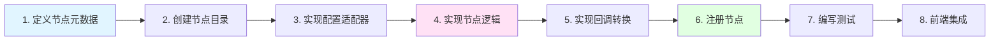

# 工作流节点开发教程

本文档提供工作流节点开发的完整教程，从零开始构建一个新的工作流节点。

## 开发概述

### 节点开发流程



### 核心文件结构

```
backend/domain/workflow/
├── entity/
│   └── node_meta.go                    # 1. 定义节点元数据
├── internal/
│   ├── canvas/
│   │   └── adaptor/
│   │       └── to_schema.go            # 6. 节点注册 (RegisterAllNodeAdaptors)
│   └── nodes/
│       ├── {node_name}/                # 2. 节点实现目录
│       │   ├── {node_name}.go          # 4. 节点逻辑实现
│       │   ├── adapt.go                # 3. 配置适配器
│       │   └── {node_name}_test.go     # 7. 测试文件
│       └── node.go                     # RegisterNodeAdaptor 函数定义
```

## 实战案例：开发邮件发送节点

我们将开发一个完整的邮件发送节点（EmailSender），作为学习案例。

### 步骤 1: 定义节点元数据

在 `backend/domain/workflow/entity/node_meta.go` 中添加节点定义。

#### 1.1 定义节点类型常量

```go
// backend/domain/workflow/entity/node_meta.go

const (
    // ... 现有节点类型
    NodeTypeEmailSender NodeType = "EmailSender"  // 新增
)
```

#### 1.2 添加节点元数据

```go
var NodeTypeMetas = map[NodeType]*NodeTypeMeta{
    // ... 现有节点元数据

    NodeTypeEmailSender: {
        ID:           101,  // 使用未占用的 ID
        Key:          NodeTypeEmailSender,
        DisplayKey:   "Email",  // 前端显示的 Key
        Name:         "邮件发送",
        Category:     "utilities",  // 节点分类
        Desc:         "发送电子邮件通知",
        Color:        "#3071F2",  // 节点颜色
        IconURI:      "default_icon/workflow_icon/icon-email.jpg",
        SupportBatch: false,  // 是否支持批量处理
        ExecutableMeta: ExecutableMeta{
            PreFillZero:      true,   // 执行前填充零值
            PostFillNil:      true,   // 执行后填充 nil
            DefaultTimeoutMS: 30000,  // 默认超时 30 秒
            UseCtxCache:      true,   // 使用上下文缓存
        },
        EnUSName:        "Email Sender",
        EnUSDescription: "Send email notifications",
    },
}
```

#### 1.3 元数据字段说明

| 字段 | 类型 | 说明 | 示例 |
|------|------|------|------|
| **ID** | int64 | 节点唯一 ID | 101 |
| **Key** | NodeType | 节点类型标识 | NodeTypeEmailSender |
| **DisplayKey** | string | 前端显示标识 | "Email" |
| **Name** | string | 中文名称 | "邮件发送" |
| **Category** | string | 节点分类 | "utilities" |
| **Color** | string | 节点颜色（十六进制） | "#3071F2" |
| **IconURI** | string | 图标路径 | "default_icon/..." |
| **SupportBatch** | bool | 是否支持批处理 | false |

#### 1.4 ExecutableMeta 配置说明

| 字段 | 说明 | 使用场景 |
|------|------|---------|
| **PreFillZero** | 执行前用零值填充未提供的输入 | 确保输入参数完整性 |
| **PostFillNil** | 执行后用 nil 填充未返回的输出 | 确保输出结构完整 |
| **DefaultTimeoutMS** | 默认超时时间（毫秒） | 防止节点执行时间过长 |
| **UseCtxCache** | 使用上下文缓存 | 在节点内部存储临时数据 |
| **MayUseChatModel** | 可能调用聊天模型 | LLM 相关节点 |
| **UseDatabase** | 需要数据库 | 数据库操作节点 |
| **UseKnowledge** | 需要知识库 | 知识库相关节点 |
| **UsePlugin** | 需要插件 | 插件调用节点 |
| **IncrementalOutput** | 增量输出（流式） | 需要实时流式输出 |
| **BlockEndStream** | 阻塞结束流 | 等待所有流式数据 |
| **InputSourceAware** | 感知输入源状态 | 需要知道输入来源 |

### 步骤 2: 创建节点目录结构

```bash
mkdir -p backend/domain/workflow/internal/nodes/emailsender
cd backend/domain/workflow/internal/nodes/emailsender
```

创建以下文件：
- `emailsender.go` - 节点逻辑实现
- `adapt.go` - 配置适配器
- `emailsender_test.go` - 单元测试

### 步骤 3: 实现配置适配器

创建 `backend/domain/workflow/internal/nodes/emailsender/adapt.go`

```go
package emailsender

import (
    "context"
    "fmt"

    "github.com/coze-dev/coze-studio/backend/domain/workflow/entity"
    "github.com/coze-dev/coze-studio/backend/domain/workflow/entity/vo"
    "github.com/coze-dev/coze-studio/backend/domain/workflow/internal/canvas/convert"
    "github.com/coze-dev/coze-studio/backend/domain/workflow/internal/nodes"
    "github.com/coze-dev/coze-studio/backend/domain/workflow/internal/schema"
)

// Config 节点配置结构
type Config struct {
    SMTPHost     string // SMTP 服务器地址
    SMTPPort     int    // SMTP 端口
    SMTPUsername string // SMTP 用户名
    SMTPPassword string // SMTP 密码
    UseTLS       bool   // 是否使用 TLS
}

// Adapt 实现适配器接口，将前端配置转换为后端配置
func (c *Config) Adapt(
    ctx context.Context,
    n *vo.Node,
    opts ...nodes.AdaptOption,
) (*schema.NodeSchema, error) {
    // 1. 创建 NodeSchema
    ns := &schema.NodeSchema{
        Key:     vo.NodeKey(n.ID),
        Type:    entity.NodeTypeEmailSender,
        Name:    n.Data.Meta.Title,
        Configs: c,
    }

    // 2. 解析配置参数
    inputs := n.Data.Inputs

    // 从前端配置中获取 SMTP 配置
    if smtpConfig := inputs.SMTPConfig; smtpConfig != nil {
        c.SMTPHost = smtpConfig.Host
        c.SMTPPort = smtpConfig.Port
        c.SMTPUsername = smtpConfig.Username
        c.SMTPPassword = smtpConfig.Password
        c.UseTLS = smtpConfig.UseTLS
    }

    // 3. 设置输入类型和来源
    if err := convert.SetInputsForNodeSchema(n, ns); err != nil {
        return nil, fmt.Errorf("set inputs: %w", err)
    }

    // 4. 设置输出类型
    if err := convert.SetOutputTypesForNodeSchema(n, ns); err != nil {
        return nil, fmt.Errorf("set outputs: %w", err)
    }

    return ns, nil
}

// Build 构建节点实例
func (c *Config) Build(
    ctx context.Context,
    ns *schema.NodeSchema,
    opts ...schema.BuildOption,
) (any, error) {
    // 验证必需配置
    if c.SMTPHost == "" {
        return nil, fmt.Errorf("SMTP host is required")
    }
    if c.SMTPPort == 0 {
        return nil, fmt.Errorf("SMTP port is required")
    }

    // 创建节点实例
    sender := &EmailSender{
        smtpHost:     c.SMTPHost,
        smtpPort:     c.SMTPPort,
        smtpUsername: c.SMTPUsername,
        smtpPassword: c.SMTPPassword,
        useTLS:       c.UseTLS,
    }

    return sender, nil
}
```

### 步骤 4: 实现节点逻辑

创建 `backend/domain/workflow/internal/nodes/emailsender/emailsender.go`

```go
package emailsender

import (
    "context"
    "crypto/tls"
    "fmt"
    "net/smtp"

    "github.com/coze-dev/coze-studio/backend/domain/workflow/internal/nodes"
    "github.com/coze-dev/coze-studio/backend/pkg/logs"
)

// EmailSender 邮件发送节点
type EmailSender struct {
    smtpHost     string
    smtpPort     int
    smtpUsername string
    smtpPassword string
    useTLS       bool
}

// Invoke 实现节点执行逻辑
func (e *EmailSender) Invoke(
    ctx context.Context,
    input map[string]any,
) (map[string]any, error) {
    // 1. 提取输入参数
    to, err := e.getString(input, "to")
    if err != nil {
        return nil, fmt.Errorf("get 'to': %w", err)
    }

    subject, err := e.getString(input, "subject")
    if err != nil {
        return nil, fmt.Errorf("get 'subject': %w", err)
    }

    body, err := e.getString(input, "body")
    if err != nil {
        return nil, fmt.Errorf("get 'body': %w", err)
    }

    // 可选参数
    from := e.getStringOrDefault(input, "from", e.smtpUsername)
    cc := e.getStringOrDefault(input, "cc", "")
    bcc := e.getStringOrDefault(input, "bcc", "")

    // 2. 检查上下文是否已取消
    select {
    case <-ctx.Done():
        return nil, ctx.Err()
    default:
    }

    // 3. 构建邮件内容
    message := e.buildMessage(from, to, cc, bcc, subject, body)

    // 4. 发送邮件
    err = e.send(ctx, to, message)
    if err != nil {
        logs.CtxErrorf(ctx, "failed to send email: %v", err)
        return nil, fmt.Errorf("send email: %w", err)
    }

    // 5. 返回输出
    return map[string]any{
        "success":    true,
        "message_id": generateMessageID(),
        "sent_at":    getCurrentTimestamp(),
    }, nil
}

// send 发送邮件
func (e *EmailSender) send(ctx context.Context, to string, message []byte) error {
    // 构建 SMTP 地址
    addr := fmt.Sprintf("%s:%d", e.smtpHost, e.smtpPort)

    // 设置认证
    auth := smtp.PlainAuth("", e.smtpUsername, e.smtpPassword, e.smtpHost)

    // 如果使用 TLS
    if e.useTLS {
        return e.sendWithTLS(addr, auth, e.smtpUsername, []string{to}, message)
    }

    // 普通发送
    return smtp.SendMail(addr, auth, e.smtpUsername, []string{to}, message)
}

// sendWithTLS 使用 TLS 发送邮件
func (e *EmailSender) sendWithTLS(
    addr string,
    auth smtp.Auth,
    from string,
    to []string,
    message []byte,
) error {
    // 连接到 SMTP 服务器
    client, err := smtp.Dial(addr)
    if err != nil {
        return fmt.Errorf("dial: %w", err)
    }
    defer client.Close()

    // STARTTLS
    tlsConfig := &tls.Config{
        ServerName:         e.smtpHost,
        InsecureSkipVerify: false,
    }

    if err = client.StartTLS(tlsConfig); err != nil {
        return fmt.Errorf("start tls: %w", err)
    }

    // 认证
    if err = client.Auth(auth); err != nil {
        return fmt.Errorf("auth: %w", err)
    }

    // 设置发件人
    if err = client.Mail(from); err != nil {
        return fmt.Errorf("set mail from: %w", err)
    }

    // 设置收件人
    for _, addr := range to {
        if err = client.Rcpt(addr); err != nil {
            return fmt.Errorf("set rcpt to: %w", err)
        }
    }

    // 发送邮件内容
    w, err := client.Data()
    if err != nil {
        return fmt.Errorf("get data writer: %w", err)
    }

    _, err = w.Write(message)
    if err != nil {
        return fmt.Errorf("write data: %w", err)
    }

    err = w.Close()
    if err != nil {
        return fmt.Errorf("close writer: %w", err)
    }

    return client.Quit()
}

// buildMessage 构建邮件消息
func (e *EmailSender) buildMessage(
    from, to, cc, bcc, subject, body string,
) []byte {
    message := fmt.Sprintf("From: %s\r\n", from)
    message += fmt.Sprintf("To: %s\r\n", to)

    if cc != "" {
        message += fmt.Sprintf("Cc: %s\r\n", cc)
    }
    if bcc != "" {
        message += fmt.Sprintf("Bcc: %s\r\n", bcc)
    }

    message += fmt.Sprintf("Subject: %s\r\n", subject)
    message += "Content-Type: text/html; charset=UTF-8\r\n"
    message += "\r\n"
    message += body

    return []byte(message)
}

// getString 从输入中获取字符串
func (e *EmailSender) getString(input map[string]any, key string) (string, error) {
    value, ok := input[key]
    if !ok {
        return "", fmt.Errorf("missing required input: %s", key)
    }

    str, ok := value.(string)
    if !ok {
        return "", fmt.Errorf("input '%s' must be string, got %T", key, value)
    }

    if str == "" {
        return "", fmt.Errorf("input '%s' cannot be empty", key)
    }

    return str, nil
}

// getStringOrDefault 从输入中获取字符串或返回默认值
func (e *EmailSender) getStringOrDefault(
    input map[string]any,
    key string,
    defaultValue string,
) string {
    value, ok := input[key]
    if !ok {
        return defaultValue
    }

    str, ok := value.(string)
    if !ok {
        return defaultValue
    }

    return str
}

// 辅助函数
func generateMessageID() string {
    // 生成唯一的消息 ID
    return fmt.Sprintf("<%d@workflow>", time.Now().UnixNano())
}

func getCurrentTimestamp() string {
    return time.Now().Format(time.RFC3339)
}
```

### 步骤 5: 实现回调转换（可选）

回调转换用于在前端展示节点的输入输出，改善用户体验。

```go
// ToCallbackInput 转换输入用于前端展示
func (e *EmailSender) ToCallbackInput(
    ctx context.Context,
    input map[string]any,
) (*nodes.StructuredCallbackInput, error) {
    // 提取关键信息用于前端展示
    displayInput := map[string]any{
        "to":      input["to"],
        "subject": input["subject"],
        "from":    e.getStringOrDefault(input, "from", e.smtpUsername),
    }

    // 不展示敏感信息（如邮件正文）
    if body, ok := input["body"].(string); ok && len(body) > 100 {
        displayInput["body_preview"] = body[:100] + "..."
    } else {
        displayInput["body_preview"] = input["body"]
    }

    return &nodes.StructuredCallbackInput{
        Input: displayInput,
    }, nil
}

// ToCallbackOutput 转换输出用于前端展示
func (e *EmailSender) ToCallbackOutput(
    ctx context.Context,
    output map[string]any,
) (*nodes.StructuredCallbackOutput, error) {
    return &nodes.StructuredCallbackOutput{
        Output: output,
    }, nil
}
```

### 步骤 6: 注册节点

在 `backend/domain/workflow/internal/canvas/adaptor/to_schema.go` 的 `RegisterAllNodeAdaptors()` 函数中注册节点适配器。

**位置**: `backend/domain/workflow/internal/canvas/adaptor/to_schema.go:594`

```go
package adaptor

import (
    // ... 现有导入
    "github.com/coze-dev/coze-studio/backend/domain/workflow/internal/nodes/emailsender"
)

// RegisterAllNodeAdaptors register all NodeType's NodeAdaptor.
func RegisterAllNodeAdaptors() {
    // ... 现有注册

    // 注册邮件发送节点
    nodes.RegisterNodeAdaptor(
        entity.NodeTypeEmailSender,
        func() nodes.NodeAdaptor {
            return &emailsender.Config{}
        },
    )
}
```

**注意**: `RegisterNodeAdaptor` 函数定义在 `backend/domain/workflow/internal/nodes/node.go:167`

### 步骤 7: 编写测试

创建 `backend/domain/workflow/internal/nodes/emailsender/emailsender_test.go`

```go
package emailsender

import (
    "context"
    "testing"

    "github.com/stretchr/testify/assert"
    "github.com/stretchr/testify/require"
)

func TestEmailSender_Invoke(t *testing.T) {
    // 创建测试用的节点实例
    sender := &EmailSender{
        smtpHost:     "smtp.example.com",
        smtpPort:     587,
        smtpUsername: "test@example.com",
        smtpPassword: "password",
        useTLS:       true,
    }

    tests := []struct {
        name    string
        input   map[string]any
        wantErr bool
        errMsg  string
    }{
        {
            name: "成功发送邮件",
            input: map[string]any{
                "to":      "recipient@example.com",
                "subject": "Test Email",
                "body":    "<h1>Hello</h1><p>This is a test.</p>",
            },
            wantErr: false,
        },
        {
            name: "缺少必需字段 to",
            input: map[string]any{
                "subject": "Test Email",
                "body":    "Test body",
            },
            wantErr: true,
            errMsg:  "missing required input: to",
        },
        {
            name: "缺少必需字段 subject",
            input: map[string]any{
                "to":   "recipient@example.com",
                "body": "Test body",
            },
            wantErr: true,
            errMsg:  "missing required input: subject",
        },
        {
            name: "空字符串 to",
            input: map[string]any{
                "to":      "",
                "subject": "Test Email",
                "body":    "Test body",
            },
            wantErr: true,
            errMsg:  "input 'to' cannot be empty",
        },
    }

    for _, tt := range tests {
        t.Run(tt.name, func(t *testing.T) {
            ctx := context.Background()
            output, err := sender.Invoke(ctx, tt.input)

            if tt.wantErr {
                require.Error(t, err)
                if tt.errMsg != "" {
                    assert.Contains(t, err.Error(), tt.errMsg)
                }
            } else {
                require.NoError(t, err)
                assert.NotNil(t, output)
                assert.True(t, output["success"].(bool))
                assert.NotEmpty(t, output["message_id"])
                assert.NotEmpty(t, output["sent_at"])
            }
        })
    }
}

func TestEmailSender_BuildMessage(t *testing.T) {
    sender := &EmailSender{}

    message := sender.buildMessage(
        "sender@example.com",
        "recipient@example.com",
        "cc@example.com",
        "bcc@example.com",
        "Test Subject",
        "<h1>Test Body</h1>",
    )

    messageStr := string(message)

    // 验证邮件头
    assert.Contains(t, messageStr, "From: sender@example.com")
    assert.Contains(t, messageStr, "To: recipient@example.com")
    assert.Contains(t, messageStr, "Cc: cc@example.com")
    assert.Contains(t, messageStr, "Bcc: bcc@example.com")
    assert.Contains(t, messageStr, "Subject: Test Subject")
    assert.Contains(t, messageStr, "Content-Type: text/html; charset=UTF-8")

    // 验证邮件正文
    assert.Contains(t, messageStr, "<h1>Test Body</h1>")
}

func TestConfig_Adapt(t *testing.T) {
    config := &Config{}

    // 创建测试节点配置
    node := &vo.Node{
        ID: "test_node_1",
        Data: vo.NodeData{
            Meta: vo.NodeMeta{
                Title: "Test Email Sender",
            },
            Inputs: vo.NodeInputs{
                SMTPConfig: &vo.SMTPConfig{
                    Host:     "smtp.test.com",
                    Port:     587,
                    Username: "user@test.com",
                    Password: "pass",
                    UseTLS:   true,
                },
            },
        },
    }

    ctx := context.Background()
    ns, err := config.Adapt(ctx, node)

    require.NoError(t, err)
    assert.NotNil(t, ns)
    assert.Equal(t, entity.NodeTypeEmailSender, ns.Type)
    assert.Equal(t, "test_node_1", string(ns.Key))

    // 验证配置
    assert.Equal(t, "smtp.test.com", config.SMTPHost)
    assert.Equal(t, 587, config.SMTPPort)
    assert.Equal(t, "user@test.com", config.SMTPUsername)
    assert.Equal(t, "pass", config.SMTPPassword)
    assert.True(t, config.UseTLS)
}

func TestConfig_Build(t *testing.T) {
    tests := []struct {
        name    string
        config  *Config
        wantErr bool
        errMsg  string
    }{
        {
            name: "有效配置",
            config: &Config{
                SMTPHost:     "smtp.example.com",
                SMTPPort:     587,
                SMTPUsername: "user@example.com",
                SMTPPassword: "password",
                UseTLS:       true,
            },
            wantErr: false,
        },
        {
            name: "缺少 SMTP Host",
            config: &Config{
                SMTPPort:     587,
                SMTPUsername: "user@example.com",
                SMTPPassword: "password",
            },
            wantErr: true,
            errMsg:  "SMTP host is required",
        },
        {
            name: "缺少 SMTP Port",
            config: &Config{
                SMTPHost:     "smtp.example.com",
                SMTPUsername: "user@example.com",
                SMTPPassword: "password",
            },
            wantErr: true,
            errMsg:  "SMTP port is required",
        },
    }

    for _, tt := range tests {
        t.Run(tt.name, func(t *testing.T) {
            ctx := context.Background()
            ns := &schema.NodeSchema{}

            node, err := tt.config.Build(ctx, ns)

            if tt.wantErr {
                require.Error(t, err)
                if tt.errMsg != "" {
                    assert.Contains(t, err.Error(), tt.errMsg)
                }
            } else {
                require.NoError(t, err)
                assert.NotNil(t, node)

                sender, ok := node.(*EmailSender)
                require.True(t, ok)
                assert.Equal(t, tt.config.SMTPHost, sender.smtpHost)
                assert.Equal(t, tt.config.SMTPPort, sender.smtpPort)
            }
        })
    }
}
```

运行测试：

```bash
cd backend/domain/workflow/internal/nodes/emailsender
go test -v
```

### 步骤 8: 前端集成

#### 8.1 前端节点配置

创建前端节点配置文件（TypeScript）：

```typescript
// frontend/packages/workflow/src/nodes/email-sender/config.ts

export interface EmailSenderConfig {
  smtp: {
    host: string;
    port: number;
    username: string;
    password: string;
    useTLS: boolean;
  };
}

export interface EmailSenderInputs {
  to: string;           // 收件人
  subject: string;      // 主题
  body: string;         // 邮件正文（HTML）
  from?: string;        // 发件人（可选）
  cc?: string;          // 抄送（可选）
  bcc?: string;         // 密送（可选）
}

export interface EmailSenderOutputs {
  success: boolean;     // 是否成功
  message_id: string;   // 消息 ID
  sent_at: string;      // 发送时间
}

export const EmailSenderNodeDefinition = {
  type: 'EmailSender',
  name: '邮件发送',
  category: 'utilities',
  icon: 'icon-email',
  color: '#3071F2',

  // 输入定义
  inputs: {
    to: {
      type: 'string',
      required: true,
      label: '收件人',
      placeholder: 'recipient@example.com',
    },
    subject: {
      type: 'string',
      required: true,
      label: '主题',
      placeholder: '邮件主题',
    },
    body: {
      type: 'string',
      required: true,
      label: '正文',
      multiline: true,
      placeholder: '邮件正文（支持 HTML）',
    },
    from: {
      type: 'string',
      required: false,
      label: '发件人',
      placeholder: '默认使用 SMTP 用户名',
    },
    cc: {
      type: 'string',
      required: false,
      label: '抄送',
      placeholder: 'cc@example.com',
    },
    bcc: {
      type: 'string',
      required: false,
      label: '密送',
      placeholder: 'bcc@example.com',
    },
  },

  // 输出定义
  outputs: {
    success: {
      type: 'boolean',
      label: '发送成功',
    },
    message_id: {
      type: 'string',
      label: '消息 ID',
    },
    sent_at: {
      type: 'string',
      label: '发送时间',
    },
  },

  // SMTP 配置
  config: {
    smtp: {
      host: {
        type: 'string',
        required: true,
        label: 'SMTP 服务器',
        placeholder: 'smtp.example.com',
      },
      port: {
        type: 'number',
        required: true,
        label: 'SMTP 端口',
        default: 587,
      },
      username: {
        type: 'string',
        required: true,
        label: '用户名',
        placeholder: 'user@example.com',
      },
      password: {
        type: 'password',
        required: true,
        label: '密码',
      },
      useTLS: {
        type: 'boolean',
        required: false,
        label: '使用 TLS',
        default: true,
      },
    },
  },
};
```

#### 8.2 注册节点到前端

**位置**: `frontend/packages/workflow/base/src/types/registry.ts`

```typescript
// frontend/packages/workflow/base/src/types/registry.ts

import { EmailSenderNodeDefinition } from './email-sender/config';

export function registerNodes() {
  // ... 注册其他节点

  // 注册邮件发送节点
  registerNode(EmailSenderNodeDefinition);
}
```

**相关文件**:
- 节点类型定义: `frontend/packages/workflow/base/src/types/node-type.ts`

## 高级特性

### 1. 支持流式输出

如果节点需要支持流式输出（如实时日志），实现 `StreamableNodeWOpt` 接口：

```go
import (
    einoschema "github.com/cloudwego/eino/schema"
)

// Stream 实现流式输出
func (e *EmailSender) Stream(
    ctx context.Context,
    input map[string]any,
    opts ...nodes.NodeOption,
) (*einoschema.StreamReader[map[string]any], error) {
    // 创建流式读取器
    reader := einoschema.NewStreamReader[map[string]any]()

    go func() {
        defer reader.Close()

        // 发送进度更新
        reader.Send(map[string]any{
            "status": "connecting",
            "progress": 0.2,
        }, nil)

        // 执行邮件发送
        result, err := e.Invoke(ctx, input)
        if err != nil {
            reader.Send(nil, err)
            return
        }

        // 发送最终结果
        reader.Send(map[string]any{
            "status": "completed",
            "progress": 1.0,
            "result": result,
        }, nil)
    }()

    return reader, nil
}
```

### 2. 支持批量处理

如果节点支持批量处理，设置 `SupportBatch: true`：

```go
NodeTypeEmailSender: {
    // ...
    SupportBatch: true,
    // ...
}
```

实现批量处理逻辑：

```go
func (e *EmailSender) InvokeBatch(
    ctx context.Context,
    inputs []map[string]any,
) ([]map[string]any, error) {
    results := make([]map[string]any, len(inputs))

    for i, input := range inputs {
        result, err := e.Invoke(ctx, input)
        if err != nil {
            return nil, fmt.Errorf("batch item %d: %w", i, err)
        }
        results[i] = result
    }

    return results, nil
}
```

### 3. 实现节点初始化

如果节点需要初始化（如连接池），实现 `Initializer` 接口：

```go
// Init 实现节点初始化
func (e *EmailSender) Init(ctx context.Context) (context.Context, error) {
    // 初始化连接池
    e.pool = createConnectionPool(e.smtpHost, e.smtpPort)

    // 测试连接
    if err := e.pool.Ping(ctx); err != nil {
        return ctx, fmt.Errorf("failed to connect to SMTP server: %w", err)
    }

    logs.CtxInfof(ctx, "EmailSender initialized successfully")
    return ctx, nil
}
```

### 4. 使用上下文缓存

在节点执行过程中存储临时数据：

```go
import "github.com/coze-dev/coze-studio/backend/pkg/ctxcache"

func (e *EmailSender) Invoke(
    ctx context.Context,
    input map[string]any,
) (map[string]any, error) {
    // 存储警告信息到上下文缓存
    warnings := []string{}

    if !e.useTLS {
        warnings = append(warnings, "TLS is disabled, connection may not be secure")
    }

    if len(warnings) > 0 {
        ctxcache.Set(ctx, "warnings", warnings)
    }

    // ... 执行邮件发送
}

// ToCallbackOutput 中读取缓存的警告
func (e *EmailSender) ToCallbackOutput(
    ctx context.Context,
    output map[string]any,
) (*nodes.StructuredCallbackOutput, error) {
    // 从上下文缓存读取警告
    if warnings, ok := ctxcache.Get(ctx, "warnings"); ok {
        output["warnings"] = warnings
    }

    return &nodes.StructuredCallbackOutput{
        Output: output,
    }, nil
}
```

## 节点开发最佳实践

### 1. 输入验证

```go
func (e *EmailSender) validateInputs(input map[string]any) error {
    // 检查必需字段
    requiredFields := []string{"to", "subject", "body"}
    for _, field := range requiredFields {
        if _, ok := input[field]; !ok {
            return fmt.Errorf("missing required field: %s", field)
        }
    }

    // 验证邮箱格式
    if to, ok := input["to"].(string); ok {
        if !isValidEmail(to) {
            return fmt.Errorf("invalid email address: %s", to)
        }
    }

    // 验证字段类型
    if _, ok := input["subject"].(string); !ok {
        return fmt.Errorf("subject must be string")
    }

    return nil
}
```

### 2. 错误处理

```go
import (
    "github.com/coze-dev/coze-studio/backend/domain/workflow/entity/vo"
    "github.com/coze-dev/coze-studio/backend/types/errno"
)

func (e *EmailSender) Invoke(
    ctx context.Context,
    input map[string]any,
) (map[string]any, error) {
    // ... 执行逻辑

    if err != nil {
        // 返回工作流错误，包含错误级别
        return nil, vo.NewWorkflowError(
            errno.WorkflowNodeExecutionError,
            fmt.Sprintf("failed to send email: %v", err),
            vo.LevelError,  // Error/Warn/Cancel
        )
    }

    // ...
}
```

### 3. 日志记录

```go
import "github.com/coze-dev/coze-studio/backend/pkg/logs"

func (e *EmailSender) Invoke(
    ctx context.Context,
    input map[string]any,
) (map[string]any, error) {
    // 记录输入
    logs.CtxDebugf(ctx, "sending email to: %v", input["to"])

    // 执行
    err := e.send(ctx, to, message)

    if err != nil {
        // 记录错误
        logs.CtxErrorf(ctx, "failed to send email: %v", err)
        return nil, err
    }

    // 记录成功
    logs.CtxInfof(ctx, "email sent successfully to: %s", to)

    return output, nil
}
```

### 4. 性能优化

```go
// 使用连接池
type EmailSender struct {
    // ...
    pool *SMTPConnectionPool
}

// 并发发送（批量处理）
func (e *EmailSender) InvokeBatch(
    ctx context.Context,
    inputs []map[string]any,
) ([]map[string]any, error) {
    // 使用 goroutine 池并发处理
    results := make([]map[string]any, len(inputs))
    errs := make([]error, len(inputs))

    var wg sync.WaitGroup
    semaphore := make(chan struct{}, 10) // 最多 10 个并发

    for i, input := range inputs {
        wg.Add(1)
        go func(index int, inp map[string]any) {
            defer wg.Done()

            semaphore <- struct{}{}
            defer func() { <-semaphore }()

            results[index], errs[index] = e.Invoke(ctx, inp)
        }(i, input)
    }

    wg.Wait()

    // 检查错误
    for _, err := range errs {
        if err != nil {
            return nil, err
        }
    }

    return results, nil
}
```

### 5. 超时控制

```go
func (e *EmailSender) Invoke(
    ctx context.Context,
    input map[string]any,
) (map[string]any, error) {
    // 使用 context 控制超时
    ctx, cancel := context.WithTimeout(ctx, 30*time.Second)
    defer cancel()

    // 在执行中检查超时
    select {
    case <-ctx.Done():
        return nil, fmt.Errorf("operation timeout: %w", ctx.Err())
    default:
    }

    // 执行发送
    err := e.sendWithContext(ctx, to, message)
    if err != nil {
        if ctx.Err() != nil {
            return nil, fmt.Errorf("operation cancelled: %w", ctx.Err())
        }
        return nil, err
    }

    return output, nil
}
```

## 调试和测试

### 本地测试

```bash
# 单元测试
cd backend/domain/workflow/internal/nodes/emailsender
go test -v

# 带覆盖率
go test -v -cover -coverprofile=coverage.out
go tool cover -html=coverage.out

# 基准测试
go test -bench=. -benchmem
```

### 集成测试

创建工作流进行端到端测试：

```json
{
  "nodes": [
    {
      "key": "entry",
      "type": "Entry",
      "data": {
        "inputs": {
          "email": {"type": "string"},
          "subject": {"type": "string"}
        }
      }
    },
    {
      "key": "email_1",
      "type": "EmailSender",
      "data": {
        "inputs": {
          "to": {"ref": {"from_node_key": "entry", "from_path": "email"}},
          "subject": {"ref": {"from_node_key": "entry", "from_path": "subject"}},
          "body": {"val": "<h1>Test Email</h1>"}
        }
      }
    },
    {
      "key": "exit",
      "type": "Exit",
      "data": {
        "inputs": {
          "result": {"ref": {"from_node_key": "email_1", "from_path": "success"}}
        }
      }
    }
  ],
  "edges": [
    {"source": "entry", "target": "email_1"},
    {"source": "email_1", "target": "exit"}
  ]
}
```

## 常见问题

### Q1: 节点 ID 如何选择？

选择一个未使用的 ID（100+），检查 `node_meta.go` 中现有 ID。

### Q2: 如何处理敏感信息？

```go
// 不要在日志中记录敏感信息
logs.CtxInfof(ctx, "connecting to SMTP server: %s", e.smtpHost)
// 而不是
logs.CtxInfof(ctx, "connecting with password: %s", e.smtpPassword) // ❌

// 在回调输出中隐藏敏感信息
func (e *EmailSender) ToCallbackOutput(...) (*nodes.StructuredCallbackOutput, error) {
    output := map[string]any{
        "password": "***",  // 隐藏密码
    }
    return &nodes.StructuredCallbackOutput{Output: output}, nil
}
```

### Q3: 如何支持自定义配置？

使用前端配置 UI 和后端 Config 结构：

```go
type Config struct {
    CustomField string `json:"custom_field"`
}

func (c *Config) Adapt(ctx context.Context, n *vo.Node, ...) (*schema.NodeSchema, error) {
    // 从前端配置读取
    c.CustomField = n.Data.Inputs.CustomConfig.Field
    // ...
}
```

### Q4: 节点执行失败如何处理？

返回 WorkflowError 并设置合适的错误级别：

```go
return nil, vo.NewWorkflowError(
    errno.WorkflowNodeExecutionError,
    "详细错误信息",
    vo.LevelError,  // Error: 致命错误, Warn: 警告, Cancel: 用户取消
)
```

## 下一步

- [工作流开发指南](./workflow-development.md) - 工作流系统概览
- [后端架构](../architecture/backend.md) - 后端架构设计
- [API 参考](../api/workflow.md) - Workflow API 文档
